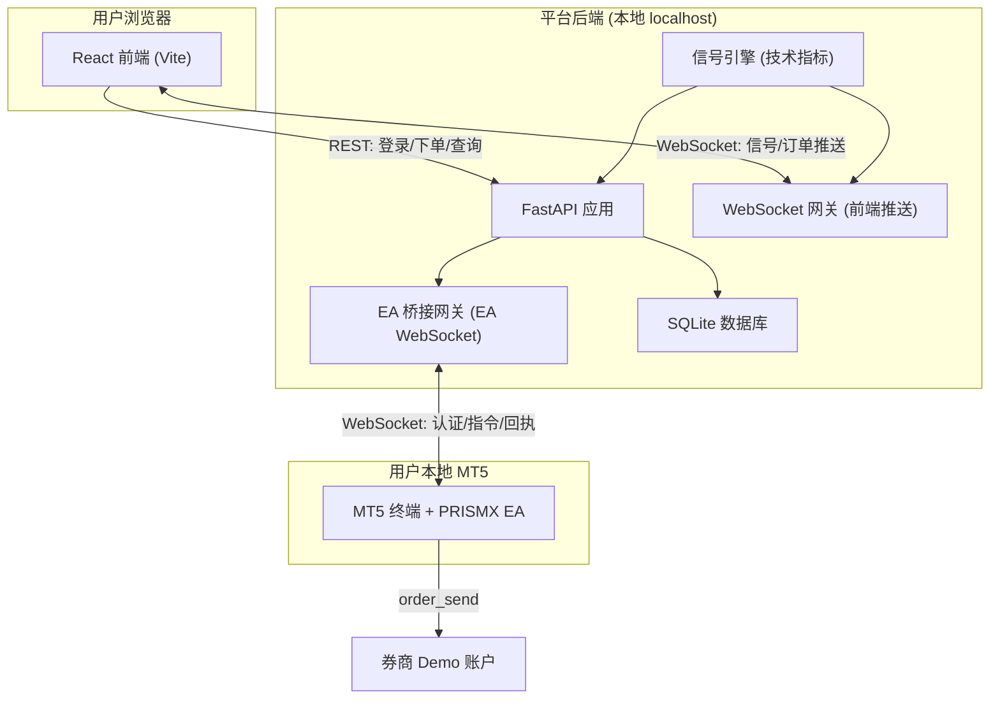
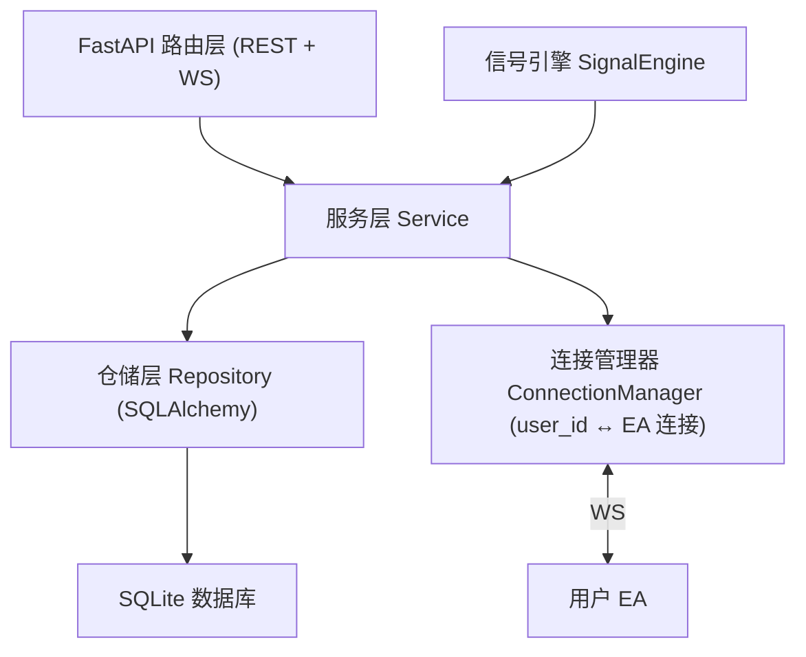
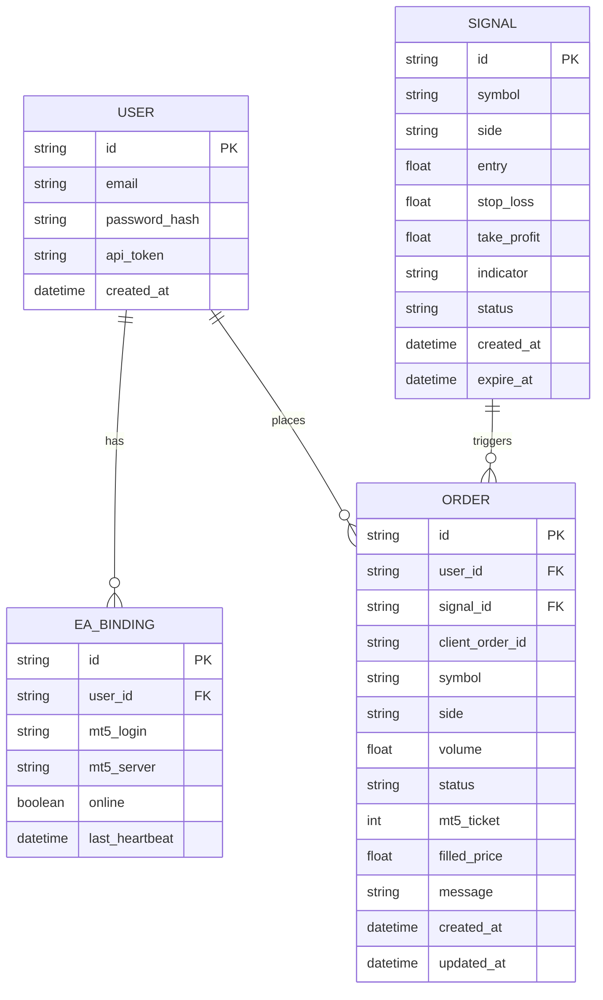

# PRISMX Signal Lab（棱镜信号实验室）技术架构文档

## 1. 架构设计



说明：本地阶段所有后端组件运行在同一进程/同一台机器，前端、EA 均连接 `localhost`。生产部署时仅需将连接地址改为公网域名并启用 HTTPS/WSS，代码逻辑不变。

## 2. 技术说明

- 前端：React@18 + TypeScript + tailwindcss@3 + Vite；i18n 采用 react-i18next 实现中英双语切换。
- 初始化工具：vite-init。
- 后端：Python + FastAPI（REST + WebSocket 一体），uvicorn 运行；信号引擎用 pandas + 技术指标计算。
- 数据库：SQLite（本地阶段，零配置，文件存储）；ORM 用 SQLAlchemy。
- 认证：JWT（用户登录）；EA 使用 per-user API Token 认证。
- EA：MQL5，提供两个版本（见第 7 节），均内置中英双语文案与日志。

## 3. 路由定义（前端）

| 路由 | 用途 |
|------|------|
| /login | 登录与注册页 |
| / | 信号面板页（主页，需登录） |
| /bind | EA 绑定页（Token 管理、MT5 账号登记） |
| /orders | 订单与回执页 |

## 4. API 定义

### 4.1 认证

用户注册
```
POST /api/auth/register
Request:  { "email": string, "password": string }
Response: { "token": string, "user": { "id": string, "email": string } }
```

用户登录
```
POST /api/auth/login
Request:  { "email": string, "password": string }
Response: { "token": string, "user": { "id": string, "email": string } }
```

### 4.2 EA 绑定

获取/重置 API Token
```
GET  /api/ea/token        -> { "apiToken": string, "boundAccount": string | null }
POST /api/ea/token/reset  -> { "apiToken": string }
```

登记 MT5 账号
```
POST /api/ea/account
Request:  { "mt5Login": string, "mt5Server": string }
Response: { "ok": true }
```

EA 在线状态
```
GET /api/ea/status -> { "online": boolean, "mt5Login": string | null, "lastHeartbeat": string | null }
```

### 4.3 信号

获取信号列表
```
GET /api/signals -> { "signals": Signal[] }

Signal = {
  "id": string,
  "symbol": string,         // 品种，如 EURUSD
  "side": "BUY" | "SELL",   // 方向
  "entry": number,          // 入场价
  "stopLoss": number,
  "takeProfit": number,
  "indicator": string,      // 触发指标说明
  "createdAt": string,
  "expireAt": string,
  "status": "ACTIVE" | "EXPIRED"
}
```

### 4.4 下单

提交下单（幂等）
```
POST /api/orders
Request:  {
  "signalId": string,
  "symbol": string,
  "side": "BUY" | "SELL",
  "volume": number,         // 手数
  "clientOrderId": string   // 前端生成的幂等键
}
Response: { "orderId": string, "status": "PENDING" }
```

查询订单
```
GET /api/orders -> { "orders": Order[] }

Order = {
  "id": string,
  "clientOrderId": string,
  "signalId": string,
  "symbol": string,
  "side": "BUY" | "SELL",
  "volume": number,
  "status": "PENDING" | "FILLED" | "REJECTED" | "FAILED",
  "mt5Ticket": number | null,
  "filledPrice": number | null,
  "message": string | null,
  "createdAt": string,
  "updatedAt": string
}
```

### 4.5 WebSocket 通道

前端通道 `/ws/client`（JWT 鉴权）：服务端推送
```
{ "type": "SIGNAL_NEW", "data": Signal }
{ "type": "ORDER_UPDATE", "data": Order }
{ "type": "EA_STATUS", "data": { "online": boolean, "mt5Login": string|null } }
```

EA 通道 `/ws/ea`（API Token 鉴权）：双向消息
```
EA -> 平台:
{ "type": "AUTH", "apiToken": string, "mt5Login": number, "mt5Server": string }
{ "type": "HEARTBEAT", "ts": number }
{ "type": "ORDER_RESULT", "clientOrderId": string, "success": boolean, "mt5Ticket": number, "filledPrice": number, "message": string }
{ "type": "POSITIONS", "data": Position[] }

平台 -> EA:
{ "type": "AUTH_OK", "userId": string }
{ "type": "AUTH_FAIL", "reason": string }
{ "type": "ORDER_CMD", "clientOrderId": string, "symbol": string, "side": "BUY"|"SELL", "volume": number, "stopLoss": number, "takeProfit": number }
```

## 5. 服务端架构图



下单路由逻辑：路由层接收下单请求 → 服务层做风控与幂等校验 → 落库为 PENDING → 通过连接管理器按 user_id 找到对应 EA 连接并下发 ORDER_CMD → 收到 ORDER_RESULT 后更新订单状态并经前端 WS 推送。

## 6. 数据模型

### 6.1 数据模型定义



### 6.2 数据定义语言

```sql
-- 用户表
CREATE TABLE users (
    id TEXT PRIMARY KEY,
    email TEXT UNIQUE NOT NULL,
    password_hash TEXT NOT NULL,
    api_token TEXT UNIQUE NOT NULL,
    created_at TIMESTAMP DEFAULT CURRENT_TIMESTAMP
);

-- EA 绑定表
CREATE TABLE ea_bindings (
    id TEXT PRIMARY KEY,
    user_id TEXT NOT NULL REFERENCES users(id),
    mt5_login TEXT,
    mt5_server TEXT,
    online BOOLEAN DEFAULT 0,
    last_heartbeat TIMESTAMP
);
CREATE INDEX idx_ea_user ON ea_bindings(user_id);

-- 信号表
CREATE TABLE signals (
    id TEXT PRIMARY KEY,
    symbol TEXT NOT NULL,
    side TEXT NOT NULL,
    entry REAL,
    stop_loss REAL,
    take_profit REAL,
    indicator TEXT,
    status TEXT DEFAULT 'ACTIVE',
    created_at TIMESTAMP DEFAULT CURRENT_TIMESTAMP,
    expire_at TIMESTAMP
);

-- 订单表
CREATE TABLE orders (
    id TEXT PRIMARY KEY,
    user_id TEXT NOT NULL REFERENCES users(id),
    signal_id TEXT REFERENCES signals(id),
    client_order_id TEXT NOT NULL,
    symbol TEXT NOT NULL,
    side TEXT NOT NULL,
    volume REAL NOT NULL,
    status TEXT DEFAULT 'PENDING',
    mt5_ticket INTEGER,
    filled_price REAL,
    message TEXT,
    created_at TIMESTAMP DEFAULT CURRENT_TIMESTAMP,
    updated_at TIMESTAMP DEFAULT CURRENT_TIMESTAMP,
    UNIQUE(user_id, client_order_id)
);
CREATE INDEX idx_order_user ON orders(user_id);
```

## 7. EA 的两个版本

两个版本均为 MQL5，内置中英双语（通过 EA 输入参数 `Language` 切换，影响图表注释与日志输出），均通过 `InpApiToken` 与平台绑定。

- **版本 A — WebSocket 实时版（PRISMX_EA_WS）**：通过 WebSocket 长连接平台 `/ws/ea`，实时接收下单指令、上报回执与持仓、维持心跳。低延迟，是主推方案。
- **版本 B — HTTP 轮询版（PRISMX_EA_Poll）**：通过 MT5 的 WebRequest 定时轮询平台 REST 接口拉取待执行指令并回报结果。无需 WebSocket 支持，兼容性更强，适合受限环境作为备选。

两版本对外的认证方式（API Token）、绑定逻辑（上报 mt5_login/mt5_server）、指令与回执的数据结构保持一致，便于平台统一处理。

## 8. 项目目录结构

```
PRISMX SIGNAL/
├── frontend/                  # React 前端
│   ├── src/
│   │   ├── pages/             # 登录、信号面板、绑定、订单页
│   │   ├── components/        # 复用组件
│   │   ├── i18n/              # 中英双语资源
│   │   ├── api/               # 接口与 WebSocket 封装
│   │   ├── store/             # 状态管理
│   │   └── styles/            # 主题（黑紫）
│   └── ...
├── backend/                   # FastAPI 后端
│   ├── app/
│   │   ├── routers/           # auth / signals / orders / ea / ws
│   │   ├── services/          # 业务逻辑（含连接管理器、风控）
│   │   ├── models/            # ORM 模型
│   │   ├── engine/            # 信号引擎（技术指标）
│   │   ├── core/              # 配置、安全、数据库
│   │   └── main.py
│   └── requirements.txt
├── ea/                        # MQL5 EA
│   ├── PRISMX_EA_WS.mq5       # 版本 A：WebSocket 实时版
│   └── PRISMX_EA_Poll.mq5     # 版本 B：HTTP 轮询版
└── .trae/documents/           # 本文档与 PRD
```
