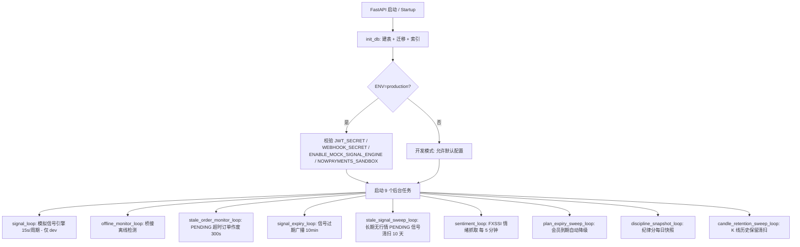

# PRISMX Signal Lab 技术架构文档 / Technical Architecture Document

> **最后更新 / Last Updated**: 2026-07-23
> **项目版本 / Project Version**: 21.7.26
> **文档语言 / Language**: 中文为主，辅以英文双语注释 / Chinese primary, with bilingual English comments

---

## 目录 / Table of Contents

1. [架构设计 / Architecture](#1-架构设计--architecture)
2. [技术说明 / Technical Overview](#2-技术说明--technical-overview)
3. [路由定义 / Frontend Routes](#3-路由定义--frontend-routes)
4. [API 定义 / API Definitions](#4-api-定义--api-definitions)
5. [服务端架构图 / Server Architecture](#5-服务端架构图--server-architecture)
6. [数据模型 / Data Models](#6-数据模型--data-models)
7. [MT5 接入 Bridge / MT5 Integration Bridge](#7-mt5-接入-bridge--mt5-integration-bridge)
8. [项目目录结构 / Directory Structure](#8-项目目录结构--directory-structure)

---

## 1. 架构设计 / Architecture

### 1.1 部署架构 / Deployment Architecture

```
┌─────────────────────────────────────────────────────────────────────┐
│                         用户端 / Client Side                          │
│                                                                       │
│  ┌──────────────┐   ┌──────────────┐   ┌──────────────────────────┐ │
│  │  Web Browser  │   │   iOS/Android │   │  PRISMX Bridge (桌面)    │ │
│  │  (SPA + PWA)  │   │  (PWA 安装)   │   │  Windows·tkinter GUI    │ │
│  │  React 18 SPA  │   │  standalone   │   │  v1.3.16               │ │
│  └──────┬───────┘   └──────┬───────┘   └───────────┬──────────────┘ │
│         │ REST/WS          │ REST/WS                │ REST Poll       │
│         │ (HTTPS/WSS)      │ (HTTPS/WSS)            │ (1.5s)          │
└─────────┼──────────────────┼────────────────────────┼────────────────┘
          │                  │                        │
          ▼                  ▼                        ▼
┌─────────────────────────────────────────────────────────────────────┐
│                      服务端 / Server (Linux VPS)                       │
│                                                                       │
│  ┌──────────────┐     ┌───────────────────────────────────────────┐  │
│  │    Nginx     │────▶│   FastAPI (uvicorn)                        │  │
│  │ 反向代理+SSL  │     │   ┌─────────────────────────────────┐     │  │
│  │ 静态文件分发   │     │   │ 15 REST Routers + 1 WS Router   │     │  │
│  └──────────────┘     │   ├─────────────────────────────────┤     │  │
│                       │   │ 9 后台任务 (asyncio tasks)        │     │  │
│                       │   │ - 信号引擎 (mock/dev)              │     │  │
│                       │   │ - 离线监控                         │     │  │
│                       │   │ - 超时订单清扫                      │     │  │
│                       │   │ - 信号过期广播                      │     │  │
│                       │   │ - 信号胜负判读清扫                   │     │  │
│                       │   │ - 社区情绪定时抓取 (FXSSI)          │     │  │
│                       │   │ - 订阅到期自动降级                   │     │  │
│                       │   │ - 纪律分每日快照                    │     │  │
│                       │   │ - K 线历史保留清扫                  │     │  │
│                       │   ├─────────────────────────────────┤     │  │
│                       │   │ 中间件:                              │     │  │
│                       │   │ - SlowAPI 限流                      │     │  │
│                       │   │ - CORS 跨域                         │     │  │
│                       │   │ - ProxyHeaders 真实IP还原           │     │  │
│                       │   └─────────────────────────────────┘     │  │
│                       └────────────┬──────────────────────────────┘  │
│                                    │                                  │
│                       ┌────────────▼──────────────────────────────┐  │
│                       │   PostgreSQL (Supabase Managed)            │  │
│                       │   OR SQLite (开发/单机)                     │  │
│                       │   Session Pool: 15 + 15 overflow           │  │
│                       └───────────────────────────────────────────┘  │
│                                                                       │
│  ┌──────────────────────────────────────────────────────────────┐   │
│  │   外部服务 / External Services                                  │   │
│  │   - TradingView Webhook (信号来源)                              │   │
│  │   - NOWPayments (加密货币支付·USDT)                             │   │
│  │   - FXSSI (社区情绪聚合数据)                                     │   │
│  │   - Google Identity Services (OAuth 登录)                       │   │
│  │   - Web Push (浏览器推送·VAPID)                                  │   │
│  └──────────────────────────────────────────────────────────────┘   │
│                                                                       │
│  ┌──────────────────────────────────────────────────────────────┐   │
│  │   用户本机 / User Machine                                       │   │
│  │   - MT5 终端 (1~N 个实例)                                       │   │
│  │   - PRISMX Bridge 桌面程序                                      │   │
│  │     · API Token 鉴权 (SHA-256 + DPAPI 加密)                     │   │
│  │     · HTTP 轮询 1.5s 拉取下单指令                                │   │
│  │     · 扫描所有运行中的 MT5 终端                                   │   │
│  │     · 上报账户状态/持仓/报价/平仓明细                              │   │
│  │     · 系统托盘 + 开机自启 (winreg)                               │   │
│  │     · 自动更新检测 (GitHub Releases)                             │   │
│  └──────────────────────────────────────────────────────────────┘   │
└─────────────────────────────────────────────────────────────────────┘
```

### 1.2 开发架构 / Development Architecture

```
frontend/          -- 前端 SPA：React + TypeScript + Tailwind + Vite
│  src/
│  ├── api/        -- REST 客户端 + 类型定义 + 工具函数
│  ├── components/ -- 共享 UI 组件
│  │   ├── charts/     -- 图表页专属组件 (轻量图/下单/持仓/画线)
│  │   ├── landing/    -- 落地页组件 (3D场景/FAQ/定价)
│  │   └── signals/    -- 信号面板组件
│  ├── i18n/       -- 国际化 (zh/en)
│  ├── pages/      -- 路由页 (13 页, 全部 lazy 加载)
│  ├── store/      -- 状态管理 (Auth / Live / Prefs / WebSocket)
│  ├── styles/     -- 全局 CSS (Tailwind 工具类 + 自定义终端主题)
│  └── utils/      -- 工具 (指标计算/通知/推送/品种元数据)

backend/           -- 后端 API：Python FastAPI + SQLAlchemy
│  app/
│  ├── core/       -- 配置 / 数据库 / 限流 / 安全
│  ├── engine/     -- 信号引擎 (模拟/过期广播)
│  ├── models/     -- ORM 数据模型 (18 张表)
│  ├── routers/    -- REST 路由 (15 个) + WebSocket 路由 (1 个)
│  ├── services/   -- 业务服务 (行情/策略/支付/推送/仓位管理...)
│  └── utils/      -- 指标计算 (Python)
│  tests/          -- 测试 (13 文件, 162 用例, pytest)

bridge/            -- MT5 桥接桌面程序 (Python·tkinter, Windows only)
│  bridge_app.py   -- 主程序：GUI + 鉴权 + 轮询 + 更新检测
│  mt5_worker.py   -- MT5 终端操作：下单/持仓/报价/平仓明细采集
│  diag.py         -- 诊断工具
│  requirements.txt
```

---

## 2. 技术说明 / Technical Overview

### 2.1 技术栈 / Tech Stack

| 层级 / Layer | 技术 / Technology | 版本 / Version | 说明 / Notes |
|---|---|---|---|
| 前端框架 | React | ^18.3.1 | SPA, 所有路由 lazy 加载 |
| 前端语言 | TypeScript | ^5.5.4 | strict 模式 |
| UI 框架 | Tailwind CSS | ^3.4.13 | 暗色主题系统 + 自定义终端终端风格 |
| 构建工具 | Vite | ^5.4.8 | 开发代理 + 手动分包 |
| 路由 | react-router-dom | ^6.26.2 | BrowserRouter + lazy loading |
| 图表库 | lightweight-charts | ^5.2.0 | 自建 K 线, 多面板原生支持 |
| 3D 渲染 | three + @react-three/fiber | ^0.169.0 / ^8.15.19 | 落地页 WebGL 背景 |
| 国际化 | i18next + react-i18next | ^23.15.1 / ^15.0.2 | zh/en, localStorage 持久化 |
| PWA | manifest + Service Worker | - | display: standalone, Web Push |
| 后端框架 | FastAPI (uvicorn) | 0.115.0 / 0.30.6 | async lifespan |
| ORM | SQLAlchemy | 2.0.34 | SQLite / PostgreSQL 双模式 |
| 数据校验 | Pydantic | 2.9.2 | 请求/响应模型 |
| 密码哈希 | bcrypt | 4.2.0 | 72 字节截断 |
| JWT | python-jose | 3.3.0 | HS256, 120 分钟 + 滑动续期 |
| 限流 | slowapi | 0.1.9 | 按 IP 限流 + 按邮箱登录锁定 |
| Google 登录 | google-auth | 2.35.0 | ID Token 验证 |
| 数值计算 | pandas + numpy | 2.2.2 / 1.26.4 | 回测 + 指标计算 |
| 推送 | pywebpush | 2.0.0 | VAPID Web Push |
| 支付 | NOWPayments API | - | USDT 加密货币支付 |

### 2.2 关键设计决策 / Key Design Decisions

1. **订阅等级 (FREE/PRO) 与管理员权限完全独立**
   - 管理员权限 (role=admin) 与订阅等级 (plan=FREE/PRO) 是两个正交的轴
   - 管理后台不依赖任何订阅等级, 任何等级不授予管理权限
   - 集中判断逻辑在 `services/plans.py`, 避免散落在各路由中

2. **信号双状态轴 (status vs result)**
   - `status`: ACTIVE/EXPIRED — 能否下单 (10 分钟)
   - `result`: PENDING/HIT_TP/HIT_SL/STALE — 客观胜负判定 (独立追踪)
   - 信号过期后仍可继续追踪胜负, 直到 10 天无行情更新判为 STALE

3. **JWT 滑动续期 (Sliding Renewal)**
   - 120 分钟有效期, 剩余不到一半时通过 `X-Refreshed-Token` 响应头下发新 token
   - 前端 `client.ts` 静默替换, 活跃用户永不被踢下线
   - `token_version` 字段实现改密后旧 token 全部立即失效

4. **多 Context 性能隔离**
   - 高频推送的持仓/报价单独放各自的 React Context
   - 只订阅信号的组件不会被报价更新触发重渲染
   - `keepIfEqual()` 浅比较 + 保留旧引用避免无意义渲染

5. **自建行情源替代 TradingView Widget**
   - 历史 K 线: `GET /api/chart/history` (从内存 `chart_store` 一次性快照)
   - 实时更新: `GET /api/chart/latest` 轮询
   - 所有数据走自有域名, 在任何网络环境可访问

6. **桥接超时重发 + 幂等保护**
   - 指令 `PENDING` 超时 300s 自动作废为 FAILED
   - 已执行指令缓存到本地 JSON (idempotency cache), 重启不丢
   - 未回报结果持久化队列 `~/.prismx_bridge_reports.json`, 重启后继续重试

7. **Google 登录 + "账号预劫持" 防护**
   - `google_linked_at` 字段区分"从未通过 Google 验证"和"本就是 Google 创建"
   - 攻击者先注册邮箱密码 → 受害者 Google 登录被拒 (该邮箱 Google 身份从未验证)
   - 用户本来就是 Google 登录创建的 → 之后设了密码 → Google 登录仍然正常 (已验证)

---

## 3. 路由定义 / Frontend Routes

所有路由定义在 `frontend/src/App.tsx` 中, 使用 `BrowserRouter` + `lazy()` 进行路由级代码分割。

### 3.1 路由表 / Route Table

| 路径 / Path | 页面组件 / Page | 认证要求 / Auth | 说明 / Description |
|---|---|---|---|
| `/` | `LandingPage` | 无 (未登录) / `DashboardPage` 重定向 (已登录) | 营销主页, 3D WebGL 背景 (PrismScene) |
| `/login` | `LoginPage` | 无 | 登录 + 注册 + Google Sign-In |
| `/dashboard` | `DashboardPage` | JWT | 仪表盘: SignalHero + SignalExec + MarketOverview + QuotesTable + PersonalWinRateCard |
| `/app` | `SignalsPage` | JWT | 信号网格: 全站信号 + 个人策略信号合并展示 |
| `/charts` | `ChartsPage` | JWT | 实时图表页 (lightweight-charts v5) |
| `/bind` | `BindPage` | JWT | API Token 管理 + 多账号绑定表 |
| `/orders` | `OrdersPage` | JWT | 持仓 + 个人胜率 + 平仓明细 + 自动仓管 + 订单历史 |
| `/account` | `AccountPage` | JWT | 个人信息/改密/通知偏好/Web Push 订阅 |
| `/download` | `DownloadPage` | JWT | Bridge 下载 + 教程 |
| `/strategies` | `StrategiesPage` | JWT | 自定义策略 CRUD + 回测 (2026-07 起对全体登录用户开放) |
| `/upgrade` | `UpgradePage` | JWT | PRO 升级 (NOWPayments 加密货币支付, USDT) |
| `/admin` | `AdminPage` | JWT + role=admin | 管理后台 |
| `/simulator` | `SimulatorPage` | JWT + role=admin | 历史信号回放 (内部试用) |
| `*` | 重定向到 `/` | - | 404 兜底 |

### 3.2 路由守卫 / Auth Guards

```typescript
// 登录守卫: JWT 有效才能进入, 否则跳转 /login
function Protected({ children }: { children: ReactNode }) {
  const { isAuthed } = useAuth()
  return isAuthed ? <>{children}</> : <Navigate to="/login" replace />
}

// 管理员守卫: role === 'admin', 否则送回 /dashboard
function AdminOnly({ children }: { children: ReactNode }) {
  const { user } = useAuth()
  return user?.role === 'admin' ? <>{children}</> : <Navigate to="/dashboard" replace />
}
```

被 `Protected` 包裹的路由共享 `Layout` 组件 (顶部导航 + 内容区 + 移动端底部 Tab 栏)。

### 3.3 导航结构 / Navigation Structure

**桌面端 / Desktop Nav** (Layout.tsx):
- 5 个主导航项: 仪表盘 (dashboard) / 信号 (app) / 图表 (charts) / 绑定 (bind) / 订单 (orders)
- 右上角图标: EAStatusBadge / NotificationBell / LanguageToggle (单按钮循环 zh↔en) / UserMenu
- BridgeUpdateNotice: 版本更新提示横幅

**移动端 / Mobile Nav** (Layout.tsx):
- Apple 风格液态玻璃底部 Tab 栏 (`.lg-tabbar`)
- 4 个主 Tab: signals / charts / dashboard / orders
- "更多" 按钮展开其余入口: bind / account / download / upgrade / strategies / admin

---

## 4. API 定义 / API Definitions

所有后端路由在 `backend/app/routers/` 下, 通过 `backend/app/main.py` 注册, 前缀 `/api`。

### 4.1 REST 路由汇总 / REST Routers Summary

| 路由模块 / Router | 文件 / File | 前缀 / Prefix | 核心端点 / Key Endpoints |
|---|---|---|---|
| **auth** | `routers/auth.py` | `/api/auth` | `POST /auth/register`, `POST /auth/login`, `POST /auth/google` |
| **account**¹ | `routers/account.py` | `/api/auth` | `GET /auth/me`, `POST /auth/password`, `GET /auth/prefs`, `PUT /auth/prefs` |
| **signals** | `routers/signals.py` | `/api/signals` | `GET /signals`, `GET /signals/stats`, `GET /signals/winrate`, `GET /signals/simulate` |
| **trends** | `routers/trends.py` | `/api/trends` | `GET /trends` (多周期趋势快照) |
| **orders** | `routers/orders.py` | `/api/orders` | `GET /orders`, `POST /orders`, `POST /orders/close`, `POST /orders/modify`, `POST /orders/{id}/cancel`, `GET /orders/winrate`, `GET /orders/closed-trades`, `GET /orders/discipline` |
| **chart** | `routers/chart.py` | `/api` (无独立前缀) | `POST /feed/candles`, `POST /feed/quotes` (EA 行情写入, X-EA-Token 鉴权), `GET /quotes` (全站报价快照), `GET /symbols` (当前活跃品种), `GET /chart/history`, `GET /chart/latest` |
| **webhook** | `routers/webhook.py` | `/api/webhook` | `POST /webhook/tradingview` (TradingView 信号接入), `POST /webhook/trend` (多周期趋势推送) |
| **bridge** | `routers/bridge.py` | `/api/bridge` | `POST /bridge/poll` (桥接下单轮询, 核心), `POST /bridge/result` (执行结果回报), `POST /bridge/positions`, `POST /bridge/quotes`, `POST /bridge/trade-history` (平仓明细上报), `GET /bridge/accounts`, `POST /bridge/accounts/suffix`, `DELETE /bridge/accounts/{login}`, `GET /bridge/version-status` |
| **ea** | `routers/ea.py` | `/api/ea` | `GET /ea/token`, `POST /ea/token/reset` |
| **notifications** | `routers/notifications.py` | `/api/notifications` | `GET /notifications/prefs`, `PUT /notifications/prefs`, `GET /notifications/indicators`, `GET /notifications/symbols`, `GET /notifications/push/vapid-public-key`, `POST /notifications/push/subscribe`, `POST /notifications/push/unsubscribe` |
| **admin** | `routers/admin.py` | `/api/admin` | `GET /admin/users`, `PATCH /admin/users/{id}`, `PATCH /admin/users/bulk`, `GET /admin/metrics`, `GET|PUT /admin/settings`, `GET|PUT /admin/pricing`, `GET|PUT /admin/trial`, `GET|PUT /admin/discipline`, `GET|PUT /admin/candle-history`, `GET|PUT /admin/strategy-settings` |
| **automation** | `routers/automation.py` | `/api/automation` | `GET /automation/settings`, `PUT /automation/settings` (自动仓位管理, PRO 专属) |
| **sentiment** | `routers/sentiment.py` | `/api/sentiment` | `GET /sentiment` (社区情绪, FXSSI 数据) |
| **payments** | `routers/payments.py` | `/api/payments` | `GET /payments/plans`, `GET /payments/currencies`, `POST /payments/create`, `GET /payments/status/{id}`, `GET /payments/trial`, `POST /payments/trial/claim`, `POST /payments/webhook` (NOWPayments IPN 回调, 无 JWT, HMAC-SHA512 签名校验) |
| **strategies** | `routers/strategies.py` | `/api/strategies` | `GET /strategies/templates`, `GET /strategies`, `POST /strategies`, `PATCH /strategies/{id}`, `DELETE /strategies/{id}`, `POST /strategies/backtest`, `GET /strategies/signals`, `DELETE /strategies/signals` |

¹ `account.py` 与 `auth.py` 共用同一个 `/auth` 前缀 (两个独立 Router 对象, `main.py` 分别注册), 因此 `/auth/me` 等端点实际实现在 `account.py` 里而非 `auth.py`。共 **15 个 Router 对象**注册在 `main.py` (对应上表 15 行), 加 1 个 `ws` Router (无前缀, 挂载 `/ws/client`)。

### 4.2 前端 API 客户端 / Frontend API Client

`frontend/src/api/client.ts` (~549 行) — 统一的 REST 客户端封装:

- **Bearer Token 管理**: 从 `localStorage` 读取 `prismx_token`, 自动带 `Authorization` 头
- **滑动续期**: 监听 `X-Refreshed-Token` 响应头, 静默替换本地 token
- **422 错误展平**: FastAPI 字段校验错误的 `[{loc, msg, type}]` 数组展平为可读字符串
- **401 处理**: 清除 token 并调用 `onUnauthorized` 回调 (跳转登录页)

API 子模块:
- `authApi`: register, login, google
- `signalApi`: list, stats, winrate
- `simulateApi`: run (历史信号回放)
- `trendApi`: list
- `quoteApi`: list (全站统一报价快照)
- `symbolApi`: list (当前活跃品种)
- `chartApi`: history, latest
- `orderApi`: list, place, close, modify, cancel, winrate, closedTrades, discipline
- `strategyApi`: templates, list, create, update, remove, backtest, signals, clearSignals
- `accountApi`: list, setSuffix, remove
- `bridgeVersionApi`: status
- `eaApi`: getToken, resetToken
- `userApi`: me, changePassword, getPrefs, putPrefs
- `notificationApi`: getPrefs, putPrefs, getIndicators, getSymbols
- `adminApi`: listUsers, updateUser, bulkUpdateUsers, metrics, getSettings, updateSettings, getPricing, updatePricing, getTrial, updateTrial, getDiscipline, updateDiscipline, getCandleHistory, updateCandleHistory, getStrategySettings, updateStrategySettings
- `automationApi`: getSettings, putSettings
- `sentimentApi`: get
- `paymentApi`: getPlans, getCurrencies, create, status, getTrial, claimTrial
- `pushApi`: getVapidKey, subscribe, unsubscribe

### 4.3 WebSocket 协议 / WebSocket Protocol

端点: `ws://{host}/ws/client`

**鉴权流程 / Auth Flow**:
1. 连接建立后, 客户端发首帧 JSON: `{ "type": "AUTH", "token": "<JWT>" }`
2. 成功: 服务端回复 `{ "type": "AUTH_OK" }`
3. 失败: 服务端回复 `{ "type": "AUTH_FAIL" }`, 客户端关闭重连

**消息类型 / Message Types** (`WSMessage` 接口, `api/types.ts`):

| type | 数据 / data | 说明 / Description |
|---|---|---|
| `SIGNAL_NEW` | `Signal` | 新信号推送 (PRO 用户实时, FREE 用户延迟) |
| `SIGNAL_EXPIRED` | `{ id: string }` | 信号过期通知 |
| `STRATEGY_SIGNAL` | `StrategySignal` | 个人策略触发的新信号 |
| `ORDER_UPDATE` | `Order` | 订单状态更新 (PENDING→FILLED/REJECTED 等) |
| `POSITIONS` | `Position[]` | 实时持仓快照 (高频, 独立 Context) |
| `QUOTES` | `Quote[]` | 按账户区分的报价 (下单确认页用) |
| `GLOBAL_QUOTES` | `Quote[]` | 全站统一展示报价 (EA 推送) |
| `TREND_UPDATE` | `Trend` | 某品种多周期趋势翻转 |
| `PREFS_UPDATE` | `Record<string, unknown>` | 跨设备偏好同步 (如画线) |
| `ACCOUNTS_STATUS` | `{ onlineLogins: string[] }` | 账号在线状态变化 |

**自动重连 / Auto-reconnect**: 客户端 `useClientSocket.ts` 监听 `onclose` 事件, 2 秒后自动重连。断线时组件收到 `wsDisconnected=true` 后显示横幅提示。

### 4.4 限流策略 / Rate Limiting

| 端点 / Endpoint | 速率 / Rate | 维度 / Key |
|---|---|---|
| `POST /auth/login` | 10/分钟 | 客户端 IP |
| `POST /auth/register` | 5/分钟 | 客户端 IP |
| `POST /auth/google` | 10/分钟 | 客户端 IP |
| 交易端点 (下单/平仓/改单/撤单) | 120/分钟 (2/秒) | 客户端 IP |
| `POST /auth/password` | 10/分钟 | 客户端 IP |
| `POST /payments/create` | 5/分钟 | 客户端 IP |

**登录暴力破解防护** (`rate_limit.py`): 按邮箱累计失败次数, 超过 8 次触发 5 分钟锁定期。

---

## 5. 服务端架构图 / Server Architecture

### 5.1 启动流程 / Startup Flow (main.py lifepan)



### 5.2 请求处理中间件栈 / Middleware Stack

```
浏览器 Request
    │
    ▼
┌─── ProxyHeadersMiddleware ───┐  (最外层: 从 X-Forwarded-For 还原真实客户端 IP)
├─── SlowAPIMiddleware ────────┤  (限流: 按 IP 计数, 超限返回 429)
├─── CORSMiddleware ───────────┤  (跨域: 白名单 + 暴露 X-Refreshed-Token 响应头)
└─── Router Handler ───────────┘
    │
    ├── Depends(get_current_user): JWT 验证 + 滑动续期 + 过期降级检测
    ├── Depends(get_db): 数据库会话
    └── 路由逻辑
```

### 5.3 WebSocket 连接管理 / Connection Manager

`backend/app/services/connection_manager.py`:

- 注册表: `user_id → {WebSocket, ...}` (一个用户可有多个连接 (多设备))
- `broadcast_to_user()`: 向单个用户的所有连接广播
- `broadcast()`: 向所有连接广播 (如全站信号)
- `online_count`: 当前在线连接数
- 断开自动清理

### 5.4 信号等级过滤 / Signal Plan Filtering

`backend/app/services/signal_broadcast.py`:

```
信号广播流程:
  新信号(signal_engine/webhook) → broadcast_new_signal()
    ├── is_realtime_plan(user.plan)?
    │   ├── 是 (PRO): 实时 WebSocket 推送 SIGNAL_NEW + Web Push
    │   └── 否 (FREE): 不推送, 仅通过 REST GET /signals 拉取时返回 (天然延迟)
    └── 过期: broadcast_expired() → 所有接收过此信号的用户收到 SIGNAL_EXPIRED
```

### 5.5 关键服务 / Key Services

| 服务 / Service | 文件 / File | 功能 / Function |
|---|---|---|
| **signal_engine** | `engine/signal_engine.py` | 模拟信号引擎 (随机游走, 仅 dev) + 信号过期广播循环 |
| **signal_resolution** | `services/signal_resolution.py` | 信号胜负判定 (用 K 线高/低 vs 止损/止盈) |
| **trade_performance** | `services/trade_performance.py` | 个人胜率 (基于真实平仓明细 + 实时持仓对账) |
| **chart_store** | `services/chart_store.py` | 内存 K 线缓存 (最多 500 条/品种×周期) |
| **candle_store** | `services/candle_store.py` | 已收盘 K 线落库 + 保留策略清扫 |
| **strategy_engine** | `services/strategy_engine.py` | 10 个策略模板 + 回测引擎 + 实时评估 |
| **quotes_store** | `services/quotes_store.py` | 报价内存缓存 |
| **sentiment_store** | `services/sentiment_store.py` | FXSSI 社区情绪抓取 (每 5 分钟) |
| **push_dispatch** | `services/push_dispatch.py` | Web Push 分发 (信号 + 事件通知) |
| **auto_manage** | `services/auto_manage.py` | 自动仓位管理 (保本/移动止损/分批止盈) |
| **discipline** | `services/discipline.py` | 交易纪律三维度评分 |
| **plan_expiry** | `services/plan_expiry.py` | 会员到期自动降级 |
| **settings_store** | `services/settings_store.py` | 平台设置缓存 (券商锁/定价/试用/纪律/K线/策略) |
| **nowpayments** | `services/nowpayments.py` | NOWPayments API 封装 |
| **bridge_version_check** | `services/bridge_version_check.py` | Bridge 版本状态追踪 |

---

## 6. 数据模型 / Data Models

> 所有模型定义在 `backend/app/models/__init__.py` 中, 基于 SQLAlchemy ORM。
> 数据库迁移通过 `database.py` 的 `_migrate_columns()` 实现轻量级在线列添加/回填。

### 6.1 表结构汇总 / Tables Summary

| 表名 / Table | 模型 / Model | 说明 / Description |
|---|---|---|
| `users` | `User` | 平台用户 (邮箱/密码/角色/等级/API Token) |
| `mt5_accounts` | `MT5Account` | MT5 多账号绑定 (一个用户可挂多个) |
| `signals` | `Signal` | 交易信号 (全站共享 + 双状态轴) |
| `orders` | `Order` | 下单指令与回执 (PENDING/FILLED/REJECTED/FAILED/CANCELLED) |
| `trends` | `Trend` | 多周期趋势快照 (一个品种一条, 最新覆盖) |
| `closed_trades` | `ClosedTrade` | 真实 MT5 平仓明细 (个人胜率数据源) |
| `notification_prefs` | `NotificationPref` | 通知偏好 (按用户一条, 策略类别+品种+事件三维白名单) |
| `push_subscriptions` | `PushSubscription` | Web Push 设备订阅 (按用户+设备) |
| `user_prefs` | `UserPref` | 用户通用偏好 (跨设备同步, JSON 文档) |
| `auto_manage_settings` | `AutoManageSettings` | 自动仓位管理设置 (PRO 专属) |
| `auto_managed_positions` | `AutoManagedPosition` | 自动仓位管理每仓状态 |
| `discipline_snapshots` | `DisciplineSnapshot` | 纪律分每日快照 (驱动 30 天趋势线) |
| `platform_settings` | `PlatformSetting` | 平台级设置键值对 (后台运营配置) |
| `payments` | `Payment` | NOWPayments 支付记录 |
| `candles` | `Candle` | K 线历史落库 (已收盘 bar, 供回测) |
| `user_strategies` | `UserStrategy` | 用户自定义策略 (模板+调参+独立止损止盈) |
| `strategy_signals` | `StrategySignal` | 个人策略触发信号 (与全站信号表分表) |
| `admin_audit_logs` | `AdminAuditLog` | 管理员操作审计日志 |

### 6.2 核心模型详解 / Core Model Details

#### User (users)

| 字段 / Field | 类型 / Type | 说明 / Description |
|---|---|---|
| `id` | String UUID | 主键 |
| `email` | String UNIQUE | 邮箱唯一索引 |
| `password_hash` | String NULLABLE | bcrypt 哈希; Google 用户为 NULL |
| `api_token` | String UNIQUE | API Token SHA-256 哈希 (明文只展示一次) |
| `role` | String default "user" | user / admin (权力轴) |
| `plan` | String default "FREE" | FREE / PRO (商业轴) |
| `plan_expires_at` | DateTime NULLABLE | 订阅到期; NULL=永久 |
| `plan_note` | String NULLABLE | 管理员内部备注 |
| `trial_used_at` | DateTime NULLABLE | 免费试用领取时间 (终身一次) |
| `plan_is_trial` | Boolean default false | 当前 PRO 是否为试用 |
| `last_active_at` | DateTime NULLABLE | 最近活跃时间 (DAU 统计, 5 分钟节流) |
| `bridge_version` | String NULLABLE | 该用户最近上报的 Bridge 版本 |
| `token_version` | Integer default 0 | 会话版本号 (改密自增, 旧 token 失效) |
| `google_linked_at` | DateTime NULLABLE | 首次通过 Google 验证的时间, 用于区分"账号预劫持" |

#### Signal (signals)

| 字段 / Field | 类型 / Type | 说明 / Description |
|---|---|---|
| `id` | String UUID | 主键 |
| `symbol` | String | 品种代码 |
| `side` | String | BUY / SELL |
| `entry` | Float | 入场价 |
| `stop_loss` | Float | 止损价 |
| `take_profit` | Float | 止盈价 |
| `indicator` | String | 指标名称 (如 "RSI") |
| `source` | String default "mock" | 来源: mock / tradingview |
| `external_id` | String UNIQUE NULLABLE | 外部去重 ID (如 TradingView alert id) |
| `status` | String default "ACTIVE" | ACTIVE / EXPIRED |
| `result` | String default "PENDING" | 胜负判定: PENDING / HIT_TP / HIT_SL / STALE |
| `baseline_high` | Float NULLABLE | 价格基线 (高) — 首次观测记录 |
| `baseline_low` | Float NULLABLE | 价格基线 (低) |
| `created_at` | DateTime | 创建时间 |
| `expire_at` | DateTime | 过期时间 |
| `resolved_at` | DateTime | 胜负判定时间 |

索引: `(status, expire_at)` — 过期清扫, `(symbol, result)` — 胜负判定

#### Order (orders)

| 字段 / Field | 类型 / Type | 说明 / Description |
|---|---|---|
| `id` | String UUID | 主键 |
| `user_id` | String FK→users | 用户 |
| `signal_id` | String FK→signals NULLABLE | 关联信号 (手动单为空) |
| `client_order_id` | String | 幂等下单 ID (uk 联合 user_id) |
| `action` | String default "ORDER" | ORDER / CLOSE / MODIFY |
| `symbol` | String | 品种 |
| `side` | String | BUY / SELL |
| `volume` | Float | 手数 |
| `ticket` | Integer NULLABLE | 目标持仓 ticket (平仓/改单用) |
| `sl` / `tp` | Float NULLABLE | 止损止盈绝对价 |
| `mt5_login` | String NULLABLE | 目标 MT5 账号 login |
| `status` | String default "PENDING" | PENDING/FILLED/REJECTED/FAILED/CANCELLED |
| `delivered` | Boolean default false | 是否已下发给 Bridge |
| `delivered_at` | DateTime NULLABLE | 下发时间 (用于超时重发) |
| `mt5_ticket` | Integer NULLABLE | MT5 成交单号 |
| `filled_price` | Float NULLABLE | 成交价 |
| `position_last_seen_open` | DateTime NULLABLE | Bridge 最近一次把该仓位报为"仍持仓" |

索引: `user_id`, `(user_id, client_order_id)` UNIQUE, `(status)`

#### UserStrategy (user_strategies)

| 字段 / Field | 类型 / Type | 说明 / Description |
|---|---|---|
| `id` | String UUID | 主键 |
| `user_id` | String FK→users | 用户 |
| `template` | String | 10 个模板之一 |
| `name` | String NULLABLE | 自定义名称 |
| `symbol` | String | 品种 |
| `interval` | String | 周期 (1/5/15/60/240/D) |
| `params` | Text JSON | 模板参数 |
| `stop_loss_method` | String default "percent" | 止损方式: percent / steps |
| `stop_loss_value` | Float default 1.0 | 止损值 |
| `take_profit_method` | String default "rr" | 止盈方式: rr / percent / steps |
| `take_profit_value` | Float default 2.0 | 止盈值 |
| `one_trade_at_a_time` | Boolean default true | 一次一单 |
| `enabled` | Boolean default false | 是否启用 |
| `last_signal_bar_t` | Integer NULLABLE | 最近触发信号的 bar 时间 (防重复) |

### 6.3 订阅等级权益 / Plan Tiers

| 权益 / Feature | FREE | PRO |
|---|---|---|
| 实时信号 | 延迟 (REST 拉取) | 实时 WebSocket 推送 |
| 一键下单 | ✗ | ✓ |
| 持仓/订单管理 | ✗ | ✓ |
| 自动仓位管理 | ✗ | ✓ |
| Web Push 通知 | ✗ | ✓ |
| 个人胜率 | ✗ | ✓ |
| 纪律分 | ✓ (总览) | ✓ (含三维度明细) |
| 图表页 | ✓ | ✓ |
| 自定义策略 | ✓ (查看+回测) | ✓ (启用) |
| MT5 账户数 | 最多 1 个 | 不限 |
| 策略数上限 | - | 默认 3 (管理员可调) |
| NOWPayments 支付 | ✗ | ✓ |

---

## 7. MT5 接入 Bridge / MT5 Integration Bridge

### 7.1 Bridge 概述 / Bridge Overview

**文件**: `bridge/bridge_app.py` (主程序) + `bridge/mt5_worker.py` (MT5 终端操作)

**版本**: v1.3.16

**平台**: Windows only (依赖 MetaTrader5 Python 包)

**工作模式**: 桌面程序 (tkinter GUI) 以系统托盘方式运行, 开机自启 (winreg), 扫描本机所有运行中的 MT5 终端, 通过 API Token 连接后端, 上报账户状态与数据, 并轮询执行网页下发的交易指令。

### 7.2 架构流程 / Architecture Flow

```
┌─────────────────────────────────────────────────────┐
│                  PRISMX Bridge                        │
│                                                       │
│  ┌──────────────┐     ┌──────────────────────────┐   │
│  │  tkinter GUI  │     │  轮询引擎 (每 1.5s)       │   │
│  │  - Token 输入  │     │  POST /api/bridge/poll   │   │
│  │  - 状态展示    │     │  ┌────────────────────┐ │   │
│  │  - 系统托盘    │     │  │ 拉取待执行指令       │ │   │
│  └──────────────┘     │  │ (PENDING orders)     │ │   │
│                        │  ├────────────────────┤ │   │
│  ┌──────────────┐     │  │ 比对幂等缓存         │ │   │
│  │  鉴权管理     │     │  │ (防止重复执行)       │ │   │
│  │  - API Token  │     │  ├────────────────────┤ │   │
│  │  - DPAPI 加密  │     │  │ 执行指令 (mt5_worker)│ │   │
│  │  - SHA-256    │     │  ├────────────────────┤ │   │
│  └──────────────┘     │  │ 上报执行结果         │ │   │
│                        │  ├────────────────────┤ │   │
│  ┌──────────────┐     │  │ 上报持仓/报价/账户    │ │   │
│  │  MT5 Worker   │     │  │ 上报平仓明细         │ │   │
│  │  - 下单       │     │  └────────────────────┘ │   │
│  │  - 平仓       │     └──────────────────────────┘   │
│  │  - 持仓采集    │                                     │
│  │  - 报价采集    │   ┌──────────────────────────┐   │
│  │  - 平仓明细    │   │  本地持久化                │   │
│  │  - 魔术号778899│   │  - ~/.prismx_bridge.json │   │
│  └──────────────┘     │  - *_executed.json       │   │
│                        │  - *_reports.json        │   │
│  ┌──────────────┐     │  - *_trades.json         │   │
│  │  更新检测     │     └──────────────────────────┘   │
│  │  GitHub API   │                                     │
│  └──────────────┘                                     │
└─────────────────────────────────────────────────────┘
         │                        ▲
         ▼                        │
┌─────────────────────────────────────────────────────┐
│                后端 /api/bridge                        │
│  POST /poll ── 下发指令 + 接收执行结果/持仓/报价/平仓   │
│  GET /accounts ── 返回账户列表                         │
│  DELETE /accounts/{login} ── 删除绑定账户               │
└─────────────────────────────────────────────────────┘
```

### 7.3 关键机制 / Key Mechanisms

**鉴权 / Auth**:
- 用户从网页获取 API Token (明文 `prismx_` + 32 字节 urlsafe-base64), 在 Bridge 中输入
- Bridge 用 DPAPI (Windows Data Protection API) 加密存储 token
- 每次请求带 `X-API-Token` 头; 后端 SHA-256 后与库中哈希比对 (常量时间比较)

**轮询 / Polling**:
- 每 1.5 秒 `POST /api/bridge/poll`, 发送当前账户状态/持仓/报价, 服务器返回待执行指令
- 后端维持 7 秒在线窗口: 超过 7 秒无心跳 → 账号离线

**幂等保护 / Idempotency**:
- `~/.prismx_bridge_executed.json`: 已执行指令的 `client_order_id → {time, result}` 缓存, TTL 24 小时
- `~/.prismx_bridge_reports.json`: 未成功回报的执行结果队列, 持久化 + 重启后重试
- `~/.prismx_bridge_trades.json`: 未成功上报的平仓明细队列

**MT5 终端操作 (mt5_worker.py)**:
- 同一进程串行附加不同 MT5 终端 (单进程模式, 避免 PyInstaller 多进程坑)
- 连接复用: 单终端场景保持连接, 多终端时切换才重连
- 魔术号码 778899 区分本平台开仓 vs 手动/其他 EA 开仓
- 平仓明细采集: 按仓位编号匹配所有后续平仓成交 (含手动平仓)

**自动更新 / Auto-update**:
- 通过 `https://api.github.com/repos/PRISMX-TD/PRISMX-SIGNAL-LAB/releases/latest` 检测新版本
- 有更新时自动下载 `PRISMX-Bridge-Setup.exe`, 弹出安装提示

**开机自启 / Auto-start**:
- 通过 `winreg` 写入 `HKCU\Software\Microsoft\Windows\CurrentVersion\Run`

---

## 8. 项目目录结构 / Directory Structure

```
PRISMX SIGNAL 21.7.26/                    # 项目根目录 / Project Root
│
├── backend/                               # 后端 / Backend (Python FastAPI)
│   ├── app/
│   │   ├── __init__.py
│   │   ├── main.py                        # FastAPI 入口 + lifespan 管理 9 后台任务
│   │   ├── schemas.py                     # Pydantic 请求/响应模型 (Auth/Admin/Strategy/Order...)
│   │   ├── core/
│   │   │   ├── __init__.py
│   │   │   ├── config.py                  # 应用配置 (pydantic-settings, 282 行)
│   │   │   │                              #  JWT/限流/DB/CORS/信号/支付/VAPID/安全校验
│   │   │   ├── database.py               # SQLAlchemy 引擎 + 会话 + 轻量迁移 (_migrate_columns)
│   │   │   ├── rate_limit.py             # slowapi 限流 + 邮箱登录锁定
│   │   │   └── security.py               # bcrypt 哈希 + JWT 签发/验证 + API Token + Google 验证
│   │   ├── engine/
│   │   │   ├── __init__.py
│   │   │   └── signal_engine.py           # 模拟信号引擎 (dev) + 信号过期广播循环
│   │   ├── models/
│   │   │   └── __init__.py               # 18 个 ORM 数据模型 (~631 行)
│   │   ├── routers/
│   │   │   ├── __init__.py
│   │   │   ├── auth.py                   # 注册/登录/Google (与 account.py 共用 /auth 前缀)
│   │   │   ├── account.py                # 个人资料/改密/偏好 (GET /auth/me 等, 见 4.1 节脚注)
│   │   │   ├── signals.py                # 信号列表/统计/胜率/历史回放
│   │   │   ├── trends.py                 # 多周期趋势
│   │   │   ├── orders.py                 # 下单/平仓/改单/撤单/胜率/平仓明细/纪律分
│   │   │   ├── chart.py                  # EA 行情写入(candles/quotes) + K 线历史/最新 + 报价/活跃品种
│   │   │   ├── webhook.py                # TradingView Webhook 信号(/tradingview)/趋势接收
│   │   │   ├── bridge.py                 # 桥接轮询/结果回报/持仓/报价/平仓明细 + 账户管理 + 版本检测
│   │   │   ├── ea.py                     # API Token 管理
│   │   │   ├── notifications.py          # 通知偏好 + Web Push 订阅
│   │   │   ├── admin.py                  # 管理后台 (用户/指标/设置/定价/试用/纪律/K线/策略)
│   │   │   ├── automation.py             # 自动仓位管理设置
│   │   │   ├── sentiment.py              # 社区情绪
│   │   │   ├── payments.py               # NOWPayments 支付 + IPN 回调 (webhook)
│   │   │   ├── strategies.py             # 自定义策略 CRUD + 回测 + 信号
│   │   │   └── ws.py                     # WebSocket 路由 (信号广播/订单更新/持仓/报价)
│   │   ├── services/
│   │   │   ├── __init__.py
│   │   │   ├── deps.py                   # 认证依赖 (get_current_user/require_admin/风控校验)
│   │   │   ├── plans.py                  # 订阅等级规则 (FREE/PRO 两级制)
│   │   │   ├── signal_broadcast.py       # 信号等级过滤 + 广播
│   │   │   ├── signal_resolution.py      # 信号胜负判定 (基线 + K线极值)
│   │   │   ├── trade_performance.py      # 个人胜率 (平仓明细 + 持仓对账)
│   │   │   ├── chart_store.py            # 内存 K 线缓存 (最多 500 条/品种×周期)
│   │   │   ├── candle_store.py           # K 线历史落库 + 保留策略清扫
│   │   │   ├── strategy_engine.py        # 策略引擎 (10 模板 + 回测 + 实时评估)
│   │   │   ├── quotes_store.py           # 报价内存缓存
│   │   │   ├── sentiment_store.py        # FXSSI 情绪抓取 (每 5 分钟)
│   │   │   ├── push_dispatch.py          # Web Push 分发 (信号 + 事件)
│   │   │   ├── connection_manager.py     # WebSocket 连接注册表
│   │   │   ├── auto_manage.py            # 自动仓位管理 (保本/移动止损/分批止盈)
│   │   │   ├── discipline.py             # 纪律分三维度评分
│   │   │   ├── plan_expiry.py            # 订阅到期自动降级
│   │   │   ├── settings_store.py         # 平台设置缓存 (6 类运营配置)
│   │   │   ├── nowpayments.py            # NOWPayments API 封装
│   │   │   └── bridge_version_check.py   # Bridge 版本追踪
│   │   └── utils/
│   │       ├── __init__.py
│   │       └── indicator.py              # 技术指标计算 (frontend/utils/indicators.ts 的 Python 移植)
│   ├── tests/                            # 测试 / Tests (pytest, 13 文件, 162 用例)
│   │   ├── conftest.py
│   │   ├── test_candle_admin_settings.py
│   │   ├── test_candle_store.py
│   │   ├── test_chart_feed.py
│   │   ├── test_discipline.py
│   │   ├── test_google_auth.py
│   │   ├── test_order_lifecycle.py
│   │   ├── test_quotes_store.py
│   │   ├── test_simulate.py
│   │   ├── test_strategies_api.py
│   │   ├── test_strategy_engine.py
│   │   ├── test_token_refresh.py
│   │   ├── test_trade_performance.py
│   │   └── test_trial.py
│   ├── requirements.txt                  # 生产依赖 (FastAPI/SQLAlchemy/Pydantic/...)
│   └── requirements-dev.txt             # 开发依赖 (pytest/httpx/...)
│
├── frontend/                             # 前端 / Frontend (React 18 + TypeScript 5 + Vite 5)
│   ├── public/
│   │   ├── icons/                        # PWA 图标 (favicon/192/512/maskable/apple-touch)
│   │   ├── logo.png
│   │   ├── manifest.webmanifest          # PWA manifest (display: standalone)
│   │   └── sw.js                         # Service Worker (Web Push)
│   ├── src/
│   │   ├── main.tsx                      # 入口 / Entry: React 18 createRoot + 手势缩放拦截
│   │   ├── App.tsx                       # 路由定义 (BrowserRouter + lazy + Protected/AdminOnly)
│   │   ├── vite-env.d.ts
│   │   ├── api/
│   │   │   ├── client.ts                 # REST 客户端 (~549 行, Bearer Token + 滑动续期)
│   │   │   │                            #  包含 18 个 API 子模块
│   │   │   ├── types.ts                  # TypeScript 类型定义 (~488 行, 50+ interfaces/types)
│   │   │   ├── utils.ts                  # 工具函数 (311 行: clientOrderId/本地化/UTC+8 格式化
│   │   │   │                            #  pip/合约/风险手数/R:R/倒计时/版本比较)
│   │   │   └── useSentiment.ts           # 社区情绪 React Hook
│   │   ├── components/
│   │   │   ├── charts/                   # 图表页专属组件
│   │   │   │   ├── AccountSummary.tsx    # 账户摘要 (余额/净值/浮亏/杠杆/在线, 73 行)
│   │   │   │   ├── DrawLayer.tsx         # 画线层 (ISeriesPrimitive, 坐标外推)
│   │   │   │   ├── IndicatorSettingsModal.tsx  # 指标设置模态框 (6 指标)
│   │   │   │   ├── OrderTicket.tsx       # 下单面板 (买卖/账户选择/手数/SLTP/风险预览, 331 行)
│   │   │   │   ├── PositionsDock.tsx     # 持仓/挂单底部面板 (297 行)
│   │   │   │   ├── SymbolHeader.tsx      # 报价抬头条 (bid/ask/spread/high/low/change, 139 行)
│   │   │   │   ├── WatchlistPanel.tsx    # 自选列表 + 品种搜索
│   │   │   │   └── indicatorSettings.ts  # 指标参数类型/默认值/合并逻辑
│   │   │   ├── landing/                  # 落地页组件
│   │   │   │   ├── PrismScene.tsx        # 3D WebGL 流动着色器背景 (three/react-three-fiber)
│   │   │   │   ├── FaqSection.tsx        # FAQ 折叠区域
│   │   │   │   ├── MobileStickyCta.tsx   # 移动端固定 CTA 按钮
│   │   │   │   ├── HeroDemoCard.tsx      # Hero 区域演示卡片
│   │   │   │   ├── PhoneShowcase.tsx     # 手机展示区域
│   │   │   │   ├── PricingSection.tsx    # 定价区域
│   │   │   │   ├── ComparisonSection.tsx # 对比区域
│   │   │   │   ├── WinRateRuleCard.tsx   # 胜率规则卡片
│   │   │   │   └── useReveal.ts          # 滚动揭示 Hook
│   │   │   ├── signals/                  # 信号面板组件
│   │   │   │   ├── MarketOverview.tsx    # 市场概览
│   │   │   │   ├── QuotesTable.tsx       # 报价表
│   │   │   │   ├── SignalExec.tsx        # 信号执行
│   │   │   │   ├── SignalGrid.tsx        # 信号网格列表
│   │   │   │   ├── SignalHero.tsx        # 信号英雄区
│   │   │   │   ├── SignalOthers.tsx      # 其他信号
│   │   │   │   ├── SignalView.ts         # 信号视图类型
│   │   │   │   ├── StrategyWinRateCard.tsx  # 策略胜率卡片
│   │   │   │   └── hooks.ts              # 下单 Hook (useOrderPlacement)
│   │   │   ├── Layout.tsx                # 主布局 (顶部导航 + 底部 Tab + LiveProvider)
│   │   │   ├── Logo.tsx                  # Logo 组件
│   │   │   ├── LanguageToggle.tsx        # 语言切换 (单按钮 zh↔en)
│   │   │   ├── EAStatusBadge.tsx         # 连接状态徽标
│   │   │   ├── NotificationBell.tsx      # 通知铃铛
│   │   │   ├── UserMenu.tsx              # 用户菜单
│   │   │   ├── BridgeUpdateNotice.tsx    # Bridge 更新提示横幅
│   │   │   ├── ConfirmModal.tsx          # 通用确认模态框
│   │   │   ├── Select.tsx                # 自定义下拉选择 (暗色主题, portal 到 body 防裁切)
│   │   │   ├── SlideOrderModal.tsx       # 滑动确认下单 (信号单)
│   │   │   ├── ChartOrderModal.tsx       # 全屏下单模态框 (手动/图表单)
│   │   │   ├── GoogleLoginButton.tsx     # Google 登录按钮
│   │   │   ├── PersonalWinRateCard.tsx   # 个人胜率卡片
│   │   │   ├── PositionCard.tsx          # 持仓卡片
│   │   │   ├── DisciplineScoreCard.tsx   # 纪律分卡片
│   │   │   ├── ClosedTradesList.tsx      # 平仓明细列表
│   │   │   ├── TokenRevealModal.tsx      # API Token 揭示弹窗
│   │   │   ├── NotifDeviceBanner.tsx     # 通知设备横幅
│   │   │   ├── RadialGauge.tsx           # 径向仪表盘
│   │   │   ├── PwaBackGuard.tsx          # PWA 返回守卫
│   │   │   └── AuroraBackground.tsx      # 极光背景
│   │   ├── i18n/
│   │   │   ├── index.ts                  # i18next 初始化 (zh/en, localStorage 持久化)
│   │   │   ├── zh.json                   # 中文翻译 (~1155 行, 覆盖全部页面与组件)
│   │   │   └── en.json                   # 英文翻译 (~1155 行, 与 zh.json 结构一致)
│   │   ├── pages/                        # 路由页 (13 页, 全部 lazy 加载)
│   │   │   ├── LandingPage.tsx           # 营销主页 (3D WebGL 背景)
│   │   │   ├── LoginPage.tsx             # 登录/注册/Google
│   │   │   ├── DashboardPage.tsx         # 仪表盘
│   │   │   ├── SignalsPage.tsx           # 信号网格
│   │   │   ├── ChartsPage.tsx            # 图表页 (~2000 行, 最复杂页面, 含自定义 ScrollRow 拖拽条)
│   │   │   ├── BindPage.tsx              # API Token + 多账号
│   │   │   ├── OrdersPage.tsx            # 订单/持仓/胜率/仓管/交易历史
│   │   │   ├── AccountPage.tsx           # 个人资料/改密/通知/推送
│   │   │   ├── DownloadPage.tsx          # Bridge 下载 + 教程
│   │   │   ├── StrategiesPage.tsx        # 自定义策略 CRUD + 回测
│   │   │   ├── UpgradePage.tsx           # PRO 升级 (NOWPayments USDT)
│   │   │   ├── AdminPage.tsx             # 管理后台
│   │   │   └── SimulatorPage.tsx         # 历史信号回放 (内部试用)
│   │   ├── store/                        # 状态管理
│   │   │   ├── auth.tsx                  # AuthProvider: JWT + 用户 (localStorage 持久化)
│   │   │   ├── live.tsx                  # LiveProvider: 信号/订单/趋势/持仓/报价/账户
│   │   │   │                            #  多 Context 分离 (Positions/Quotes/GlobalQuotes)
│   │   │   │                            #  WebSocket 实时推送 + 兜底轮询
│   │   │   ├── prefs.tsx                 # PrefsProvider: 用户偏好云端同步
│   │   │   │                            #  按命名空间防抖落库 (500ms), localStorage 离线缓存
│   │   │   └── useClientSocket.ts        # WebSocket Hook: AUTH 帧 + 自动重连 (2s)
│   │   ├── styles/
│   │   │   └── index.css                 # 全局 CSS (~2940 行, Tailwind 工具类 + 自定义终端主题)
│   │   │                                #  含 :root CSS 变量/组件类(.glass/.btn/.input/.tag/.chip)
│   │   │                                #  终端样式(.term-*)/移动端导航(.lg-*)/动画/全屏模式
│   │   └── utils/
│   │       ├── indicators.ts             # 纯技术指标计算 (MA/EMA/Bollinger/RSI/MACD)
│   │       │                            #  Python 版本: backend/app/utils/indicator.py
│   │       ├── notifications.ts          # 通知辅助函数
│   │       ├── push.ts                   # Web Push 订阅管理
│   │       ├── symbolMeta.ts             # 品种展示元数据 (字母+颜色, 统一配色)
│   │       └── useBackToClose.ts         # 返回键关闭面板 Hook
│   ├── .env.example                      # 环境变量示例
│   ├── index.html                        # HTML 入口 (SEO meta, PWA, Google Fonts, GIS)
│   ├── package.json                      # 依赖与脚本 (React 18/Vite 5/TypeScript 5/lightweight-charts 5)
│   ├── tsconfig.json                     # TypeScript 配置 (strict, ES2020, bundler)
│   ├── tsconfig.node.json
│   ├── vite.config.ts                    # Vite 配置 (开发代理, 手动分包 three/charts/gsap/vendor)
│   ├── tailwind.config.js               # Tailwind 配置 (自定义颜色/字体/圆角/阴影/动画)
│   ├── postcss.config.js
│   └── vercel.json                       # Vercel 部署配置
│
├── bridge/                               # MT5 桥接桌面程序 / Bridge Desktop App
│   ├── bridge_app.py                     # 主程序: GUI (tkinter) + 鉴权 + 轮询 + 更新检测 + 系统托盘
│   │                                    #  v1.3.16, ~1251 行
│   ├── mt5_worker.py                     # MT5 终端操作: 下单/平仓/持仓/报价/平仓明细采集
│   │                                    #  魔术号码 778899, 连接复用
│   ├── diag.py                           # 诊断工具
│   ├── make_icon.py                      # 图标生成
│   ├── app.ico / app.png                 # 应用图标
│   └── requirements.txt                  # 依赖 (MetaTrader5/pystray/Pillow)
│
├── logo/                                 # Logo 资源
│   └── logo.png
│
├── .gitignore
└── (this document)                       # 本文档 / This document
```

### 8.1 ChartsPage 内部架构 / ChartsPage Internal Architecture

`frontend/src/pages/ChartsPage.tsx` (~1906 行) 是项目中最复杂的页面, 其内部架构如下:

**桌面端布局 (3 栏终端壳 / 3-column Terminal Shell)**:
```
┌─────────────┐  ┌─────────────────────────────┐  ┌─────────────┐
│ term-shell-l │  │     term-shell-c             │  │ term-shell-r │
│              │  │ ┌─────────────────────────┐  │  │              │
│ Watchlist    │  │ │ SymbolHeader            │  │  │ OrderTicket  │
│ Panel        │  │ │ (bid/ask/spread/high/low)│  │  │ (买/卖/手数  │
│ (自选列表)    │  │ ├─────────────────────────┤  │  │  SL/TP/风险) │
│              │  │ │ Chart                   │  │  │              │
│ Symbol Search│  │ │ (lightweight-charts v5)  │  │  ├─────────────┤
│ + Favorites  │  │ │ + 6 indicators          │  │  │ Account      │
│              │  │ │ + DrawLayer             │  │  │ Summary      │
│              │  │ ├─────────────────────────┤  │  │ (余额/净值    │
│              │  │ │ PositionsDock           │  │  │  浮亏/杠杆)  │
│              │  │ │ (持仓+挂单, 可展开修改)   │  │  │              │
│              │  │ └─────────────────────────┘  │  └─────────────┘
└─────────────┘  └─────────────────────────────┘
```

**工具栏拖拽条 / Toolbar Scroll Bar**:
- 桌面端画线工具行 `.term-toolbar-tools` 溢出时, 原生滚动条受浏览器最小厚度下限限制无法做细
- 改用自定义 `ScrollRow` 组件: 隐藏原生滚动条, 用真实的 `<div>` 画一条 2px 高的拖拽条 (`.term-toolbar-thumb`)
- thumb 宽度/位置按 `scrollLeft` 实时计算, 支持鼠标按住拖动, 无溢出时自动隐藏
- 手机端保持 `wrap` 换行模式, 不使用横滑/拖拽条

**移动端布局 (堆叠 / Stacked)**:
```
┌─────────────────────────────────────────┐
│ SymbolHeader (compact, 移动端紧凑版)      │
├─────────────────────────────────────────┤
│ Chart (轻量图, 全宽)                     │
├─────────────────────────────────────────┤
│ Tab Bar: [K线] [指标] [画线] [交易]       │
├─────────────────────────────────────────┤
│ 每个 Tab 对应内容                         │
│   K线: 周期选择器                         │
│   指标: IndicatorSettingsModal 入口       │
│   画线: DrawToolsRow                     │
│   交易: OrderTicket + AccountSummary     │
└─────────────────────────────────────────┘
```

**账户同步机制 / Account Sync**:
- ChartsPage 持有 `selectedLogin` 状态 (useState)
- `activeAccount = accounts.find(a => a.login === selectedLogin)`
- `accountPositions = useMemo` 按 `activeAccount.login` 过滤
- `accountOrders = useMemo` 按 `activeAccount.login` 过滤
- 如果选中的账号消失, `useEffect` 自动重置到第一个在线账号
- OrderTicket ×3 (桌面/手机交易/手机竖屏) 均接收 `selectedLogin` + `onSelectLogin`
- AccountSummary ×3 使用 `activeAccount`
- PositionsDock ×2 使用 `accountPositions` + `accountOrders`

**画线层 / DrawLayer (DrawLayer.tsx)**:
- 通过 `ISeriesPrimitive` 集成到 lightweight-charts
- 坐标外推: 使用 `timeToX`/`xToTime` (逻辑索引桥) 而非 `timeToCoordinate`/`coordinateToTime`, 支持画线延伸到最新 K 线右侧
- `autoscaleInfo` 返回 `null`, 画线不压缩蜡烛图
- 工具: cursor/cross/trend/hline/vline/ray/crossline/rect/fib

**指标计算 / Indicators (utils/indicators.ts)**:
- 纯数学函数, 不依赖图表 API, 输入升序 `number[]` 或 `Candle[]`
- 返回等长数组, 预热期位置填 `null`
- 支持 6 大指标: MA (SMA), EMA, Bollinger Bands, Volume, RSI, MACD
- MA/EMA 支持变长多条线 (1~6 条, 用户可加减), 每条独立周期+颜色
- 指标参数持久化到用户偏好 `charts.indicatorSettings`, 跨设备同步

**图表配置 / Chart Config**:
- `timeScale.rightOffset: 8` — 最新 K 线右侧留白
- `SYMBOL_DECIMALS`: XAUUSD:2, XAGUSD:3, WTI:2, EURUSD:5, GBPUSD:5, USDJPY:3, BTCUSD:2
- `INTERVALS`: 1m/5m/15m/1H/4H/1D
- 成交量/RSI/MACD 各自独立 pane (lightweight-charts v5 原生多面板)
- 十字线悬浮显示所在 K 线的各指标值 (chart.subscribeCrosshairMove)
- 全屏模式支持

---

> **文档结束 / End of Document**
>
> 本文档完全基于 `PRISMX SIGNAL 21.7.26` 代码库 (2026-07-23) 的实际内容编写,
> 所有路径、文件名、版本号、行数均与当前代码库一致。
>
> This document is entirely based on the actual `PRISMX SIGNAL 21.7.26` codebase
> as of 2026-07-23. All paths, filenames, version numbers, and line counts match the
> current codebase.