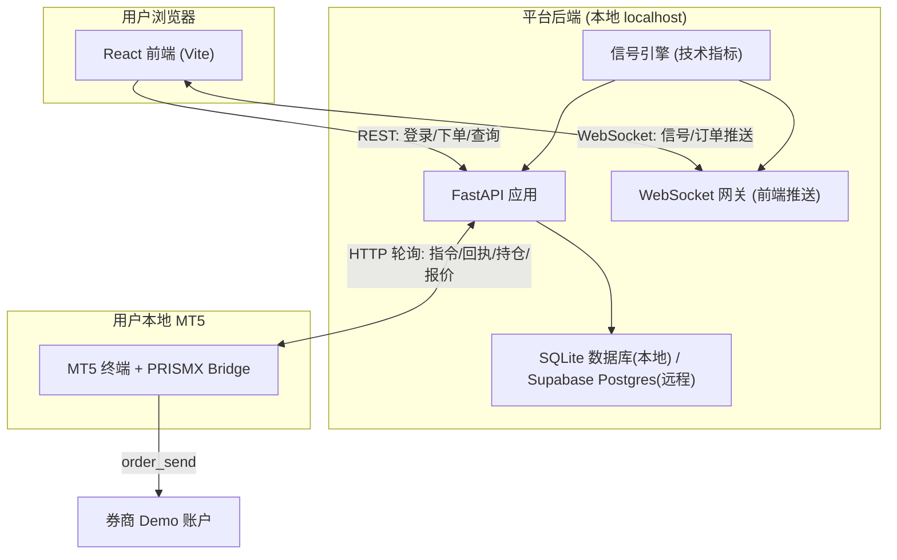
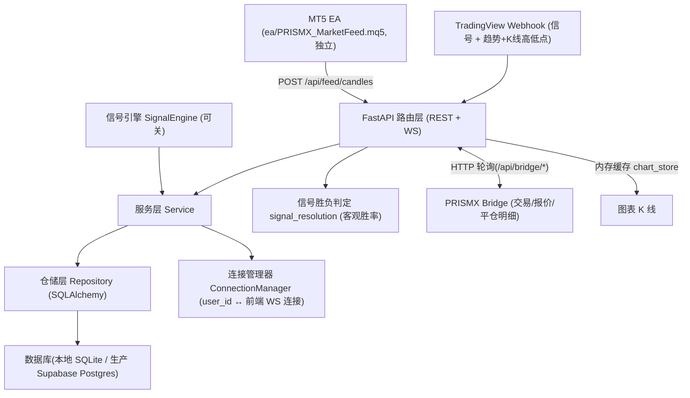

# Signal Lab（信号实验室）技术架构文档

## 1. 架构设计

### 1.1 生产部署架构(当前线上状态)

```
用户浏览器(prismxsignallab.com / prismx-signal-lab.vercel.app)
  │
  ↓  HTTPS
Vercel(前端静态托管, Vite, root: frontend/)
  │  调用 https://api.prismxsignallab.com
  ↓
腾讯云 VPS — Nginx(HTTPS 终止, Let's Encrypt 自动续期)
  │  proxy_pass → 127.0.0.1:8000
  ↓
FastAPI 应用(uvicorn + systemd 常驻,开机自启+崩溃重启)
  ├─ REST API(注册/登录/信号/趋势/下单/平仓/改单/撤单/桥接/图表/Webhook/通知/管理后台/自动仓位/情绪)
  ├─ WebSocket 网关(/ws/client 前端推送)
  ├─ 信号引擎(技术指标,每 15 秒生成信号;可关) + TradingView Webhook(信号+多周期趋势)
  ├─ 信号胜负判定(用趋势 webhook 顺带上报的 K 线高低点判 TP/SL 先触发,产出客观胜率)
  ├─ 图表行情缓存(内存,由 MT5 EA 经 /api/feed/candles 写入)
  └─ MT5 接入(唯一交易方式)
       │  PRISMX Bridge → /api/bridge/*(HTTP 轮询,多账号,开仓/平仓/改单,报价与真实平仓明细上报)
       ↓
用户本地 MT5 终端 + PRISMX Bridge.exe(扫描 terminal64.exe)
  → 真实下单执行 / 回执 / 持仓 / 报价 / 平仓成交明细上报

另有 MT5 EA(ea/PRISMX_MarketFeed.mq5)挂在任意一张图表上,
  经 /api/feed/candles、/api/feed/quotes、/api/webhook/trend 批量推 K 线/报价/趋势,
  与用户端 Bridge 无任何代码依赖、只读不下单。旧的独立喂价程序
  (feeder/chart_feeder.py)已于 2026-07-17 停用并从仓库删除,`FEED_TOKEN`
  配置项与其鉴权分支也已从后端移除,/api/feed/candles 现在只认 X-EA-Token。
```

数据流:
- **前端 ↔ 后端**: VITE_API_BASE 环境变量指向 `api.prismxsignallab.com`,REST 走 `https://`,WebSocket 自动 `wss://`
- **后端 ↔ 数据库**: Supabase PostgreSQL 17.6(Session pooler, 端口 5432, 走 IPv4;SQLAlchemy 连接池默认 15+15、`pool_pre_ping` 断连自愈,详见第 2 节「数据库连接池」)
- **后端 ↔ MT5(交易)**: 统一经 PRISMX Bridge 连 `/api/bridge/*`(HTTP 轮询,`X-Api-Token` 头认证)。原 WS 版 EA(`/ws/ea`)与轮询版 EA(`/api/ea/poll/*`)已于 2026-07-02 移除
- **后端 ↔ MT5(图表)**: MT5 EA(`ea/PRISMX_MarketFeed.mq5`,不进本仓库)挂在任意一张图表上,批量抓 K 线经 `POST /api/feed/candles`(`X-EA-Token` 头认证)写入后端内存缓存,供全体用户图表页共用。与用户端 Bridge 完全独立、只读不下单。旧的独立喂价程序 `feeder/chart_feeder.py`(`X-Feed-Token` 头)已于 2026-07-17 确认 EA 稳定运行后停用并从仓库删除,`FEED_TOKEN` 配置项一并移除

### 1.2 本地开发架构(用于本地调试)



说明:本地开发时前端通过 Vite 代理转发 `/api` 到 `localhost:8000`;VITE_API_BASE 留空则自动走代理,设值则走线上。`DATABASE_URL` 不设时默认使用本地 SQLite(`sqlite:///./prismx.db`)。

## 2. 技术说明

- 前端：React@18 + TypeScript@5 + tailwindcss@3 + Vite@5；路由用 react-router-dom@6(`BrowserRouter`),所有页面**路由级懒加载(`React.lazy` + `Suspense`)** 做代码分割;i18n 用 i18next + react-i18next 实现中英双语切换。API 地址通过 `VITE_API_BASE` 环境变量配置(生产指向 `https://api.prismxsignallab.com`,本地留空走 Vite 代理)。浏览器推送通知用 Service Worker(`public/sw.js`)+ Web Push；2026-07-15 起补上 PWA manifest(`public/manifest.webmanifest`,`display: standalone`)与 iOS 专属 meta 标签,这是 iOS 16.4+ 开放 Push API 的前提条件,详见 4.8 节说明。社区多空情绪由**后端**定时抓取并缓存(`backend/app/services/sentiment_store.py`,数据源 FXSSI,详见第 2 节"社区情绪数据源"),前端 `GET /api/sentiment` 只读缓存,每 5 分钟轮询(原 Myfxbook + Vercel Edge Function 代理方案已于 2026-07-06 废弃)。登录后主页是**仪表盘 `/dashboard`**(信号立场卡 + 执行卡 + 市场概览 + 行情表),`/app` 为信号列表页。营销主页 `/` 于 2026-07-11 做 **3D 重设计**:首屏背景是 `PrismScene`(全屏 GLSL 极光流体着色器,用 `three` + `@react-three/fiber` 渲染,`React.lazy` 懒加载;无 WebGL / 软件渲染器 / `prefers-reduced-motion` / 实测帧率 <12fps 时降级为纯 CSS 光斑(2026-07-12 加帧率哨兵,判定会话内记忆),移动端半分辨率),详见第 2 节「首页 3D 背景」与第 8 节目录结构。
- 手机返回手势：2026-07-17 起全站弹窗/确认框/下拉菜单（指标设置、下单弹窗、账户切换菜单、各类确认框、头像/通知铃铛下拉等）都用 `frontend/src/utils/useBackToClose.ts` 接管返回手势——打开时压一条历史记录占位，划返回/按 Android 返回键只关这一层，不再直接退出整页；与已有的 `PwaBackGuard`（挂载时压守卫记录、防止返回手势直接退出 PWA）通过一个模块级共享计数器/栈协调，避免两者互相误判，弹窗可以正确嵌套（先关内层再关外层）。踩过的坑与最终方案见《部署与上线进度》踩坑记录 #23。
- 后台：Python + FastAPI（REST + WebSocket 一体），uvicorn 运行；模拟信号引擎用 pandas/numpy 算技术指标；限流用 slowapi(按 IP);Web Push 用 pywebpush;Google 登录用 google-auth 校验 ID Token；加密货币支付经 NOWPayments（USDT 多链，httpx 调用，见 4.13 节）。
- 部署：前端 Vercel(自动构建+部署),后端腾讯云 VPS(Ubuntu 24.04)通过 systemd 常驻 + Nginx 反代 + Let's Encrypt HTTPS。
- 数据库：支持双模式 — 本地开发默认 SQLite(`DATABASE_URL` 未设置时);生产通过 `.env` 中 `DATABASE_URL` 指定 Supabase PostgreSQL。ORM 用 SQLAlchemy,`_migrate_columns` 做轻量迁移并自动适配类型(SQLite DATETIME ↔ Postgres TIMESTAMP)。生产用 Session pooler 连接,连接池大小与断连自愈参数走 `.env`(`DB_POOL_SIZE`/`DB_MAX_OVERFLOW`/`DB_POOL_RECYCLE`,见「数据库连接池」)。
- 认证：JWT（用户登录,密钥由环境变量 `JWT_SECRET` 提供,HS256,有效期 **2 小时**,2026-07-22 起从 1 天缩短——单纯降低前端 localStorage 里 token 一旦被 XSS 窃取后的可用窗口,不影响活跃用户,因为下面的滑动续期本来就会在用户持续操作时自动换发新 token）,并做**滑动续期**——任一 JWT 保护接口在 token 剩余有效期不足一半时,经响应头 `X-Refreshed-Token` 下发新 token,前端静默替换,活跃用户不会每天被踢下线(见 [deps.py](file:///c:/Users/Rex/Downloads/PRISMX%20SIGNAL%2014.7.26/backend/app/services/deps.py#L43-L68) 与 [client.ts](file:///c:/Users/Rex/Downloads/PRISMX%20SIGNAL%2014.7.26/frontend/src/api/client.ts#L40-L47))。Bridge 使用 per-user API Token(`X-Api-Token` 头);**Token 在数据库中只存 SHA-256 哈希**,明文仅在绑定页重置(生成)时返回一次,泄库也无法冒充 Bridge(见 [security.py](file:///c:/Users/Rex/Downloads/PRISMX%20SIGNAL%2014.7.26/backend/app/core/security.py#L103-L122))。另支持 Google 一键登录。密码规则统一 ≥8 位(注册与改密一致)。
- Bridge：Python + tkinter GUI,打包为独立 exe(PyInstaller),当前源码版本 **v1.3.16**(1.3.7 之后到 1.3.16 之间的逐版改动——已平仓交易明细漏报/延迟/金额修复、EURGBP 报价补齐、Bridge 版本上报——详见《部署与上线进度》第六节「已上线功能清单」,这里不重复;[bridge_app.py](file:///c:/Users/Rex/Downloads/PRISMX%20SIGNAL%2014.7.26/bridge/bridge_app.py#L30) 的 `APP_VERSION`,与前端下载页 [DownloadPage.tsx](file:///c:/Users/Rex/Downloads/PRISMX%20SIGNAL%2014.7.26/frontend/src/pages/DownloadPage.tsx#L13) 硬编码的展示版本一致;两处是独立硬编码,没有自动化机制检查,发布新版时需手动同步两处)。连接时扫描本机 MT5(`terminal64.exe`),对后端走 HTTP 轮询(每 1.5 秒),后端地址写死 `https://api.prismxsignallab.com`,Token 用 DPAPI 加密存盘,用户只需填 API Token(**v1.3.7 起记住 Token 后启动即自动连接**,免去每次手动点连接)。支持多账号与开仓/平仓/改单,并上报实时报价(bid/ask)与**真实平仓成交明细**(魔术号 `778899` 认领本平台开的仓位,供个人跟单胜率统计,见 [mt5_worker.py](file:///c:/Users/Rex/Downloads/PRISMX%20SIGNAL%2014.7.26/bridge/mt5_worker.py) 的 `_closed_trades_payload`)。**已执行指令结果与未回报队列均持久化到本地文件**(`~/.prismx_bridge_executed.json`、`~/.prismx_bridge_reports.json`),程序重启后不重复下单、断点续报,配合后端超时重发实现端到端幂等。**v1.3.7 桌面体验**:系统托盘最小化(`pystray`+`Pillow`,可选降级)+ 开机自启(Windows 注册表)。**Bridge 是唯一的 MT5 交易接入方式**——原 MQL5 EA 两个版本(WS 实时版 / HTTP 轮询版)已于 2026-07-02 连同 `/ws/ea`、`/api/ea/poll/*` 端点一并移除。
- 订单超时保护：PENDING 指令落库后超过 `ORDER_PENDING_TIMEOUT_SECONDS`(默认 300 秒)未执行即自动作废为 FAILED(轮询下发前拦截 + 每 10 秒后台清扫),防止桥接离线期间的陈旧指令在很久之后按过时价格成交;若桥接实际已执行、回执迟到,真实回执仍会覆盖 FAILED(以实际执行结果为准)。
- 图表行情：图表页(`/charts`)不再用 TradingView Widget,改为**自建中央行情源**。**2026-07-15 起主数据源是 MT5 EA**([ea/PRISMX_MarketFeed.mq5](file:///c:/Users/Rex/Downloads/PRISMX%20SIGNAL%2014.7.26/ea/README.md),不进本仓库,详见第 7 节末尾与《部署与上线进度》第七节)——单文件 EA 挂在任意一张图表上,按配置品种批量推 K 线(`POST /api/feed/candles`,`X-EA-Token` 头)、全站统一报价(`POST /api/feed/quotes`)、多周期趋势。旧的独立程序 `feeder/chart_feeder.py`(`X-Feed-Token` 头)已于 **2026-07-17** 确认 EA 稳定运行后停用,连同 `feeder/` 整个目录、后端 `FEED_TOKEN` 配置项与鉴权分支一并移除,`/api/feed/candles` 现在只认 `X-EA-Token`。后端用**内存缓存** [chart_store.py](file:///c:/Users/Rex/Downloads/PRISMX%20SIGNAL%2014.7.26/backend/app/services/chart_store.py)(每组合最多 500 根,进程重启即空、靠 EA 每 60 秒 backfill 自愈,不落库)存放,前端经 `GET /api/chart/history` 与 `/api/chart/latest`(均需 JWT)读取。EA 与用户端 Bridge 无任何代码依赖,只读不下单。**2026-07-17 起 K 线带成交量**(`FeedBar.v`,EA 发 MT5 的 tick_volume,默认 0)。
- 图表技术指标：图表页 2026-07-17 起支持 MA/EMA/布林带/成交量/RSI/MACD 六个常见指标,纯前端计算(`frontend/src/utils/indicators.ts`,不依赖任何图表库,只吃 OHLCV 数组吐 `(number|null)[]`,可独立单测)。为承载 RSI/MACD 这类需要独立坐标轴的副图指标,`lightweight-charts` 由 4.2.3 升级到 **5.2.0**(原生多窗格 pane,v4 没有);主图叠加指标(MA/EMA/布林带)常驻建好、开关只切换 `visible`,成交量/RSI/MACD 三个副图各占一个独立 pane、开关时动态创建/销毁(移除 series 会连带自动删除空 pane)。指标设置(周期、颜色、MA/EMA 均线条数)存进用户偏好的 `charts`/`indicatorSettings` 命名空间,云端同步;MA/EMA 支持用户自行增删均线条数(1~6 条)。悬停十字准线/触摸拖动时,图例显示悬停点对应 K 线的指标数值,松开回退显示最新值(通过 `chart.subscribeCrosshairMove` 与 2 秒报价轮询的写入时序协调实现,详见 `ChartsPage.tsx` 里 `hoveringRef` 的说明)。
- 双轨胜率追踪:**信号客观胜率**(全平台统一,`GET /api/signals/winrate`)由 [signal_resolution.py](file:///c:/Users/Rex/Downloads/PRISMX%20SIGNAL%2014.7.26/backend/app/services/signal_resolution.py) 用行情判定每条 TradingView 信号先碰到止盈还是止损(`Signal.result`:PENDING/HIT_TP/HIT_SL/STALE),与 `status`(能否下单)完全独立;**个人跟单胜率**(每用户私有,`GET /api/orders/winrate`)由 [trade_performance.py](file:///c:/Users/Rex/Downloads/PRISMX%20SIGNAL%2014.7.26/backend/app/services/trade_performance.py) 按真实平仓明细(`ClosedTrade`)聚合。详见第 2 节「信号胜负判定」与第 6 节数据模型。
- **信号胜负判定新增价格基线（2026-07-22 修复）**：`resolve_signals_with_price` 此前直接拿趋势 webhook 上报的整根 K 线高低点判定，而这根线可能早于信号创建就已经在形成（如 H1 线一开盘就在追踪、信号却是开盘后才生成），高低点会混入信号创建前、与该信号无关的价格波动，可能把巧合记成命中。新增 `Signal.baseline_high`/`baseline_low` 两列：首次观测到某个信号时只记录基线、不判定胜负；此后只有真正超出基线的新极值（信号存在期间才发生的价格行为）才计入判定。基线随每次上报单调扩张，不会漏判任何真实发生在信号创建之后的命中。属于统计口径收紧，不改变接口形状。
- 测试：`backend/tests/` 下有 12 个 pytest 文件共 **162 例**（2026-07-22 起，此前 159 例；`test_order_lifecycle.py` 新增降级账户上限、FREE 信号门槛被拒、FREE 手动下单放行三个用例，见《产品需求文档》6.24 节）——[test_order_lifecycle.py](file:///c:/Users/Rex/Downloads/PRISMX%20SIGNAL%2014.7.26/backend/tests/test_order_lifecycle.py)(18 例)、[test_token_refresh.py](file:///c:/Users/Rex/Downloads/PRISMX%20SIGNAL%2014.7.26/backend/tests/test_token_refresh.py)(4 例)、[test_trade_performance.py](file:///c:/Users/Rex/Downloads/PRISMX%20SIGNAL%2014.7.26/backend/tests/test_trade_performance.py)(13 例)、[test_simulate.py](file:///c:/Users/Rex/Downloads/PRISMX%20SIGNAL%2014.7.26/backend/tests/test_simulate.py)(16 例)、[test_trial.py](file:///c:/Users/Rex/Downloads/PRISMX%20SIGNAL%2014.7.26/backend/tests/test_trial.py)(11 例)、[test_discipline.py](file:///c:/Users/Rex/Downloads/PRISMX%20SIGNAL%2014.7.26/backend/tests/test_discipline.py)(19 例)、[test_strategy_engine.py](file:///c:/Users/Rex/Downloads/PRISMX%20SIGNAL%2014.7.26/backend/tests/test_strategy_engine.py)(41 例)、[test_strategies_api.py](file:///c:/Users/Rex/Downloads/PRISMX%20SIGNAL%2014.7.26/backend/tests/test_strategies_api.py)(14 例)、[test_candle_store.py](file:///c:/Users/Rex/Downloads/PRISMX%20SIGNAL%2014.7.26/backend/tests/test_candle_store.py)(7 例)、[test_candle_admin_settings.py](file:///c:/Users/Rex/Downloads/PRISMX%20SIGNAL%2014.7.26/backend/tests/test_candle_admin_settings.py)(4 例)、[test_quotes_store.py](file:///c:/Users/Rex/Downloads/PRISMX%20SIGNAL%2014.7.26/backend/tests/test_quotes_store.py)(4 例)、[test_chart_feed.py](file:///c:/Users/Rex/Downloads/PRISMX%20SIGNAL%2014.7.26/backend/tests/test_chart_feed.py)(11 例)。测试用独立 SQLite 库,依赖装 `requirements-dev.txt`,运行 `cd backend && python -m pytest tests/`。**Windows 本地跑测试须开 Python UTF-8 模式**:`slowapi` 初始化 `Limiter` 时用系统默认编码读 `backend/.env`,中文 Windows(GBK/cp936)会 `UnicodeDecodeError` 崩在 conftest 导入阶段(生产 Ubuntu 是 UTF-8 locale,无此问题);本地改用 `PYTHONUTF8=1 python -m pytest tests/`(或先 `set PYTHONUTF8=1`)即可。**桥接下发相关的测试须让上报账号命中合作券商锁**:券商锁默认启用(关键字 `MakeCapital`,见 4.10 节),故 `conftest.py` 的 `make_account` 与 `test_order_lifecycle.py` 的 `poll` 辅助函数统一用服务器名 `MakeCapital-Demo`(共享常量 `conftest.BROKER_SERVER`)上报——否则账号会被券商锁拒绝、不上线,指令永不下发,`test_bridge_poll_*` / `test_close_happy_path_pending` 会失败。

### 关键配置说明

以下为上线后做过的重要改动,接手维护时需了解其设计意图:

**数据库双模式** ([database.py](file:///c:/Users/Rex/Downloads/PRISMX%20SIGNAL%2014.7.26/backend/app/core/database.py#L63-L161)): `_migrate_columns` 通过 `DATABASE_URL` 前缀自动切换类型 — SQLite 用 `DATETIME`,Postgres 用 `TIMESTAMP`。`.env` 中设完整的 `postgresql://` 连接串即可切换,不设则默认本地 SQLite。

**数据库连接池** ([database.py](file:///c:/Users/Rex/Downloads/PRISMX%20SIGNAL%2014.7.26/backend/app/core/database.py)): 生产 Postgres 用 SQLAlchemy 连接池,可用连接数直接决定桥接高频轮询下的并发上限。`pool_size`(常驻)+`max_overflow`(峰值)走 `.env` 的 `DB_POOL_SIZE`/`DB_MAX_OVERFLOW`(默认各 15,合计 30),须与 Supabase Pooler 的 "Pool Size" 上限对齐。`pool_pre_ping=True` 在取用连接前探活,跨区/Pooler 断连时自动重连;`pool_recycle`(默认 1800s,走 `DB_POOL_RECYCLE`)回收空闲过久的连接。SQLite 不使用 QueuePool,以上参数自动跳过。

**前端 API 寻址** ([client.ts](file:///c:/Users/Rex/Downloads/PRISMX%20SIGNAL%2014.7.26/frontend/src/api/client.ts#L8) / [useClientSocket.ts](file:///c:/Users/Rex/Downloads/PRISMX%20SIGNAL%2014.7.26/frontend/src/store/useClientSocket.ts#L23-L35)): 通过 `VITE_API_BASE` 环境变量控制。生产设 `https://api.prismxsignallab.com`,本地留空走 Vite 代理。WebSocket 地址自动 `http→ws` / `https→wss` 转换。[vite-env.d.ts](file:///c:/Users/Rex/Downloads/PRISMX%20SIGNAL%2014.7.26/frontend/src/vite-env.d.ts) 提供 `ImportMetaEnv` 类型声明,缺乏则 `tsc -b` 报 TS2339。

**生产环境强制校验** ([config.py](file:///c:/Users/Rex/Downloads/PRISMX%20SIGNAL%2014.7.26/backend/app/core/config.py#L142-L162)): `ENV=production` 时,`config.py` 在导入期就校验两个密钥——`JWT_SECRET` 仍为默认弱值 → `raise RuntimeError`(等同认证绕过必须堵死);`WEBHOOK_SECRET` 为空 → `raise RuntimeError`(否则任何人猜到 webhook 地址即可伪造信号)。不再以数据库类型推断是否生产,避免「生产仍用 SQLite」时漏判。`EA_TOKEN` 为空**不**报错(图表没数据但不影响交易主链路)。

**CORS** ([config.py](file:///c:/Users/Rex/Downloads/PRISMX%20SIGNAL%2014.7.26/backend/app/core/config.py#L34-L46)): 精确白名单为主。`CORS_ORIGINS` 代码默认值为 `http://localhost:5173`、`http://127.0.0.1:5173`、`https://prismxsignallab.com`、`https://www.prismxsignallab.com`(注:`prismx-signal-lab.vercel.app` **不在**代码默认里,若要放行该备用域名需在 `.env` 的 `CORS_ORIGINS` 显式加上)。`CORS_ORIGIN_REGEX` 默认 `None`(已**移除**放行所有 `*.vercel.app` 的通配正则,避免任意人部署前端即可携带凭证跨域);如需放行固定预览域名,在 `.env` 显式配置精确 origin。`main.py` 还 `expose_headers=["X-Refreshed-Token"]` 供跨域前端读取滑动续期头。

**信号有效期** ([config.py](file:///c:/Users/Rex/Downloads/PRISMX%20SIGNAL%2014.7.26/backend/app/core/config.py#L48-L56)): `SIGNAL_EXPIRE_MINUTES` 默认 **10** 分钟(信号 `expire_at = created_at + 10min`,前端 `SIGNAL_LIFESPAN_MS` 与之对齐)。`ENABLE_MOCK_SIGNAL_ENGINE` 代码默认 `true`(仅供本地开发测试);**生产环境已于 2026-07-07 起设为 `false`,线上信号全部来自真实 TradingView webhook,不存在模拟信号**。

**信号胜负判定与客观胜率** ([signal_resolution.py](file:///c:/Users/Rex/Downloads/PRISMX%20SIGNAL%2014.7.26/backend/app/services/signal_resolution.py)): `Signal` 有第二条与 `status` 完全独立的状态线 `result`(PENDING/HIT_TP/HIT_SL/STALE)。信号一生成即视为"已进场",**不受 10 分钟 `status` 过期影响**,一直追踪到真正碰到止盈/止损。判定行情来自 **TradingView 趋势 webhook 顺带上报的当根 K 线高低点**(`/api/webhook/trend` 的 `high`/`low` 字段,见 4.7):`resolve_signals_with_price` 拿该品种下所有 `result=PENDING` 的信号逐一比对——同一根 K 线内止盈止损都被触及的极端情况(跳空)**保守按止损**处理。若一条信号超过 `SIGNAL_STALE_DAYS`(默认 **10** 天,[config.py](file:///c:/Users/Rex/Downloads/PRISMX%20SIGNAL%2014.7.26/backend/app/core/config.py#L58-L66))从未等到任何行情更新,由 `stale_signal_sweep_loop`(每小时)标记为 `STALE`(视为数据源中断,不计入胜率)。客观胜率 `GET /api/signals/winrate` 只统计 `source=tradingview` 的信号,分母为 `HIT_TP+HIT_SL`,PENDING/STALE 不计。**要让胜负判定跑起来,TradingView 的趋势指标必须把 K 线 high/low 一并发出(见《PineScript策略接入规范》第七节)**,否则信号永远停在 PENDING。

**图表喂价鉴权** ([config.py](file:///c:/Users/Rex/Downloads/PRISMX%20SIGNAL%2014.7.26/backend/app/core/config.py) / [chart.py](file:///c:/Users/Rex/Downloads/PRISMX%20SIGNAL%2014.7.26/backend/app/routers/chart.py)): MT5 EA 写 K 线走 `X-EA-Token` 头,与 `EA_TOKEN` 常量时间比较,不符 401;`EA_TOKEN` 未配置则拒绝所有喂价写入(图表无数据,但不影响交易主链路,故不像 `JWT_SECRET`/`WEBHOOK_SECRET` 那样在生产强制)。允许周期 `ALLOWED_INTERVALS = {"1","5","15","60","240","D"}`,须与 EA 的周期配置、前端 `ChartsPage` 的 `INTERVALS` 三处保持一致。旧的 `X-Feed-Token`/`FEED_TOKEN` 双 token 兼容分支(`_valid_ea_or_feed_token`)已于 **2026-07-17** 随 `feeder/` 一并移除。

**Web Push / VAPID** ([config.py](file:///c:/Users/Rex/Downloads/PRISMX%20SIGNAL%2014.7.26/backend/app/core/config.py#L95-L122)): 浏览器推送通知用 VAPID 密钥。私钥优先读 `VAPID_PRIVATE_KEY_DER`(urlsafe-base64 的 DER/PKCS8,直接交 pywebpush),回退旧字段 `VAPID_PRIVATE_KEY_B64`(标准 base64 PEM)。`VAPID_PUBLIC_KEY` 下发给前端订阅,`VAPID_SUBJECT` 为 `mailto:` 联系人。三者缺失则推送静默跳过(不影响其他功能)。

> **`vapid_claims` 字典必须按订阅复制（2026-07-15 修复）**：`push_dispatch.py` 的 `_webpush_one` 此前把调用方传入的同一个 `vapid_claims` 字典原样交给 `pywebpush.webpush()`——该库会把 `aud`（按 endpoint 所属推送服务的域名推导，FCM/Apple/Mozilla 三家不同）和 `exp` **原地写入**这个字典且此后不再覆盖（库自身源码注释："passed structures are mutable in python"）。`dispatch_push`/`dispatch_event_push` 在循环里对多个订阅复用同一个字典时，`aud` 会永远停在批次里第一条订阅所属的推送服务，其余落在不同推送服务上的订阅全部被 `403 BadJwtToken` 拒收（生产日志实锤，典型触发：同一用户电脑 Chrome + iPhone 混用）。且 403 不在 `_webpush_one` 的清理名单（410/404）里，会无限期静默失败。修复：`vapid_claims=dict(vapid_claims)`，每条订阅各用一份独立字典。

**社区多空情绪数据源**（[sentiment_store.py](file:///c:/Users/Rex/Downloads/PRISMX%20SIGNAL%2014.7.26/backend/app/services/sentiment_store.py)）：2026-07-06 由 Myfxbook 换成 FXSSI。原方案（Vercel Edge Function 代理抓 Myfxbook 网页）持续 502，排查确认是 Myfxbook 的 Cloudflare 反爬按生产出口 IP 的 IP/ASN 信誉拦截；改走官方 API（需账号换 session）同样被同一道墙拦（`/api/` 路径返回需执行 JS 的 Managed Challenge）；再改用无头 Playwright 也无法通过（Cloudflare 识别出 CDP 自动化特征）。三条路线依次尝试后放弃 Myfxbook，改用 **FXSSI**（fxssi.com）——该站不在 Cloudflare 后面，其"当前比例"工具页面本身对 `/api/current-ratios` 发起无需登录的 GET 请求（经浏览器抓包确认为真实接口），返回值含义与 Myfxbook 的 long/short 一致（且是多家券商的加权平均，更具代表性）。现由**后端**每 5 分钟定时抓取（纯 `requests`，无需任何伪装）+ 内存缓存，`GET /api/sentiment` 只读缓存，从不在请求路径上现抓；抓取失败时保留上一次成功值（`stale: true`），无需任何账号/密钥配置。

**API Token 存储与鉴权** ([security.py](file:///c:/Users/Rex/Downloads/PRISMX%20SIGNAL%2014.7.26/backend/app/core/security.py#L58-L122)): `generate_api_token()` 生成 `prismx_` 前缀的 32 字节随机 token,数据库 `users.api_token` 只存其 **SHA-256 哈希**(`hash_api_token`)。鉴权时把传入 token 哈希后按哈希查库,再 `secrets.compare_digest` 常量时间比较。明文仅在 `POST /api/ea/token/reset` 响应里出现一次,`GET /api/ea/token` 恒返回 `apiToken: null`。历史明文行由 [database.py](file:///c:/Users/Rex/Downloads/PRISMX%20SIGNAL%2014.7.26/backend/app/core/database.py#L38-L60) 的 `_hash_legacy_api_tokens()` 在启动时一次性原地哈希(用户侧无感,Bridge 里旧明文仍可用)。**桥接鉴权缓存**:桥接每秒发多个请求、每个都要按 token 查库鉴权是最重复的一笔 DB 开销,`bridge.py` 的 `_authenticate_cached` 按 token 哈希把已鉴权用户在进程内缓存 10 秒(命中即跳过查库),把每用户每秒的鉴权往返砍掉约一次;代价是等级变更/Token 撤销最多延迟 10 秒生效,对高频轮询可接受。

**JWT 滑动续期** ([deps.py](file:///c:/Users/Rex/Downloads/PRISMX%20SIGNAL%2014.7.26/backend/app/services/deps.py#L43-L68)): `get_current_user` 解析 token 后,若剩余有效期 < `JWT_EXPIRE_MINUTES/2`(默认 12 小时),经响应头 `X-Refreshed-Token` 下发新 token;`main.py` 的 CORS 中间件 `expose_headers=["X-Refreshed-Token"]` 使跨域前端能读到;前端 [client.ts](file:///c:/Users/Rex/Downloads/PRISMX%20SIGNAL%2014.7.26/frontend/src/api/client.ts#L40-L47) 收到即写回 localStorage。活跃用户因此不再每天被踢回登录页。

**账号在线判定** ([deps.py](file:///c:/Users/Rex/Downloads/PRISMX%20SIGNAL%2014.7.26/backend/app/services/deps.py#L32-L40)): `is_account_online` 以 `ONLINE_WINDOW = 7` 秒窗口判定(桥接每 1.5 秒轮询,留约 3 个周期容错)。`config.py` 里的 `EA_OFFLINE_TIMEOUT_SECONDS=30` 为旧 EA 遗留,现已不参与在线判定。

**Bridge** ([bridge_app.py](file:///c:/Users/Rex/Downloads/PRISMX%20SIGNAL%2014.7.26/bridge/bridge_app.py#L30)): 源码版本 `APP_VERSION = "1.3.16"`。历史:`1.3.5`(2026-07-10;修复 `mt5_worker.py` 的 `QUOTE_SYMBOLS` 漏报 EURGBP——仪表盘行情表列了 7 个品种、桥接只采集了 6 个，EURGBP 一直显示"-"，现已补齐)→ `1.3.6`(2026-07-15;修复 `_compute_stops` 在手动下单[无信号入场价]时把止损止盈静默清零的 bug,新增 `broker_rejected`/`limit_exceeded` 告警渲染到状态栏)→ `1.3.7`(同日;新增系统托盘最小化 `pystray`+`Pillow`、开机自启 `winreg` 写 `HKCU\...\Run`、记住 Token 后启动自动连接三项桌面体验改进,均为可选降级/不影响核心交易链路)→ `1.3.8`~`1.3.15`(2026-07-16;已平仓交易明细漏报/延迟/金额连环修复,根因最终定位到 `history_deals_get()` 按 MT5 服务器时间而非本地时间解读查询窗口——本地/服务器时间可相差数小时,详见《部署与上线进度》踩坑记录 #19)→ `1.3.16`(同日;`/api/bridge/poll` 上报体加 `bridgeVersion` 字段,驱动网页端「有新版本可更新」提示,见 4.8 节后的 Bridge 更新提醒说明)。**1.3.7 之后的版本历史不在本文档重复展开,权威记录见《部署与上线进度》第五、六节**。后端地址写死 `DEFAULT_BACKEND = "https://api.prismxsignallab.com"`(`_on_connect` 强制使用,不读用户输入/旧配置),界面无地址输入框。**Bridge ↔ 后端走 HTTP 轮询**(`POLL_INTERVAL = 1.5` 秒,`X-API-Token` 头)。Token 用 Windows DPAPI 加密存于 `~/.prismx_bridge.json` 的 `token_enc` 字段。**幂等与断点续报**:已执行结果缓存 `~/.prismx_bridge_executed.json`(TTL 24h,重发的同一 `clientOrderId` 只重报缓存结果、不再下单),未成功回报的结果入 `~/.prismx_bridge_reports.json` 队列下轮/重启后重试。`scan_terminals` 仅匹配 MT5(`terminal64.exe`),排除 MT4(`terminal.exe`);串行轮询多终端(规避 PyInstaller onefile 多进程限制)。关闭时:若 `pystray`/`Pillow` 均可用则默认最小化到系统托盘(托盘菜单"显示"/"退出",引擎运行中真正退出仍弹二次确认);否则(依赖缺失时的降级路径)沿用旧行为直接走退出确认。日志写 `~/.prismx_bridge.log`(RotatingFileHandler);启动即检测、之后每 10 分钟检测 GitHub 最新 release 提示更新(打包 exe 含 `--selftest` 隐藏自检,但只验证 numpy/MetaTrader5 可导入,不覆盖 `pystray`/`PIL`,需人工核对构建日志确认已打入)。此外每轮轮询上报实时报价与真实平仓成交明细(魔术号 `778899`)供个人跟单胜率统计,持仓上报同样按魔术号过滤排除非本平台仓位。

**首页 3D 背景**（[PrismScene.tsx](file:///c:/Users/Rex/Downloads/PRISMX%20SIGNAL%2014.7.26/frontend/src/components/landing/PrismScene.tsx) / [LandingPage.tsx](file:///c:/Users/Rex/Downloads/PRISMX%20SIGNAL%2014.7.26/frontend/src/pages/LandingPage.tsx)）：2026-07-11 营销主页做 3D 重设计。整页固定背景是 `PrismScene`——一块全屏 `@react-three/fiber` `<Canvas>`，跑一段自写的 GLSL 片元着色器（simplex 噪声 + domain warping + FBM 合成的极光流体，随滚动进度迁移调色板、随光标做局部涟漪扰动），**不是几何体棱镜**（组件名沿用旧命名）。降级机制（2026-07-12 起共四重）：① 无 WebGL 或 `prefers-reduced-motion` → 纯 CSS 光斑兜底（`CssFallback`）；② 挂载前探测 `UNMASKED_RENDERER_WEBGL`，命中软件渲染器（SwiftShader/llvmpipe/Basic Render Driver 等，虚拟机/远程桌面典型配置）→ 一帧都不渲染直接走 CSS 兜底（这类环境跑全屏 FBM 可能首帧就卡死）；③ 运行时帧率哨兵：挂载 2.2s 后测帧率，页面可见且 <12fps → 卸载 Canvas 切 CSS 兜底，判定写 `sessionStorage['prismx:webgl-slow']`（同会话返回首页不再重试）；`document.hidden` 时不计分（后台标签 rAF 被浏览器节流，测出 0 帧不代表设备慢）；④ 移动端（`max-width:768px`）→ 半分辨率 + 限速。`LandingPage` 用 `React.lazy(() => import('PrismScene'))` 懒加载 3D，避免拖慢首屏 TTI。其余分区（Hero/Stats/Showcase/Guard/Truths/Pricing/FinalCta/Footer）为纯 DOM + IntersectionObserver 滚动显现（`useReveal`，在 `LandingPage.tsx` 内联，**不是** `landing/useReveal.ts`），全部复用既有 `landing.*` i18n 键、未新增未翻译文案。**依赖注意**：`package.json` 里 `gsap`/`@react-three/drei`/`@react-three/postprocessing`/`postprocessing` 是早期重设计迭代残留、当前无任何 import（仅 `three` + `@react-three/fiber` 被 `PrismScene` 实际使用），可安全清理但不影响构建。

## 3. 路由定义（前端）

使用 `react-router-dom@6` 的 `BrowserRouter`,页面全部**路由级懒加载**。`/dashboard`、`/app`、`/charts`、`/bind`、`/orders`、`/upgrade`、`/account`、`/download` 由 `Protected` 守卫包裹(未登录跳 `/login`),且共用 `Layout`(顶部导航 + 移动端底部 Tab + `LiveProvider` 实时数据上下文,仅登录后挂载)。`/strategies`、`/admin`、`/simulator` 由 `AdminOnly` 进一步守卫(非 admin 重定向 `/dashboard`)。已登录访问 `/` 会重定向到 `/dashboard`(见 [App.tsx](file:///c:/Users/Rex/Downloads/PRISMX%20SIGNAL%2014.7.26/frontend/src/App.tsx#L28-L31))。

| 路由 | 组件 | 需登录 | 用途 |
|------|------|--------|------|
| / | LandingPage | 否 | 营销主页(2026-07-11 3D 重设计:`PrismScene` WebGL 极光背景 + Hero/价值三条/三步接入/风控哨兵/揭秘/定价双卡/FAQ/CTA 分区;已登录则重定向 /dashboard) |
| /login | LoginPage | 否 | 登录与注册页(含 Google 一键登录) |
| /dashboard | DashboardPage | 是 | **登录后主页**:多周期趋势立场卡(SignalHero,可上/下切换聚焦品种)+ 可执行信号卡(SignalExec)+ 市场概览(MarketOverview)+ 核心品种行情表(QuotesTable)+ 其他活跃信号(SignalOthers,最多 3 条) |
| /app | SignalsPage | 是 | 信号列表页:卡片网格 + 三组分段筛选(方向 ALL/BUY/SELL、状态 ALL/ACTIVE/EXPIRING、排序 最新/到期),筛选偏好云端同步。**当前实现无搜索框、无分组、无表格视图** |
| /charts | ChartsPage | 是 | 实时行情图表页(lightweight-charts v5 自建渲染,6 预设品种 × 6 周期,EA 喂价 2s 轮询,偏好云端同步)。**2026-07-17 起**支持 MA/EMA/布林带/成交量/RSI/MACD 六个技术指标,周期/颜色/MA·EMA 均线条数可客制化,悬停十字准线显示对应数值,详见第 2 节「图表技术指标」 |
| /bind | BindPage | 是 | 连接 MT5(API Token 管理、多账号表、逐账号品种后缀) |
| /orders | OrdersPage | 是 | 板块顺序：MT5 账户详情 → 当前持仓 → **我的交易表现**（个人跟单胜率 `PersonalWinRateCard` + 已平仓交易明细 `ClosedTradesList` 合为一个单元，**2026-07-16 起**顶部账号标签"全部账户/账户 A/账户 B..."同时驱动这两块——点一个账号，胜率百分比与下面的原始记录一起切换，数字不会不一致；默认"全部账户"，且都已限定当前仍绑定的账号,见 4.4 节）→ 自动仓位管理 → 操作记录（原订单表，分页+按日期区间筛选历史,见 4.4 节；不设日期筛选时本地对实时订单集合每页 10 条切片，设了日期筛选走后端分页）。持仓概览可平仓/改单,全部平仓需二次确认 |
| /account | AccountPage | 是 | 账户信息、修改/设置密码、通知偏好与浏览器推送订阅 |
| /download | DownloadPage | 是 | PRISMX Bridge 下载与使用教程 |
| /strategies | StrategiesPage | 是 + `role=admin` | 自定义策略页面：创建/编辑/回测 PineScript 模板策略（当前仅管理员可见,内部试用中）。详见 PRD 6.22~6.23 节 |
| /upgrade | UpgradePage | 是 | 升级 PRO 会员页（NOWPayments 加密货币支付,USDT 计价,含轮询等待） |
| /admin | AdminPage | 是 + `role=admin` | 管理者页面：运营指标、用户列表(搜索/单个改/批量改角色与等级)、合作券商锁设置。`AdminOnly` 守卫非 admin 直接重定向 `/dashboard`(仅隐藏入口,真正的边界在后端每个 `/admin/*` 接口上) |
| /simulator | SimulatorPage | 是 + `role=admin` | 历史信号回放页（当前仅管理员可见,内部试用中）。详见 PRD 6.20 节 |
| * | 重定向 | - | 未匹配路径 → / |

## 4. API 定义

### 4.1 认证

所有 REST 路由统一挂在 `API_PREFIX = /api` 下。鉴权分两套:**JWT**(前端用户,`Authorization: Bearer <jwt>`)与 **API Token**(Bridge,`X-Api-Token` 头)。下表「鉴权」列标注每个端点的要求。WebSocket 路由(`/ws/*`)不带 `/api` 前缀。

> 所有 JWT 鉴权端点都可能在响应头返回 `X-Refreshed-Token`(滑动续期,见第 2 节「JWT 滑动续期」),前端收到即静默替换本地 token。

#### 4.1 认证与账户（auth.py + account.py，均挂 `/api/auth`）

| 方法 | 路径 | 鉴权 | 说明 |
|------|------|------|------|
| POST | /api/auth/register | 公开(限流 5/min) | 邮箱+密码注册(password≥8),创建 User(生成 api_token),签发 JWT。邮箱已存在返回 400(防枚举)。**2026-07-21 起注册表单的密码输入框同步加了 `minLength={8}`**——此前只有后端校验，短密码会先打一次 422 往返才被拒绝，且旧版前端错误处理把 422 的字段级 `detail`（数组）直接当字符串抛出会显示成 `[object Object]`（见下方说明），体验上是"看不懂的报错"；现在浏览器原生表单校验在提交前直接拦下 |
| POST | /api/auth/login | 公开(限流 10/min) | 邮箱+密码登录,失败 401。**2026-07-22 起新增按邮箱维度的失败锁定**（`rate_limit.py` 的 `is_login_locked`/`record_failed_login`）：同一邮箱连续失败 8 次后锁定 5 分钟、返回 429,登录成功清零计数。此前的限流只按客户端 IP（`RATE_LIMIT_LOGIN`）,攻击者换 IP（如用代理池）就能对同一个账号无限次撞库,这层按邮箱的计数堵住了这个绕过路径,与按 IP 的限流并存、互不替代 |
| POST | /api/auth/google | 公开(限流 10/min) | Google ID Token 登录,按 email 找或建无密码用户。未配 GOOGLE_CLIENT_ID 返回 503。**2026-07-22 修复账号预劫持漏洞**：此前只要 email 能在库里找到对应用户就直接签发 JWT 登入,完全不检查这个账号是不是"密码账号"——攻击者可以抢先用受害者的邮箱 + 攻击者自己设置的密码走 `/auth/register` 注册（注册本身没有邮箱归属校验）,等真正的邮箱主人第一次点"用 Google 登录"时,系统只按 email 匹配就把他悄悄登进攻击者控制、攻击者仍握有密码的那个账号,后续攻击者可随时用密码登入接管。现在改为：命中的已有用户若 `password_hash is not None`（即已经是密码账号）,一律拒绝并返回 409,提示"该邮箱已注册密码账号,请使用密码登录",不再自动放行 |
| GET | /api/auth/me | JWT | 账户资料 + 名下 MT5 账户列表 |
| POST | /api/auth/password | JWT(限流 10/min,`RATE_LIMIT_PASSWORD`) | 改密(已有密码须验旧密码;Google 用户首次为设置密码),new_password≥8。**2026-07-22 起改密会让所有旧 token 立即失效**（见下方「会话版本」说明），响应体从 `{ ok }` 扩为 `{ ok, token }`——前端必须用返回的新 token 替换本地那份，否则连这次请求自己带的 token 都已失效，下一个请求会被 401 踢出。**同日再加限流**：此前是全站唯一没有限流的认证类写操作，已有密码时每次调用都要验旧密码，token 一旦泄露可无限次尝试猜旧密码 |
| GET | /api/auth/prefs | JWT | 读整份用户通用偏好(JSON,跨设备同步信号面板设置与图表画图层内容) |
| PUT | /api/auth/prefs | JWT | `{ namespace, data }`——**只传发生变化的那一个命名空间(如 "signals")，服务端与已存的其它命名空间合并**(2026-07-15 起,此前是整份覆盖;整份覆盖时两台设备并发改不同命名空间，后保存的会用它本地那份可能还没收到对方 WS 推送的旧数据整个覆盖掉，先保存的改动就丢了)。响应体与 WebSocket 推的 `PREFS_UPDATE`(见 4.9 节)都是**合并后的完整文档**，其它设备整份替换本地状态即可、不会丢自己持有的其它命名空间。2026-07-21 起 `data` 序列化后上限 256KB（`UserPrefsIn` 的 `field_validator`），超限 422——界面偏好/画线内容本就很小，纯防御性上限，避免整份文档被灌入超大 JSON |

注册/登录/Google 响应均为 `{ "token": string, "user": { "id", "email", "role", "plan" } }`（`role`/`plan` 见 6.1 节「用户分级」）。`GET /api/auth/me` 的账户资料同样带 `plan`。

> **前端统一拍平 422 字段校验错误（2026-07-21 修复，`frontend/src/api/client.ts`）**：FastAPI 对 Pydantic 校验失败的响应里，`detail` 是一个 `[{loc, msg, type}, ...]` 对象数组，不是普通业务错误惯用的字符串；此前 `request()` 不做区分，直接把 `detail` 塞进 `Error` 的 message，`Array.toString()` 隐式转换的结果是 `[object Object]`——任何触发字段校验（而非业务逻辑 4xx）的表单都会显示这个看不懂的错误。改为判断 `detail` 是否数组，是则取每项的 `msg` 拼接成可读文本；普通字符串 `detail`（各路由 `HTTPException(detail=...)` 手写的业务错误）不受影响，原样使用。这是全站通用的请求封装，一次修复覆盖所有接口，不需要逐个表单单独处理。

> **会话版本 / token 失效机制（2026-07-22 新增，`security.py`/`deps.py`）**：`users` 表新增 `token_version`（默认 0）；每个 JWT 新增 `tv` 字段固定该值。`get_current_user`（REST）与 `ws.py` 的 WebSocket 鉴权都会校验 token 里的 `tv` 与用户当前 `token_version` 是否一致，不一致就拒绝（401/`AUTH_FAIL`）。改密码时 `token_version` 自增一次，使改密前签发的所有旧 token（包括已经泄露、仍在别处被使用的）立即失效——这是撤销一个未过期 JWT 的唯一途径。旧 token 没有 `tv` 字段，鉴权时按 0 处理，与迁移给存量用户回填的默认值一致，不影响老会话。**已知的残留行为**：WS 的会话版本校验只在建连那一刻做一次，改密码发生时已经打开的 WebSocket 连接不会被强制断开，会在它下一次重连时才生效（不影响 REST 接口，改密瞬间就拒绝旧 token）。

#### 4.2 API Token 管理（ea.py，挂 `/api/ea`，均需 JWT）

| 方法 | 路径 | 说明 |
|------|------|------|
| GET | /api/ea/token | `{ apiToken: null, boundAccount }`——**Token 只存哈希,查询恒返回 null**;boundAccount 取第一个已上报的 MT5 账号(仅展示用) |
| POST | /api/ea/token/reset | 重置并返回**明文** api_token(旧失效,库中只存新哈希,明文仅此一次)`{ apiToken, boundAccount }` |

> 原 `/api/ea/account`、`/api/ea/suffix`、`/api/ea/status` 已随 EA 接入方式移除;
> 品种后缀改为**按账号**设置(`POST /api/bridge/accounts/suffix`),连接状态统一看桥接账号聚合在线状态。

#### 4.3 信号（signals.py）

```
GET /api/signals  (JWT) -> { "signals": Signal[] }   // 先把过期 ACTIVE 置 EXPIRED，返回最新 50 条
// FREE 等级（非实时，见 6.1 节）只返回 status=EXPIRED 的信号；PRO 不过滤（ACTIVE+EXPIRED 都有）

Signal = {
  "id": string, "symbol": string, "side": "BUY"|"SELL",
  "entry": number|null, "stopLoss": number|null, "takeProfit": number|null,
  "indicator": string|null, "status": "ACTIVE"|"EXPIRED",
  "createdAt": string, "expireAt": string|null,
  "result": "PENDING"|"HIT_TP"|"HIT_SL"|"STALE",   // 客观胜负判定，与 status 完全独立（见第 2 节）
  "resolvedAt": string|null                          // 判出胜负的时刻
}

GET /api/signals/stats  (JWT) -> { "daily": [{ "date": "2026-06-27", "count": 12 }, ...], "total": 86 }
// 近 7 天(含当天,按 UTC 日期分组)每日信号发出量,供仪表盘「信号发出量(7日)」sparkline 使用。纯查询,无副作用。

GET /api/signals/winrate  (JWT) -> {
  "hitTp": number, "hitSl": number, "pending": number, "stale": number,
  "totalResolved": number,          // = hitTp + hitSl
  "winRate": number|null            // = hitTp / totalResolved，无已判定信号时为 null
}
// 信号「客观胜率」：只统计 source=tradingview 的信号，全平台统一、与任何用户下单行为无关。
// 由 signal_resolution.py 用趋势 webhook 上报的 K 线高低点判定 result，PENDING/STALE 不计入分母。

GET /api/signals/simulate?days&risk&capital&mode  (JWT + require_admin)
// 历史信号回放（模拟器）：**当前仅管理员可用**（2026-07-17 实现后已封存，见产品需求文档 6.20 节——
// 代码/路由/权限均原样保留，只是前端入口收进了 /admin 页面最底部）。用已判定的真实信号
// （HIT_TP/HIT_SL，与 /signals/winrate 同一套分母口径）回放净值曲线；days∈[7,365]、
// risk(%)∈[0.1,3.0]、capital∈[1,1e9]、mode∈{compound,flat}，越界 422。
// 缓存键 (days,risk,mode) 按 capital=1 归一化（两种模式下净值都与本金严格线性），
// 60 秒 TTL，返回前按请求的 capital 缩放。详见 routers/signals.py 的 _simulate_normalized/_scale。
```

#### 4.4 下单 / 平仓 / 改单（orders.py，挂 `/api/orders`，均需 JWT）

三种操作共用 `Order` 模型(字段 `action` 区分 ORDER/CLOSE/MODIFY),`(user_id, clientOrderId)` 唯一约束实现幂等。**这个幂等键必须由前端在一次下单意图的整个生命周期内保持不变**（2026-07-21 修复）：此前每次提交都现生成一个新键（`clientOrderId()`），若订单已被服务端接收但前端因网络问题没收到回执、用户误以为失败而再滑一次确认，两次请求各带不同的键，`(user_id, clientOrderId)` 幂等约束对两个不同的键各自放行，会造成重复下单。改成幂等键随下单弹窗（`SlideOrderModal`/`ChartOrderModal`）的挂载生命周期固定一次（`orderIdRef`），弹窗内任何次数的重试都复用同一个键；弹窗关闭重开视为新的下单意图，才会生成新键。**2026-07-22 起三个交易端点各自新增并发兜底**（`_commit_order_or_existing`）：先查后插（check-then-insert）本身存在一个理论竞态窗口——两个带同一 `clientOrderId` 的并发请求都可能在对方提交前通过查询,但数据库唯一约束仍能保证只有一条落库,第二个请求原先会直接收到未处理的 `IntegrityError` 而 500;现在捕获该异常、回滚后重新查询并返回那条已存在的订单,行为上与直接命中幂等查询一致,不会产生真正的重复下单,只是把原本的 500 改成了正常响应。三个交易端点（`POST /orders`、`/orders/close`、`/orders/modify`）与撤单端点同批新增限流（`RATE_LIMIT_ORDER`，默认 `120/分钟`），此前这四个端点是全站唯二没有限流的写操作（另一个是账户读写类，登录/注册/webhook 均已有限流），阈值刻意设得很宽，只挡病态刷接口不影响正常手动交易节奏。

> **止损止盈方向校验的盲区（2026-07-22 修复，`SlideOrderModal.tsx`/`ChartOrderModal.tsx`）**：两个下单弹窗原来只在能拿到参考价（实时报价，或退回信号自带的 `entry`）时才校验止损/止盈是否落在正确方向（买单止损须低于现价、止盈须高于现价，卖单相反）；参考价缺失（没有实时报价、信号又没带 `entry`，`entryRef` 为 `null`）时，止损止盈校验整体短路为"不校验"，把两者整个填反也不会被前端拦下，要等指令发到 MT5 才被拒。新增一条不依赖参考价的相对关系校验：只要止损止盈都填了，买单必须止损<止盈、卖单必须止损>止盈，与是否拿得到参考价无关。

```
POST /api/orders          // 开仓 action=ORDER
Request: {
  "signalId"?: string,    // 关联信号则取其 entry/SL/TP
  "symbol": string, "side": "BUY"|"SELL",
  "volume": number,       // 0<vol≤10000，另受最小手数与按净值估算的上限约束
  "clientOrderId": string,// 前端生成的幂等键
  "mt5Login"?: string,    // 多账号时指定目标账号
  "stopLoss"?: number, "takeProfit"?: number  // 自定义则覆盖信号默认值
}
// 关联信号已过期 → 409；FREE 等级关联一个仍未过期的信号 → 403(结构性防绕过：
//   FREE 正常只能看到已过期信号，此为服务端兜底，防止拿到降级前保存的 signalId 绕过延迟)；
// 未指定 mt5Login 且有多个账号在线 → 400(需明确目标账号,避免指令滞留后作废);
// 手数越界/超净值上限 → 400；成功 → 返回 Order(status=PENDING)
// 2026-07-22 起：按净值估算的手数上限不再只在传了 mt5Login 时才生效——未传
// mt5Login 但恰好只有一个账号在线时，也用那唯一账号的净值校验（它正是桥接
// 单账号兜底路由会实际打过去的目标，见 4.5 节）。此前不传 mt5Login 会让这道
// 净值上限被完全跳过，是一处可被绕开的风控缺口；只有多个账号在线、目标账号
// 确实无法确定时才不做净值校验（会被上面那条 400 直接拒单，走不到下单）。

POST /api/orders/close    // 平仓/部分平仓 action=CLOSE
Request: { "clientOrderId", "ticket"(>0), "symbol", "side", "mt5Login"?, "volume"? }
// volume 省略或 0 = 全平；校验账号归属，不属本人 → 404
// 2026-07-21 起：部分平仓（volume>0 且 <全平）不得低于 MIN_VOLUME_PER_ORDER(0.01) → 400；
// 此前只挡了 volume<=0，低于最小手数的部分平仓会被下发到桥接，再被 MT5 拒绝，前后端各补一道

POST /api/orders/modify   // 改 SL·TP action=MODIFY
Request: { "clientOrderId", "ticket"(>0), "symbol", "side", "mt5Login"?, "stopLoss"(0=清除), "takeProfit"(0=清除) }

POST /api/orders/{order_id}/cancel   // 撤销一条尚未执行的挂单 action 不限
// 只能撤 status=PENDING 的指令，成功后置 CANCELLED；已终态(FILLED/REJECTED/FAILED/CANCELLED) → 409；
// 不属本人 → 404。注意：桥接若已把该指令发给 MT5，撤销无法追回那次执行（队列式下单模型的固有限制）

GET /api/orders?limit&offset&since&until -> { "orders": Order[], "total": number }
// 默认 limit=100 offset=0（不传参数时行为与 2026-07-15 前完全一致，供 useLive() 的
// 实时订单跟踪继续用）；limit 上限 500。since/until 按 created_at 筛选（until 用 <
// 而非 <=，前端传"选中截止日 + 1 天"实现"含当天"的直觉）。查询时先作废超时 PENDING。
// 2026-07-15 前恒返回最新 100 条、无分页/日期筛选能力，订单页现在用这组参数支持翻页
// 与按日期查历史（不设日期筛选时前端在 useLive().orders 的实时集合上本地切片，
// 每页 10 条，翻页不发请求；一旦设了日期区间才切到这个按需请求的历史数据，
// 后端也按 limit=10 分页）。

GET /api/orders/winrate?login=<可选>  (JWT) -> {
  "wins": number, "losses": number,
  "totalResolved": number,          // = wins + losses（已完全平仓的仓位数）
  "winRate": number|null,           // = wins / totalResolved
  "openPositions": number,          // 尚未平完的仓位数
  "bySymbol": Array<{ "symbol": string, "count": number }>  // 2026-07-21 新增，按 count 降序；
                                     // 只统计"已判定"（fully_closed）的仓位，进行中的不占任何品种的份额
}
// 个人「跟单胜率」：每用户私有，基于 Bridge 上报的真实平仓明细(ClosedTrade)。
// 方案 B——一个仓位分批平完(累计平仓手数≥开仓手数)才算"分出胜负"，按该仓位所有分批盈亏之和的正负判赢输。
// 只统计经本平台下单(魔术号 778899)且已 FILLED、有 mt5Ticket 的开仓。见 trade_performance.py。
// 2026-07-16 起：不传 login 时统计范围限定在「当前仍绑定」的 MT5 账号（对照 MT5Account 表，
// 已删除/换绑的旧账号自动排除，重新绑回自动恢复——数据从不删除，只是不再被选中）；
// 传 login 则进一步只看这一个账号，且该账号必须是当前绑定的，否则 404。历史遗留、未回填
// mt5_login 的订单在"全部账户"聚合时仍保留（避免老用户战绩突然消失），但选中单个账号时
// 不再兜底（没有账号信息，无法确认归属）。见 trade_performance.py::compute_personal_winrate
// 的 bound_logins/login 两个参数与 orders.py::_bound_logins。
// 2026-07-21：订单页「我的交易表现」「纪律分」两张卡片视觉重新设计（内容不变，主要是
// 呈现方式）——共用新抽出的 RadialGauge 组件（frontend/src/components/RadialGauge.tsx，
// 纯展示的 SVG 环形进度表，颜色/数值由调用方决定），胜率/纪律分总数从纯文字大字号改成
// 环形可视化；同批给「我的交易表现」加了按品种分布的小图表（堆叠横条+图例），颜色取自
// frontend/src/utils/symbolMeta.ts（原先私有在 QuotesTable.tsx 里，这次抽成共享模块，
// 全站同一品种的配色统一，不会报价表一个颜色、这里又是另一个颜色）。

GET /api/orders/closed-trades  (JWT) -> { "trades": ClosedTradeOut[] }
// 2026-07-15 新增。当前用户的真实平仓成交明细，最新在前，最多 200 条；与个人跟单胜率
// 同一份数据源(ClosedTrade)，但给逐笔记录而非聚合数字——订单页据此渲染"已平仓交易明细"
// 表格，落地"透明度"承诺不止停在一个百分比上。2026-07-16 起同样限定当前仍绑定的账号
// （与 /winrate 不传 login 时同一套过滤，见上方说明；这里没有 legacy-null 的兜底考虑，
// ClosedTrade.mt5_login 建表时就是 NOT NULL）。接口一次性返回（已过滤的）全部绑定账号的
// 记录；账号标签、单账号每页 10 条切片，2026-07-16 起由 `OrdersPage` 统一持有状态并驱动，
// `ClosedTradesList` 改为纯展示组件（此前是自己拉数据+自己管标签），因为同一个账号标签
// 现在还要驱动上方的 `PersonalWinRateCard`——两处若分别管理各自的选中状态，容易出现"胜率
// 数字与下面看到的记录对不上"的不一致，统一到一处状态、一次点击两边一起换。
ClosedTradeOut = {
  "id", "mt5Login": string,          // 2026-07-15 补上；此前接口漏传，多账号用户会看到
                                      // 所有账号的平仓记录混在一起分不清哪笔是哪个账号的
  "symbol", "side": "BUY"|"SELL",
  "closeVolume": number, "closePrice": number|null,
  "profit": number,                  // MT5 计算的真实盈亏(账户货币)，含隔夜利息与手续费
  "positionTicket": number, "dealTicket": number,
  "closedAt": string|null
}

GET /api/orders/discipline?login=<可选>  (JWT) -> {
  "total": number|null, "windowDays": number, "positions": number,
  "dimensions"?: {                   // 仅 PRO 返回；FREE 响应里整个键都不存在（后端裁剪，不是前端隐藏）
    "stopLoss": { "score": number|null, "violations": number, "samples": number },
    "volume":   { "score": number|null, "violations": number, "samples": number },
    "exit":     { "score": number|null, "violations": number, "samples": number }
  },
  "trend": Array<{ "date": string, "total": number|null }>  // 最近 30 天快照，升序，缺日不补
}
// 纪律分：回答"有没有按计划执行"，与赚不赚钱无关，纯只读统计，不产生任何交易指令。
// 账号过滤语义与上面的 /winrate 完全一致（同一套 bound_logins/login 参数）。
// 评分对象仅"已结束"的信号单仓位（累计平仓手数≥开仓手数），三个维度各自 0–100：
//   D1 止损纪律（40%）——开仓有没有带止损、后续 MODIFY 有没有把止损往亏损方向恶化超出容差、
//     有没有把止损直接删掉；D2 仓位纪律（30%）——手数是否远超同账号近期正常手数（默认 3 倍）；
//   D3 出场纪律（30%）——有没有在未到止损/止盈前手动平仓且当时是亏损。权重与阈值全部在
//   `PlatformSetting`（key="discipline"），管理后台可调，见 4.10 节。三个维度按非 None 项
//   加权归一化合成总分；某维度样本不足（如仓位纪律要求至少 5 笔历史订单打基准）记 None，
//   不参与合成。自动仓管替用户执行的 MODIFY/CLOSE（`client_order_id` 前缀 `auto_`）不算用户行为，
//   一律排除。已知局限：用户在 MT5 客户端直接手动操作（不经网页）检测不到，当作合规处理——
//   已写进接口注释与前端免责小字，不是待修的 bug。
// 每 6 小时由后台循环 `discipline_snapshot_loop`（main.py 注册）为每个近期有交易的用户
// 按账号 + 全账号聚合各 upsert 一行到 `discipline_snapshots` 表，驱动 30 天趋势线；
// 实时值本身是 API 现算，快照只为趋势，不是实时值的缓存。见 services/discipline.py。
// 2026-07-17 上线时先 `require_admin`（内部试用），同日验证完成后放开为 `get_current_user`，
// 对所有登录用户开放；FREE/PRO 的 dimensions 裁剪逻辑全程未变。

Order = {
  "id", "clientOrderId", "signalId"|null,
  "action": "ORDER"|"CLOSE"|"MODIFY",
  "symbol", "side", "volume",
  "ticket": number|null, "mt5Login": string|null,
  "status": "PENDING"|"FILLED"|"REJECTED"|"FAILED"|"CANCELLED",
  "mt5Ticket": number|null, "filledPrice": number|null, "message": string|null,
  "createdAt", "updatedAt"
}
```

下发逻辑:落库 PENDING 后等待 Bridge 轮询拉取(每 1.5 秒一次,延迟可忽略)。
超时保护:PENDING 超过 `ORDER_PENDING_TIMEOUT_SECONDS`(默认 300 秒)未执行自动作废为 FAILED(见第 2 节),前端经 `ORDER_UPDATE` 实时收到作废状态。

#### 4.5 多账号桥接（bridge.py，挂 `/api/bridge`）——PRISMX Bridge 用

| 方法 | 路径 | 鉴权 | 说明 |
|------|------|------|------|
| POST | /api/bridge/poll | API Token | 上报 `{ accounts: [...] }`(upsert MT5Account),返回待执行 `commands` + `accountLimitExceeded` + `brokerRejected`。多账号路由 + 超时重发(ack 60s 内不重发)+ 终态保护 |
| POST | /api/bridge/result | API Token | 回执 `{ clientOrderId, success, mt5Ticket?, filledPrice?, message?, login? }`。已是 FILLED/REJECTED 终态则返回 `{ ok, duplicate: true }`(幂等);超时作废的 FAILED 可被迟到的真实回执覆盖。`login` 用于兜底路由(未指定目标账号)时补记实际执行账号,供个人胜率按 (login, ticket) 匹配平仓明细 |
| POST | /api/bridge/positions | API Token | 上报 `{ data: Position[] }`,同时驱动自动仓位管理(见 4.11)。**2026-07-15 起 Bridge(v1.3.7+)在上报前就按魔术号(778899)过滤,只上报本平台开的仓位**——此前会上报账户下的全部持仓,与"只管平台开的仓"这条边界口径不一致,用户在 MT5 客户端手动开的仓也会出现在网页并能被网页误平 |
| POST | /api/bridge/quotes | API Token | 上报实时报价 `{ data: [{symbol,bid,ask,digits?,ts?}] }`,仅变化条目经 WS `QUOTES` 推给前端 |
| POST | /api/bridge/trade-history | API Token | 上报**真实平仓成交明细** `{ data: [{login,symbol,side,closeVolume,closePrice,profit,positionTicket,dealTicket,closedAt}] }`,按 `(user, dealTicket)` 唯一去重落库 `ClosedTrade`,返回 `{ ok, inserted }`。这是个人跟单胜率的数据源(即便在 MT5 客户端手动平仓也会被上报,只要仓位当初由本平台开出) |
| GET | /api/bridge/accounts | JWT | 列出名下所有 MT5 账户(`MT5Account[]`,online 按 7s 窗口判定)+ `accountLimit`(当前等级账户数上限,null=不限)+ `brokerLock`(合作券商锁展示信息,供绑定页提示) |
| DELETE | /api/bridge/accounts/{login} | JWT | 删除一个 MT5 账号(可选 `?server=`;如已换券商的旧账号)。**在线账号拒删 409**(桥接仍在上报会被下次轮询重新插回),需先断开 Bridge;不存在 404 |
| POST | /api/bridge/accounts/suffix | JWT | 为指定账号设后缀 `{ login, symbolSuffix }` |

`commands` 每条:`{ clientOrderId, action, login, symbol(+后缀), side, volume, ticket, entry, stopLoss, takeProfit }`。

**`/api/bridge/poll` 的两道账号闸门(2026-07-05)**:上报的账号先过合作券商锁(服务器名不含配置关键字 → 拒绝,见 4.10 节),再过等级账户数上限(见 6.1 节 `plans.py`);两类被拒的 login 分别放进响应的 `accountLimitExceeded`/`brokerRejected` 数组。**Bridge v1.3.6 起会读取这两个字段并渲染到状态栏**(黄点 + `⚠` 告警文字),此前版本(≤1.3.5)不读取、只能从网页「连接 MT5」页看到账户没出现/离线来间接发现——这是 2026-07-15 补的体验修复,不再是有意保留的范围边界。

> **账户数上限须同时约束已绑定的旧账号（2026-07-22 修复）**：`_upsert_account` 原来的账户数上限判断只在 `row is None`（**新账号**）分支里生效——已经绑定过的老账号完全不受限。一个连了多个账号的 PRO 用户降级到 FREE（上限 1 个）后，其余账号在轮询里照样 upsert 成功、照样刷新心跳、照样接单，等于降级完全没有生效。改成每次轮询先按 `login` 升序取出该用户全部已绑定账号，只保留"前 N 个"（N = `max_mt5_accounts(user.plan)`）继续 upsert，其余的连 upsert 都不进入、直接归进 `accountLimitExceeded`——不再刷新心跳，与被合作券商锁拒绝的账号一样在数秒内转离线、不再收到任何指令。**保留哪些账号按"绑定 login 升序"而非"本次上报顺序"**：如果按上报顺序取前 N 个，桥接每次上报的账号顺序若有变化，被保留/被踢的账号会跟着抖动；按绑定时就固定的 login 排序则每次轮询结果一致。`account_limit is None`（PRO）时这道闸门完全不生效，原有的"新账号超额拦截"逻辑不变。

**`/api/bridge/positions` 同时驱动自动仓位管理(2026-07-05,PRO 专属)**:每次持仓上报都会对该用户的持仓跑一遍规则引擎(`app/services/auto_manage.py`),需要动作时把 `MODIFY`/`CLOSE` 指令写入普通订单队列,下一拍由该用户的 Bridge 正常拉取执行、正常回执,跟手动操作走同一条链路,不是独立通道。详见 4.11 节。

**平仓/改单的魔术号校验（2026-07-21 加固，`mt5_worker.py::_close_position`/`_modify_position`）**：此前这两个函数只按 `ticket` 定位持仓就直接执行，不像持仓上报（上文）与自动仓管那样校验"只碰本平台开的仓"（魔术号 778899），是纵深防御上的一处遗漏——实际风险很低（Bridge 只连用户自己电脑上的自己账户，威胁模型里没有第三方能直接对着某个用户的 Bridge 发指令），但补上与持仓上报一致的校验后，即便有人手工构造请求也动不了用户在 MT5 客户端手动开的仓。**这项改动只在 Bridge 源码里生效，需要打包发布新版 `PRISMX-Bridge.exe`、用户升级后才真正生效**，不随后端 `systemctl restart prismx` 或前端 Vercel 部署自动生效，见《部署与上线进度》第四节打包流程。

#### 4.6 多周期趋势（trends.py，挂 `/api/trends`，需 JWT）

```
GET /api/trends -> { "trends": [{ "symbol", "timeframes": {"M5":"UP",...}, "updatedAt" }] }
```

趋势快照每个品种一条(后来的覆盖前面的),由 TradingView 指标经 `/api/webhook/trend` 推送(见 4.7),
前端信号面板据此渲染多周期箭头与市场情绪条。

#### 4.7 TradingView Webhook（webhook.py）

```
POST /api/webhook/tradingview   // 无 JWT/Token，靠 body 内 secret 校验，限流 60/min
Request: { "secret", "symbol", "side", "entry"?, "stopLoss"?, "takeProfit"?, "strategy"?, "id"? }
// secret 与 WEBHOOK_SECRET 常量时间比较，不符 401；带 id 且 external_id 已存在则去重
Response: { "ok": true, "deduped": boolean, "id": string }
```

落库后广播前端 `SIGNAL_NEW` 并触发 Web Push 分发(线程池执行,不阻塞事件循环)。详见《PineScript策略接入规范》。

```
POST /api/webhook/trend   // 多周期趋势推送，同样靠 body 内 secret 校验，限流 120/min
Request: { "secret", "symbol", "trends": {"M5":"UP"|"DOWN"|"FLAT", ...}, "high"?, "low"?, "id"? }
// 手动读原始 body 解析(TradingView 发 text/plain，可从混杂文本里抠第一个 {...})；upsert 覆盖该品种快照后广播 TREND_UPDATE
// 若带上当根 K 线的 high 和 low(两者都要有)，会顺带调用 resolve_signals_with_price 判定该品种下
//   所有 result=PENDING 信号是否已命中止盈/止损——这是「信号客观胜率」的唯一行情来源(见第 2 节)。
//   两者缺其一则只更新趋势、不判胜负，信号会一直停在 PENDING 直到 SIGNAL_STALE_DAYS 后被扫成 STALE。
Response: { "ok": true, "symbol": string }
```

> ⚠️ 运营关键点:要让信号胜率系统真正跑起来,TradingView 的**趋势指标必须在 alert 里带上当根 K 线的 `high`/`low`**(见《PineScript策略接入规范》第七节的模板)。否则趋势能更新、但所有信号永远停在 PENDING,胜率接口恒为 `winRate: null`。

#### 4.8 通知与 Web Push（notifications.py，挂 `/api/notifications`）

| 方法 | 路径 | 鉴权 | 说明 |
|------|------|------|------|
| GET / PUT | /api/notifications/prefs | JWT | 读/写通知偏好 `{ enabled, selected_categories[], selected_symbols[], event_types[] }`(白名单模式)。**PUT 时 `enabled=true` 需要非 FREE 等级(403),`enabled=false` 任何等级都放行**(降级用户不会被锁在"开"状态)。`event_types` 传入值会按已知集合过滤未知项。`selected_symbols` 为 2026-07-16 新增字段,见下方「策略 × 品种双维度过滤」说明 |
| GET | /api/notifications/indicators | JWT | 现有信号的指标类别去重列表,供前端勾选 |
| GET | /api/notifications/symbols | JWT | 2026-07-16 新增。当前**活跃**品种去重列表,供前端"按品种"筛选勾选——数据源是 `quotes_store.get_active_symbols()`,与仪表盘英雄卡/报价表/图表选择器同一份(EA 正在推送的品种),**不是**历史 `signals` 表里出现过的所有品种。这个区别很关键:最初实现直接查 `Signal.symbol` 去重,结果列表里堆满了 EA 早已不再配置的历史/测试品种(AAPL、VIX、SPCX 等),改成读活跃品种后自动只剩 EA 真正在推的那几个,且随 EA 增删品种自动跟着变 |
| POST | /api/notifications/push/subscribe | JWT | 订阅推送 `{ endpoint, keys{p256dh,auth} }`。**FREE 等级 403**。2026-07-21 起 `endpoint` 上限 1024 字符、`p256dh`/`auth` 各上限 256 字符（真实 Web Push 密钥远小于此，纯粹防御性上限，避免任意大字符串占用存储） |
| POST | /api/notifications/push/unsubscribe | JWT | 取消订阅 |
| GET | /api/notifications/push/vapid-public-key | 公开 | `{ publicKey }`(前端订阅用) |

> **事件类通知（2026-07-15 新增，2026-07-18 补充 `strategy_signal`）**：`selected_categories`（信号指标类别白名单，控制"新信号"推送）与 `event_types`（账户/交易事件白名单）是两套独立设置，落在 `NotificationPref` 的两个不同列上。`event_types` 取值见 `push_dispatch.py` 的 `EVENT_TYPES`：`order_filled`（订单成交）/ `order_rejected`（订单被拒绝）/ `auto_manage`（自动仓管触发）/ `bridge_offline`（Bridge 掉线）/ `strategy_signal`（自定义策略命中，生成个人信号）。此前推送只覆盖"新信号"一种，这几类账户/交易/策略层面的事件全是静默的。触发点：`order_filled`/`order_rejected` 在 `bridge.py` 的 `bridge_result` 里（跳过自动仓管生成的指令，避免和 `auto_manage` 通知重复）；`auto_manage` 在 `auto_manage.py` 的 `evaluate_positions` 里、等 `db.commit()` 成功后才真正发送（避免通知了没真正发生的事）；`bridge_offline` 在 `bridge.py` 的 `_push_accounts_status_if_changed` 里，只在"确实在线过又变空"时触发，不误报从未连接过的用户；`strategy_signal` 在 `strategy_engine.py` 的 `evaluate_new_candle()` 里，紧跟在 `STRATEGY_SIGNAL` WS 推送之后，只发给触发它的那一个策略主人。这几类都走单用户推送 `dispatch_event_push`/`dispatch_event_push_async`（`push_dispatch.py`），与信号推送 `dispatch_push` 的多用户扇出是两条独立路径，共享 `_webpush_one` 这个最底层的单条推送辅助函数。

> **策略 × 品种双维度过滤（2026-07-16 新增）**：`selected_categories`（策略/指标类别）与新增的 `selected_symbols`（品种）是两条独立白名单，按**"与"关系**联合过滤——一条新信号必须两边都命中才推送（例如只勾了「AIFT + 黄金」，AIFT 发的欧美信号、云指标发的黄金信号都不会推）。两个维度都支持哨兵值 `"__ALL__"`（前后端各自定义同名常量，`push_dispatch.py` 与前端 `utils/notifications.ts` 的 `ALL_SENTINEL` 须保持一致）表示"不限"，勾选后该维度永远命中，包括以后 EA 新增的品种——这也是「品种」维度不采用"展开当前活跃品种列表"而是用哨兵值实现全选的原因：展开列表会在 EA 新增品种时过时，哨兵值不会。匹配逻辑在 `push_dispatch.py` 的 `_matched_user_ids`：`ALL_SENTINEL in selected or value in selected`，对类别、品种各判一次，两个都为真才收进推送名单。开启通知时若某维度白名单为空，前端默认填入 `[ALL_SENTINEL]`（而非展开当前列表），与"开启即默认给我发通知"的既有交互习惯（见上方 `notifUnsupported` 那段说明）保持一致。
>
> **通知入口重构（2026-07-16）**：此前通知设置只有账户页一个入口，用户容易忘记或找不到。新增顶部头像旁的铃铛图标（`NotificationBell.tsx`）——不打开弹层时用圆点颜色表达状态（灰=未开、紫=已开且本设备已授权、黄=已开但本设备未授权/环境不支持），点开是个小弹层：主开关 + 设备授权提示 + 跳转账户页完整设置的链接（`/account#notifications`，账户页监听 `location.hash` 滚动定位）。仪表盘新增 `NotifDeviceBanner.tsx`：只在"账号已开通知但本设备未授权推送"这一种需要用户行动的场景下出现在页面顶部，本次会话内可关闭（`sessionStorage`），平时不占任何布局空间。铃铛弹层与账户页的主开关最终都落到 `utils/notifications.ts` 的共享 `enableNotifications`/`disableNotifications`，避免两处各写一份、行为跑偏；这个共享函数内部**必须先同步发起权限申请、再去取当前偏好**（细节与 iOS 踩坑见 8 节目录结构里 `utils/` 那行的说明）。
>
> **PWA / iOS 推送前提条件（2026-07-15 修复，`ab414b0`）**：iOS 只对"从主屏幕以独立模式启动"的 Web App 开放 Push API（16.4+）；此前项目没有 `frontend/public/manifest.webmanifest`、没有 `display: standalone`、没有 `apple-touch-icon`，"添加到主屏幕"生成的只是 Safari 书签，这种模式下 `Notification`/`PushManager` 根本不存在，无论账号开关如何设置通知都不可能出现。补上 manifest（`display: standalone`）与 `index.html` 的 `apple-mobile-web-app-*` meta 标签后，iOS 用户需**重新**添加主屏幕图标（旧图标是无 manifest 时生成的，本质仍是书签）才会生效。
>
> **通知开关账号级、推送订阅设备级（2026-07-15 修复）**：`NotificationPref.enabled` 存在后端、跨设备同步；但一条 `PushSubscription` 只在用户点开关的那一台设备的浏览器里创建。在电脑上开启后，手机端开关跟着同步显示"已开启"，但手机从未订阅、永远收不到推送。修复分两层：① `frontend/src/utils/push.ts` 新增 `ensurePushSubscription()`，在浏览器通知权限已授予的前提下静默补齐/重新上报本设备订阅；`Layout.tsx` 在每次进入已登录页面时调用它（仅当账号开关为开），不会弹出权限请求，纯自愈；② `sw.js` 新增 `pushsubscriptionchange` 监听，浏览器自行轮换订阅（Chrome 常见）时用同一把 `applicationServerKey` 立即重订阅（Service Worker 内没有 JWT，新订阅的上报仍要等用户下次打开站点触发①）。
>
> **前端不再把订阅失败当成功**：`AccountPage.tsx` 此前 `subscribePush()` 拿不到 Service Worker 注册（比如 iOS 非独立模式）会静默返回 `null`，但开关仍翻成 ON、偏好仍落库——用户看到"已开启"却永远收不到通知。现在开启前先用 `pushSupported()` 判断环境，不支持则用 `account.notifUnsupported` 的中英双语文案直接拒绝；账号开关已开但本设备浏览器权限未授予时，页面常驻 `account.notifDeviceHint` 提示。同时把"白名单为空 = 什么都不推"这条隐性规则的坑也堵上：开启时若 `selected_categories`/`event_types` 为空，前端默认全选（用户仍可再取消勾选）。

#### 4.9 WebSocket 通道（ws.py，无 `/api` 前缀）

前端通道 `/ws/client`（JWT 鉴权）：连接后客户端发首帧 `{ "type":"AUTH", "token":"<jwt>" }`(token 不放 URL,避免被代理日志记录;为兼容旧客户端仍接受 query 参数 `?token=` 作回退),失败回 `AUTH_FAIL`。**WS 鉴权失败只停止重连、不清除登录态**——登录态是否失效仅由 REST 的 401 决定,避免 WS 协议/部署不一致把用户误踢回登录页。**2026-07-22 起建连时同步校验会话版本**（`token_version`/`tv`，见 4.1 节「会话版本」说明）——改密码后失效的旧 token 无法再建立新的 WS 连接，只是已经打开的连接不会被强制断开。连接建立即补推最近一次持仓与报价快照。服务端推送类型:
```
{ "type": "AUTH_OK", "userId": string }
{ "type": "AUTH_FAIL", "reason": string }
{ "type": "SIGNAL_NEW", "data": Signal }
{ "type": "SIGNAL_EXPIRED", "data": { "id": string } }
{ "type": "ORDER_UPDATE", "data": Order }
{ "type": "ACCOUNTS_STATUS", "data": { "onlineLogins": string[] } }
{ "type": "POSITIONS", "data": Position[] }
{ "type": "QUOTES", "data": [{ "symbol", "bid", "ask", "digits"? }] }
{ "type": "TREND_UPDATE", "data": { "symbol", "timeframes", "updatedAt" } }
{ "type": "PREFS_UPDATE", "data": <用户偏好 JSON> }
```

> `PREFS_UPDATE`（2026-07-07）：`PUT /api/auth/prefs` 保存成功后立即广播给该用户的其他在线连接，让图表画线等偏好跨设备（如手机 + 电脑同时开着）实时同步，不必等下次轮询/刷新。

> 原 EA 通道 `/ws/ea` 与 `EA_STATUS` 推送已随 EA 接入方式移除;连接状态统一由
> `ACCOUNTS_STATUS`(桥接账号聚合在线状态)表达。

> **账户/交易/策略事件 Web Push（2026-07-15，2026-07-18 补充 `strategy_signal`）**：WS 推送只在前端页面打开时才看得到，五类账户/交易/策略事件（`order_filled`/`order_rejected`/`auto_manage`/`bridge_offline`/`strategy_signal`，见 4.8 节 `event_types`）额外经浏览器 Web Push 单独通知，页面不在前台也能收到。触发点分散在各自业务代码里而非集中的 WS 分发点：`order_filled`/`order_rejected` 在 `bridge.py` 的 `bridge_result` 里（跳过自动仓管生成的指令，避免和 `auto_manage` 通知重复）；`auto_manage` 在 `auto_manage.py` 的 `evaluate_positions` 里等 `db.commit()` 成功后才发；`bridge_offline` 在 `bridge.py` 的 `_push_accounts_status_if_changed` 里，只在账号「确实在线过又变离线」（`previous and not online`）时触发一次，不会对从未连接过的账号误报；`strategy_signal` 在 `strategy_engine.py` 的 `evaluate_new_candle()` 里，紧跟在 `STRATEGY_SIGNAL` WS 推送之后。

> **`SIGNAL_NEW` 按等级过滤（2026-07-05）**：新信号生成时只广播给实时等级
> （非 FREE）的在线用户（`app/services/signal_broadcast.py` 的
> `broadcast_signal_new_realtime`）；FREE 用户要等信号过期那一刻才会第一次
> 收到同一条 `SIGNAL_NEW`（此时已带上最终状态），由信号过期扫描循环
> （`signal_expiry_loop`）触发 `broadcast_signal_new_free_tier`。同一逻辑
> 也套用在 Web Push 派发上（`push_dispatch.py` 的 `_matched_user_ids` 按
> `can_use_push(plan)` 过滤）。见 6.1 节「用户分级」。

## 4.10 管理后台（admin.py，挂 `/api/admin`，均需 JWT + `role=admin`）

`require_admin` 依赖挂在每个端点上，非 admin 一律 403。

| 方法 | 路径 | 说明 |
|------|------|------|
| GET | /api/admin/users | 用户列表：邮箱模糊搜索 + plan/role 过滤 + 分页，返回每个用户的 MT5 账户数 |
| PATCH | /api/admin/users/{user_id} | 改单个用户的 role/plan/planExpiresAt/planNote；每个实际变化的字段各写一条 `AdminAuditLog` |
| PATCH | /api/admin/users/bulk | 批量改一批用户（`{ userIds: string[], ...同上字段 }`），逻辑与单个 PATCH 完全一致，只是对每个目标各跑一遍；**必须注册在 `/users/{user_id}` 之前**，否则 "bulk" 会被参数化路由当成 user_id 吃掉 |
| GET / PUT | /api/admin/settings | 合作券商锁设置：`{ brokerLockEnabled, brokerPatterns[], brokerDisplayName, brokerReferralUrl }`；开锁但关键字为空返回 400；PUT 每个实际变化的键各写一条审计日志（`field` 前缀 `setting:`） |
| GET | /api/admin/metrics | `{ totalUsers, dau, wau, planCounts, signupsLast7d[] }`，`dau`/`wau` 按 `last_active_at` 落在 24h/7d 窗口内计数 |

合作券商锁的实际读取层是 `app/services/settings_store.py`（30 秒 TTL 进程内缓存，管理员保存时 `invalidate_settings_cache()` 主动失效；未写入的键回落到 `BROKER_DEFAULTS` 代码默认值——当前默认**已启用**，关键字 `["MakeCapital"]`）；执行位置见 4.5 节 `bridge_poll` 的说明。

**订阅定价设置**（2026-07 中旬新增）：

| 方法 | 路径 | 说明 |
|------|------|------|
| GET | /api/admin/pricing | 读取当前定价：月付/年付价格、促销开关与折扣百分比/角标/截止时间 |
| PUT | /api/admin/pricing | 保存定价；整份覆盖，写一条 `field="setting:pricing"` 的审计日志（不逐字段拆分，因为定价字段总是一起改） |

读取层是 `settings_store.py` 的 `get_pricing_settings`/`save_pricing_settings`/`invalidate_pricing_cache`，与合作券商设置**分开的独立缓存**（同样 30 秒 TTL），未写入时回落 `PRICING_DEFAULTS`（月付 $49、年付 $470、促销关闭）。`GET /api/payments/plans`（公开，见 4.13 节）读取同一份数据算出用户实际看到的价格。

**免费试用设置**（2026-07-17 新增，见《产品需求文档》6.19 节）：

| 方法 | 路径 | 说明 |
|------|------|------|
| GET | /api/admin/trial | 读取当前试用设置：`{ trialEnabled, trialDays }` |
| PUT | /api/admin/trial | 保存试用设置；`trialDays` 校验范围 1–90（Pydantic `ge=1, le=90`），整份覆盖，写一条 `field="setting:trial"` 的审计日志 |

读取层是 `settings_store.py` 的 `get_trial_settings`/`save_trial_settings`/`invalidate_trial_cache`（key=`"trial"`，与定价/券商锁各自独立缓存），未写入时回落 `TRIAL_DEFAULTS`（关闭，7 天）。领取端点见 4.13 节。

**纪律分参数设置**（2026-07-17 新增，见《产品需求文档》6.21 节）：

| 方法 | 路径 | 说明 |
|------|------|------|
| GET | /api/admin/discipline | 读取当前纪律分参数：`{ windowDays, weightStop, weightVolume, weightExit, slTolerancePct, volumeMultiple, volumeHistoryMin }` |
| PUT | /api/admin/discipline | 保存参数；三个权重之和必须 > 0，否则 400；整份覆盖，写一条 `field="setting:discipline"` 的审计日志 |

读取层是 `settings_store.py` 的 `get_discipline_settings`/`save_discipline_settings`/`invalidate_discipline_cache`（key=`"discipline"`，独立缓存），未写入时回落 `DISCIPLINE_DEFAULTS`（窗口 90 天，权重 40/30/30，止损容差 10%，仓位违规倍数 3.0，仓位基准最少 5 笔历史）。用户端读取见 4.4 节 `/orders/discipline`。

**K 线历史保留策略设置**（2026-07-18 新增，见《产品需求文档》6.22 节）：

| 方法 | 路径 | 说明 |
|------|------|------|
| GET | /api/admin/candle-history | 读取当前保留策略：`{ m1RetentionDays }` |
| PUT | /api/admin/candle-history | 保存保留天数（Pydantic `ge=1, le=365`），写一条 `field="setting:candle_history"` 的审计日志 |

读取层是 `settings_store.py` 的 `get_candle_settings`/`save_candle_settings`/`invalidate_candle_cache`（key=`"candle_history"`，独立缓存），未写入时回落 `CANDLE_DEFAULTS`（1 分钟线保留 30 天）。只影响 1 分钟线的清理任务（见 4.12 节），其余周期不受此项约束、永久保留。

**自定义策略平台设置**（2026-07-18 新增，见《产品需求文档》6.22 节）：

| 方法 | 路径 | 说明 |
|------|------|------|
| GET | /api/admin/strategy-settings | 读取当前设置：`{ maxStrategiesPerUser, proOnly }` |
| PUT | /api/admin/strategy-settings | 保存设置（`maxStrategiesPerUser` 范围 1–50），写一条 `field="setting:strategy"` 的审计日志 |

读取层是 `settings_store.py` 的 `get_strategy_settings`/`save_strategy_settings`/`invalidate_strategy_settings_cache`（key=`"strategy"`，独立缓存），未写入时回落 `STRATEGY_DEFAULTS`（每用户最多 3 个策略，`proOnly=True`）。用户端读取见 4.14 节。

## 4.11 自动仓位管理（automation.py，挂 `/api/automation`，均需 JWT，PRO 专属）

| 方法 | 路径 | 说明 |
|------|------|------|
| GET | /api/automation/settings | 读取当前用户的自动仓位管理设置（任何等级都可读，供前端渲染锁定态） |
| PUT | /api/automation/settings | 保存设置；`enabled=true` 需要 PRO（403），`enabled=false` 任何等级都放行（避免降级用户被锁在"开"状态） |

```
AutoManageSettings = {
  enabled, beEnabled, beTriggerR, trailEnabled, trailTriggerR, trailDistanceR,
  ptpEnabled, ptpTriggerR, ptpFraction
}
```

规则引擎 `app/services/auto_manage.py` 的 `evaluate_positions(db, user_id, positions)` 由 `bridge.py` 的 `bridge_positions` 端点调用（见 4.5 节），不是独立轮询任务；`_is_eligible` 做 30 秒 TTL 的资格缓存，非 PRO 或未开启的用户零额外数据库开销。三条规则（保本/追踪止损/分批止盈）均以 R 为单位（R = 该仓位开仓时的止损距离，首次见到该仓位时快照 `entry`/`initial_sl` 到 `AutoManagedPosition`，止损后续被移动不影响 R 的分母）。只管理通过 PRISMX 下单开出的仓位（按 `Order.mt5_ticket` 匹配平台持仓），止损只朝有利方向移动，开仓无止损的仓位（`risk` 为空/0）直接跳过。

> **止损后补的仓位不再被永久跳过（2026-07-21 修复）**：R 的快照只在**首次见到某个仓位**时发生——若开仓那一刻止损还没挂上（例如成交与挂止损之间存在时间差），`risk` 被记为 `None`，此后该仓位每次上报都会命中"开仓无止损，R 无定义"这条跳过分支，哪怕止损后来真的补上了也不会重算，这个仓位从此永远不受保本/追踪止损管理。修复：非首次见到的仓位，只要 `risk` 仍未定义且这次上报的 `stopLoss` 已经非零，就补算一次 `risk = abs(entry - current_sl)` 并回填 `initial_sl`；已经定义过的 `risk` 不会被后续的手动改止损影响（它是开仓时刻的风险基准，不是"当前止损距离"）。

**限制**：只有下一次 `bridge_positions` 上报（间隔约 1.5~3 秒，取决于 Bridge 轮询节奏）真正带着已挂好的止损值时，这条补算逻辑才会被触发——若某个仓位开仓后一直不设止损，仍然会一直停在"跳过"状态，这是设计上的合理行为（R 无法定义），不是这次修复要解决的问题。

## 4.12 图表行情（chart.py，写入无前缀路由、读取挂在 `/api` 下）

图表页不用第三方 Widget,K 线来自**自建中央 MT5 EA 喂价源**。写入端(EA)用 `X-EA-Token` 头鉴权(不是用户,无 JWT);读取端(前端)复用站内 JWT 登录态。数据只在**后端内存**(`chart_store.py`),不落库,进程重启即空、靠 EA 每 60 秒 backfill 自愈。

| 方法 | 路径 | 鉴权 | 说明 |
|------|------|------|------|
| POST | /api/feed/candles | EA Token(`X-EA-Token`) | EA 上报 K 线 `{ mode: "backfill"\|"tick", series: [{symbol, interval, bars:[{t,o,h,l,c,v}]}] }`。`backfill` 整段替换该组合、`tick` 合并最新几根;`interval` 不在 `{1,5,15,60,240,D}` 内的忽略。**`v`(成交量,2026-07-17 新增)默认 0**。token 不符或未配置 → 401 |
| GET | /api/chart/history | JWT | `?symbol&interval&limit(≤500)` → `{ symbol, interval, bars:[{t,o,h,l,c,v}] }`;`interval` 非法 → 400 |
| GET | /api/chart/latest | JWT | `?symbol&interval` → 该组合最新一根 bar(或 null) |

> 内存缓存每个「品种×周期」最多 `MAX_BARS=500` 根。可用组合由 EA 的 `InpSymbols` 决定(见第 8 节 `ea/`),前端 `ChartsPage` 预设 6 品种(XAUUSD/XAGUSD/USOIL/EURUSD/GBPUSD/USDJPY)× 6 周期(对应 code `1/5/15/60/240/D`)并每 2 秒轮询 `/chart/latest` 增量刷新;客户端侧同样按 `MAX_CLIENT_BARS=500` 截断累积的 K 线历史(`ChartsPage.tsx` 的 `candlesRef`),避免长时间开着页面导致内存无限增长。**旧的独立喂价程序 `feeder/chart_feeder.py`(`X-Feed-Token` 头)已于 2026-07-17 停用并从仓库删除**,`FEED_TOKEN` 配置项与双 token 兼容分支一并移除。

> **时间轴与十字准线时区（2026-07-15）**：K 线时间戳后端存储/接口传输始终是真 UTC（EA 归一化），前端展示层固定转换为 UTC+8。`lightweight-charts` 的坐标轴刻度与十字准线悬停时间是**两套独立的格式化配置**——`timeScale.tickMarkFormatter` 只管坐标轴刻度，`localization.timeFormatter` 才管鼠标悬停时显示的精确时间，未设置 `localization.timeFormatter` 时默认按浏览器本地时区格式化。踩过这个坑：早期只设了前者，坐标轴显示 UTC+8 但悬停时间仍是本地时区，两者对不上；现在 `ChartsPage.tsx` 用同一个 `fmtChartTime()` 函数同时喂给这两个配置项，从结构上保证二者永远一致。UTC+8 角标（`charts.utcBadge`/`utcHint`）渲染在图表容器正下方（紧邻免责声明行），不放在顶部品种/周期控制条里,避免被其它控件挤得不显眼。

> **K 线历史入库（2026-07-18 新增，见 services/candle_store.py 与《产品需求文档》6.22 节）**：`POST /feed/candles` 在写入上面这份内存缓存的同时，把这批 bar 里"已经走完（收盘）"的部分**额外持久化到数据库**（新表 `candles`），与内存缓存完全独立、互不依赖——内存缓存继续负责图表实时画图（重启即空），数据库这份是给策略回测/更长回看用的长期历史。判定一根 bar 是否已收盘用**双重判定**（2026-07-21 改，见下方"喂价端时钟纠偏"）：① 绝对判定 `t + INTERVAL_SECONDS[interval] <= now`；② 相对判定——同一批里存在时间戳更晚的 bar，说明喂价端已经在形成更新的一根，这一根必然已经走完，不依赖任意一端的绝对时钟。满足任一条件即算收盘；一整批里一根都不满足时打 WARNING 日志（`persist_closed_bars: ... none are closed yet`）。对 `(symbol, interval, t)` 做存在性检查，已存在则跳过，避免 EA 每 60 秒一次的 backfill 重复插入。**只有 1 分钟线设保留期**（默认 30 天，管理后台可调，见 4.10 节），其余周期永久保留；每天一次的后台循环（`candle_retention_sweep_loop`，`main.py` 注册）清理过期的 1 分钟线。若这批 bar 里有新收盘的，同一次请求内顺带调用 `strategy_engine.evaluate_new_candle(symbol, interval)`——见 4.14 节。

> **喂价端时钟纠偏（2026-07-21 新增，见 routers/chart.py 的 `_correct_future_skew`）**：真实事故——EA 所在机器的系统时钟比服务器快约 11 小时，导致 K 线时间戳被打进"未来"，① 绝对判定永远为假，1 分钟线连续 3 天插不进数据库（直到上面②相对判定上线才恢复写入）。但恢复写入后存进库里的时间戳本身依然是错的——经纪商服务器时间、本地系统时间双方都不方便/不允许调整，只能在 `/feed/candles` 入口识别偏差并纠正。做法：用一批里最新一根（通常是仍在形成中的那根）与服务器当前时间的差值反向平移全部时间戳，只在差值超过 `FUTURE_SKEW_CORRECTION_THRESHOLD_SECONDS`（300 秒）时才纠正，避免把正常网络延迟当异常。**两轮真实回归，都已修复并各自留有专门的回归测试（`tests/test_chart_feed.py`）**：
> 1. **纠偏量抖动**——同一根仍在形成中的 bar，自己的时间戳不变、服务器时钟持续前进，现算差值随之持续缩小（锯齿形状，每根 bar 刚开始形成时差值最大、最接近真实基准）；若每次请求都直接用现算值纠正，同一根 bar 会在形成过程中被纠正到不停变化的时间点，`chart_store` 把每次都当成新 bar，图表表现为"每次请求都冒出一根新蜡烛"。改用按 `(symbol, interval)` 缓存、带迟滞（阈值 = 周期秒数 + 60 秒余量）的"同一挡位内取最大值"方案：偏差量真正跳变（超出这个周期一整根 bar 的自然漂移范围，如断线重连/DST 切换）才重新起算，否则持续收敛到区间内观测到的最大值。
> 2. **网格错位**——纠偏量最初直接 `int(cached)` 取整秒，不是周期长度的整数倍；同一根 bar 在缓存收敛过程中被纠正到网格上不同的残数位置（比如 5 分钟线不再落在 :00/:05/:10 整点），数据库里为同一根 bar 造出好几行不同 `t` 的记录，回测图表上表现为重复/错位的蜡烛。改成 `round(cached / interval_seconds) * interval_seconds`，保证纠正后的时间戳与纠正前落在同一网格残数上。**这次连带查出 `candles` 表里有一批长期存在、根因未知的历史脏数据**（每个 symbol/interval 几乎每个交易日都会额外多出十几行网格错位记录，最早可追溯到 2024 年建库当时，与本次纠偏 bug 无关——EA 源码不在本仓库，查不到根因）；用"时间戳是否落在该 symbol/interval 出现次数最多的网格残数上"这一客观标准一次性清理，2026-07-21 从 `candles` 表删除 307,709 行、保留 43,024 行真正对齐网格的历史。

## 4.13 支付（payments.py，挂 `/api/payments`）

2026-07 中旬接入 **NOWPayments** 收 USDT，让用户在升级页（`/upgrade`）自助付费升级到 PRO，不再只能靠管理员手动升级。

| 方法 | 路径 | 鉴权 | 说明 |
|------|------|------|------|
| GET | /api/payments/plans | 公开 | 返回当前定价（含促销折扣）:`{ plans: [{id, name, price_usd, original_price_usd, days}], sale }` |
| GET | /api/payments/currencies | JWT | 代理 NOWPayments `/v1/currencies`,前端据此过滤出实际可用的 USDT 链。**2026-07-22 起需登录 + 进程内 5 分钟 TTL 缓存**——此前无鉴权且不缓存，任何人（不用登录）反复刷这个接口都会直接转发给 NOWPayments，可被用来刷第三方调用成本、拖慢真实用户 |
| POST | /api/payments/create | JWT | 建立支付订单。`{ plan: "pro_monthly"\|"pro_yearly", pay_currency }`（**只接受 USDT**，`pay_currency` 必须以 `usdt` 开头，否则 400）。以 USDT 计价（`price_currency == pay_currency`，无美元换算尾差）；返回 `{ id, payment_id, pay_address, pay_amount, pay_currency, amount_usd, plan, status, valid_until }` |
| GET | /api/payments/status/{payment_id} | JWT | 查询本地记录的支付状态；若本地非终态（PENDING/NEW/PROCESSING）则先向 NOWPayments 拉一次最新状态同步，NOWPayments 不可用时静默返回本地缓存值。**2026-07-22 起响应体新增 `actually_paid`**（NOWPayments 报告的实际到账金额，同 `pay_currency` 计价，`null`=尚无数据）——低于 `pay_amount` 说明用户少转了（常见于没算准链上手续费）；此前没有这个字段，用户少转后界面只会一直转圈、最终显示"已过期"，看不出钱到底有没有到账，升级页据此在倒计时期间提示"已收到部分金额，请补足差额"，过期/失败后提示"这笔钱没有丢失，请联系客服" |
| POST | /api/payments/webhook | 公开(HMAC 验签) | NOWPayments IPN 回调，无 JWT。用 `x-nowpayments-sig` 头做 HMAC-SHA512 签名校验（`verify_ipn_signature`，对 JSON body 按 key 排序后计算摘要，`hmac.compare_digest` 常量时间比较），不符 401 |

**支付状态机**（`Payment.status`）：`NEW → PENDING/PROCESSING → FINISHED`(或 `EXPIRED`/`FAILED`)。NOWPayments 原始状态映射：`waiting/confirming/sending → PROCESSING`；`partially_paid → PROCESSING`(NOWPayments 后台配置了容错率，实付金额在套餐价 2% 以内会自动判定 `finished`，不会真的卡在 `partially_paid`)；`expired → EXPIRED`；`failed/refunded → FAILED`。

**FINISHED 时升级/续期用户**（`_sync_payment_status`，2026-07-10 修复过一次续费 bug）：

- **旧逻辑的问题**：原代码 `if user.plan != "PRO"` 才升级——已是 PRO 的用户提前续费会被整段跳过，等到期后才发现钱白付了。
- **现逻辑**：到期时间 = `max(现有 plan_expires_at, 当前时间) + 套餐天数`。提前续费不损失剩余天数；新购或已过期则从当下起算。管理员赠送的**永久 PRO**（`plan_expires_at` 为空）不会被付款覆盖成有到期时间——直接跳过，保留永久状态。
- **并发安全**：IPN webhook 与前端 5 秒轮询可能同时把同一笔支付同步为 FINISHED。`FINISHED` 转换用条件 UPDATE（`WHERE status != 'FINISHED'`）原子抢占,只有抢到的一方给用户加时长,并用 `SELECT ... FOR UPDATE` 锁住用户行，避免同一用户两笔支付同时完成时互相覆盖到期时间。已是 FINISHED 的终态不会被迟到的乱序回调改回 PROCESSING 等中间态。

**IPN 回调地址**：`{SITE_BASE_URL}/api/payments/webhook`，须与 NOWPayments 后台配置的一致（见运维手册 2.3 节环境变量）。

**免费试用领取**（2026-07-17 新增，见《产品需求文档》6.19 节）：

| 方法 | 路径 | 鉴权 | 说明 |
|------|------|------|------|
| GET | /api/payments/trial | JWT | 当前用户能否领取：`{ enabled, days, eligible, usedAt }`；`eligible` = 开关开启 且 `trial_used_at is None` 且 `plan == "FREE"` |
| POST | /api/payments/trial/claim | JWT | 领取试用，无请求体。用条件 `UPDATE ... WHERE trial_used_at IS NULL AND plan='FREE'` 原子抢占资格（不是先读后写），防止同一用户并发点两次都成功；开关关闭 → 400；已领过/非 FREE → 409。成功即 `plan=PRO`、`plan_is_trial=true`、`plan_expires_at=now+trialDays`，返回 `{ ok, planExpiresAt, days }` |

试用标记 `User.plan_is_trial` 有三处清理点：① `plan_expiry.py::downgrade_if_expired`（到期降级，与付费到期共用同一路径）；② `_sync_payment_status` 的 FINISHED 分支——试用期内正式付费时，在计算续期基准 `base` **之前**把 `plan_is_trial` 清 false、`plan_expires_at` 清 None（`was_trial` 提前捕获，避免被下面"永久 PRO 不覆盖"的判断误伤——那个判断只看 `plan_expires_at is None`，若不提前捕获会把刚清空的试用用户错当成永久赠送 PRO 而跳过计费），使 `base` 退回 `now`，付费时长不叠加试用剩余天数；③ `admin.py` 的 `update_user`/`bulk_update_users`——`plan` 字段发生变化时无条件清 `plan_is_trial=False`（管理员操作视为权威，不写额外审计，`plan` 变更本身已有审计行）。**总开关只在领取那一刻读取**，关闭后不影响已在试用中的用户——他们会正常跑到原定到期日。

## 4.14 自定义策略（strategies.py，挂 `/api/strategies`，**当前全部端点 `require_admin`**）

模板 CRUD + 回测 + 我的策略信号。**目前全部端点仅管理员可用**（`require_admin`，功能内部试用中）——放开时把每个端点的依赖换回 `get_current_user` 即可，PRO 专属开关（`_check_access`，读 4.10 节的自定义策略平台设置）与每用户策略数上限逻辑本身已按最终设计写好，不用改。详见《产品需求文档》6.22/6.23 节。

| 方法 | 路径 | 说明 |
|------|------|------|
| GET | /strategies/templates | 列出全部 10 个模板的参数 schema（`{ templates: { [key]: { [param]: {type, min/max 或 options, default} } } }`），前端据此动态渲染调参表单，模板列表本身不写死在前端 |
| GET | /strategies | 当前用户的策略列表 |
| POST | /strategies | 创建策略：`{ template, name?, symbol, interval, params, stopLossMethod, stopLossValue, takeProfitMethod, takeProfitValue, oneTradeAtATime }`；先过 PRO 专属门槛，再查每用户数量上限（默认 3，超限 400），参数按 schema 校验/夹紧（越界夹到边界内，不拒绝）。`name` 留空由前端按模板名兜底展示 |
| PATCH | /strategies/{id} | 改 `name`/`params`/`stopLossMethod`/`stopLossValue`/`takeProfitMethod`/`takeProfitValue`/`oneTradeAtATime`/`enabled`；`enabled` 变化时重新过一次 PRO 门槛；不属于当前用户 → 404 |
| DELETE | /strategies/{id} | 删除；不影响该策略已经触发过的历史信号 |
| POST | /strategies/backtest | 拿数据库里 `candles` 表存的真实历史（`days` 范围的窗口，上限 `MAX_BACKTEST_BARS=5000` 根——**2026-07-21 修复**：查询原来是 `order_by(t.asc()).limit(5000)`，总量一旦超过上限就永远返回最早的一批，越往后积累数据反而让回测卡死在最老的历史；改成 `order_by(t.desc()).limit(5000)` 取最新一批再反转顺序），回放这个模板+参数组合，返回结构与既有「如果你跟了」信号回放（4.3 节 `/signals/simulate`）同源但字段有扩展：`{ summary, points, trades, bars, barsAvailable, insufficientData, openPositions }`——`bars` 是这次回测用到的完整 K 线（前端画蜡烛图用），每笔 `trades` 除了原有字段外多带 `entryTime`/`exitTime`(epoch 秒)/`entryPrice`/`exitPrice`，供前端在图上精确定位标记，不用把 ISO 时间字符串再解析回时间戳。`openPositions`（2026-07-21 新增）是回测结束时仍未摸到止损/止盈的持仓列表——**修复前这类信号会被静默丢弃**：一次一单模式下，第一笔信号只要到数据末尾都没出结果，后面所有能正常出结果的信号会被连带跳过（`break` 提前退出整个循环），现改成收集进 `openPositions` 单独返回、不影响后续信号的正常统计，前端渲染成横幅提示+图上琥珀色标记。历史不足 30 根 → `insufficientData:true`，`summary` 全零、`trades`/`points`/`bars`/`openPositions` 为空数组（不是报错，是"数据还没攒够"这个合法状态） |
| GET | /strategies/signals?limit | 当前用户已触发的个人策略信号，最新在前，默认 50 条上限 200 |
| DELETE | /strategies/signals | 清空当前用户全部已触发的策略信号历史（2026-07-19 新增）；不影响策略的启用状态与 `last_signal_bar_t` 去重游标。**注册顺序必须排在 `DELETE /{strategy_id}` 之前**——否则路径参数 `strategy_id` 会把字面量 `"signals"` 当成一个策略 id 吞掉，这条路由永远走不到 |

**止损止盈方式（2026-07-18 起，替换旧的 `stopLossPct`/`takeProfitR` 固定组合；2026-07-21 起 `price` 方式改名并改按点数计算）**：`UserStrategy.stop_loss_method` 取 `percent`（按入场价百分比距离）/`steps`（按点数距离），`take_profit_method` 取 `rr`（止损距离的倍数，与 `auto_manage.py` 的 R 值约定一致）/`percent`/`steps`，两者可以任意搭配。（**2026-07-21**：`stop_loss_pct`/`take_profit_pct` 两个被这次替换掉的旧列在生产表里一度仍是 NOT NULL、导致创建策略报 500，修复详见 6.1 节 2026-07-18～19 迁移说明的补充段落与《部署与上线进度》踩坑记录 #27。）`_entry_exit_prices(side, entry, symbol, sl_method, sl_value, tp_method, tp_value)` 按各自方式独立算出距离，越界用 `clamp_stop_loss`/`clamp_take_profit`（不同 method 边界不同，同一套"夹到边界内不拒绝"的校验风格；`steps` 夹到 1~1,000,000 的整数）。计算结果统一经 `_round_price()` 按价格量级四舍五入（≥100 两位小数、1~100 四位、其余六位）——百分比换算在部分价位上会残留浮点误差（如 `63619.50399999999`），此前直接透传给前端展示；改成按量级而非逐品种维护小数位白名单，因为自定义策略可以跑在任何 EA 在报的品种上。

**`steps`（点数）方式的换算（2026-07-21 新增，见 `_point_size()`）**：原来的 `price` 方式直接填一个价格差值，不同品种价格量级差异巨大（黄金填 5 是 5 美元的距离，欧美汇率填 5 就离谱地大），同一个数字在不同品种上含义完全不一致。`steps` 方式改成填点数，`_point_size(symbol, price)` 优先用 `quotes_store.get_digits(symbol)`（EA 最近一次上报的该品种小数位数，`FeedQuote.digits`）算出真实的最小报价变动单位（`10 ** -digits`），EA 还没推送过这个品种的报价（digits 未知）时退回按价格量级估算（与 `_round_price` 同一套分档：≥100 → 0.01，≥1 → 0.0001，其余 → 0.000001）。实际距离 = 点数 × point_size。**这是内部试用中的功能改动，没有做旧值的静默单位迁移**——已用旧 `price` 方式配置过的策略，部署后需要手动重新选一次止损/止盈方式，否则前端会显示一个未识别的 method。

**一次一单（`UserStrategy.one_trade_at_a_time`，默认开启，2026-07-19 新增）**：开启时，开着仓（上一次触发的信号还没摸到止损/止盈）不再触发新信号；关闭时只要满足入场条件就照样触发，不管前一笔是否还"开着"。回测与实盘评估读同一个字段，行为对齐：
- **回测**：`run_backtest()` 分两步——第一步只找出每笔交易的入场/出场（`_resolve_trade()`，从入场下一根开始向后扫，先摸到止损还是止盈判定胜负，同一根摸到两者按止损处理），一次一单时按入场顺序前进（摸到出场前不再开新仓，等价于旧实现）；关闭时每根满足条件的 bar 都独立开一笔，按出场时间重新排序后再进入第二步——净值/回撤/连亏/胜率的累计逻辑与之前完全一样，只是数据源换成了统一构造好的交易列表，保证净值曲线的时间线正确（不同笔交易的出场先后顺序不一定等于入场先后顺序）。
- **实盘**：`StrategySignal` 新增 `result`（`PENDING`/`HIT_TP`/`HIT_SL`，与 `signals` 表的胜负判定同一套词汇）与 `resolved_at`。一次一单开启时，`evaluate_new_candle()` 在算 `entry_signals()` 之前先查这个策略最近一条 `result == "PENDING"` 的信号，用这根新收盘 K 线的高低点判定是否已经摸到它的止损/止盈（同样"同根摸到两边按止损处理"）；命中就地把它标记为 `HIT_SL`/`HIT_TP`，但**这一根本身仍不开新仓**——平仓与开新仓不共用同一根 K 线，与回测的 `i = exit_j + 1` 语义一致，下一根才重新允许开仓。没有正在跟踪的仓位或字段关闭时，走原有的入场判定流程。

**十个模板**（`services/strategy_engine.py::TEMPLATE_SCHEMAS`，指标数学是 `frontend/src/utils/indicators.ts` 的 Python 移植，含新增的 MACD 移植 `_macd()`）：

| 模板 key | 判定逻辑 |
|---------|---------|
| `ma_cross` | 快线（SMA/EMA 可选）上穿慢线买入，下穿卖出 |
| `rsi_reversal` | RSI 上穿超卖阈值买入，下穿超买阈值卖出 |
| `bollinger_reversion` | 收盘价从下轨下方收回轨内买入，从上轨上方收回轨内卖出（博均值回归） |
| `macd_cross` | DIF 上穿 DEA 买入，下穿卖出 |
| `ma_pullback` | 上升趋势中（前一根收盘价在均线上方）本根探到均线附近但收盘仍站上均线买入；下降趋势对称卖出 |
| `bollinger_breakout` | 收盘价向上突破上轨买入，向下突破下轨卖出（与 `bollinger_reversion` 方向相反，博突破延续） |
| `rsi_momentum` | RSI 上穿 50 买入，下穿 50 卖出 |
| `donchian_breakout` | 收盘价突破最近 N 根（不含当前这根）的最高/最低点；只在刚突破的那一根触发一次，价格站稳通道外不会每根重复报信号 |
| `momentum_breakout` | 收盘价相对 N 根之前的涨跌幅穿越设定阈值 |
| `trend_rsi_filter` | 收盘价在趋势均线上方（上升趋势）且 RSI 上穿超卖阈值才买入；下降趋势对称卖出——趋势方向本身是过滤器 |

每个模板都有独立的 `direction`（`both`/`long`/`short`）参数进一步限制只接受哪个方向的信号；`validate_and_clamp_params()` 校验模板参数，越界数值夹到边界内而非拒绝（用户拖滑块拖到头是正常操作）。

> **浮点误差导致的幻影信号（2026-07-21 修复）**：`ma_cross`/`macd_cross`/`ma_pullback`/`trend_rsi_filter` 四个模板判定"上穿/下穿"用的是直接比较（`fast > slow`），但均线/EMA 递归计算在价格完全走平或反复出现相同数值时会残留浮点误差（如两根均线本该相等，实际算出 `100.0` 与 `100.00000000000001`），被误判成真实穿越，在没有任何行情波动的地方触发信号——这正是用户最初反馈"均线交叉放到 1 分钟/5 分钟图完全没有交易"这个问题的根源之一：短周期图价格重复/走平的情况远比大周期常见，幻影信号 + 下面这条排序 bug 叠加，实盘表现为"该有的交易没有，不该有的信号又一堆"。修复：新增 `_cmp(a, b, rel_tol=1e-9)` 容差比较，取代四个模板里的直接大小比较。

**回测引擎**（`run_backtest()`）：走一遍 `entry_signals()` 判出的每个入场点，从下一根开始向后扫，先摸到止损还是止盈判定这笔的胜负（同一根 K 线内两者都摸到时按止损处理——保守假设，与既有回放模拟器"规则公开、不偏袒"的口径一致），到数据末尾还没走出结果的这笔不计入统计（不算赢也不算输）。净值/回撤/连亏/胜率的累计口径与 `/signals/simulate` 完全同构，方便横向比较。一次一单/并发模式的差异见上文。

**实时评估与个人信号**（`evaluate_new_candle(symbol, interval)`，由 4.12 节 `/feed/candles` 在有新收盘 K 线时调用）：查出该品种/周期下所有 `enabled=true` 的策略（没有则直接返回，不做多余查询），拉最近 400 根收盘 K 线（`LIVE_LOOKBACK_BARS`，覆盖最大周期参数的预热期），先过一次一单门槛（见上文），再对每个策略跑 `entry_signals()` 只看最后一根的判定结果；命中且 `last_signal_bar_t` 不等于这根的时间（去重，防止同一根 K 线重复触发）就生成一条 `StrategySignal`（独立表，与全站共享的 `signals` 表完全隔离，见第 6 节），更新 `last_signal_bar_t`，经 `connection_manager.push_to_client()` 只推给这个策略的主人（消息类型 `STRATEGY_SIGNAL`），紧接着按 4.8 节的事件类通知路径推一条 `strategy_signal` 事件通知（受用户自己的通知偏好开关控制）。**前端已接线监听**（`live.tsx` 的 `strategySignals` 状态切片，WS `STRATEGY_SIGNAL` 消息 + 首屏 `GET /strategies/signals` 拉取双路来源），不再依赖轮询兜底。

**个人策略信号在前端的展示（2026-07-18～19）**：不单独开一块展示区域，而是转换成与平台信号同形状的对象（`strategySignalToDisplay()`，复用 `indicator` 字段展示"我的策略"小标注，`expireAt` 按平台信号同样的有效期计算，让倒计时/过期逻辑完全复用），混进同一个信号数组交给现有的信号网格/焦点轮播组件渲染，按时间统一排序；"市场概览"等全平台口径的聚合统计仍只读原始平台信号，不掺个人策略信号。

**一键下单**：前端信号卡片的"一键下单"按钮复用图表页同款的手动下单弹窗（`ChartOrderModal` + `placeManualOrder`），预填该信号的 `entry`/`stopLoss`/`takeProfit`（可编辑），提交时**不传 `signalId`**——`POST /orders` 本身就支持无信号的手动下单，这条路径完全不需要任何 Order 相关的后端改动；下单前端按信号来源分流（平台信号带 `signalId` 走 `placeOrder`，个人策略信号走不带 `signalId` 的 `placeManualOrder`），确保平台客观胜率统计不被私有策略信号污染。

**回测图表的指标叠加（2026-07-19 新增）**：`BacktestChart` 组件新增 `buildIndicatorLines()`（`frontend/src/pages/StrategiesPage.tsx`），按模板画出入场条件用到的指标线——均线/布林带/唐奇安通道这类跟价格同量纲的叠在主图价格轴上（pane 0），RSI/MACD/动量分数这类走 lightweight-charts v5 的 `chart.addSeries(..., paneIndex)` 独立副图（pane 1，含超买超卖/阈值参考虚线）。指标数学复用 `frontend/src/utils/indicators.ts`，与本节判断入场条件同一套口径。图表上方"显示指标"勾选框默认开启，关闭时移除对应 series（pane 1 存在的话整个副图一起消失）。

## 5. 服务端架构图



下单路由逻辑：路由层接收下单请求 → 风控与幂等校验 → 落库为 PENDING → Bridge 轮询 `/api/bridge/poll` 拉取指令(按目标账号路由,超时重发,回执窗口内不重发) → Bridge 回传 `POST /api/bridge/result` 后更新订单状态并经前端 WS 推送 `ORDER_UPDATE`。PENDING 超过 `ORDER_PENDING_TIMEOUT_SECONDS` 未执行由后台任务/轮询入口作废为 FAILED。

两条独立的胜率数据流:①**信号客观胜率**——TradingView 信号入库(`result=PENDING`),趋势 webhook 带 K 线高低点时 `resolve_signals_with_price` 判 TP/SL 先触发,产出 `HIT_TP/HIT_SL`,超期未判由 `stale_signal_sweep_loop` 标 `STALE`;②**个人跟单胜率**——Bridge 上报真实平仓明细(`ClosedTrade`),`trade_performance` 按仓位聚合。两者互不影响,也与 `Order.status` 无关。

## 6. 数据模型

### 6.1 数据模型定义

```mermaid
erDiagram
    USER ||--o{ MT5_ACCOUNT : owns
    USER ||--o{ ORDER : places
    USER ||--o| NOTIFICATION_PREF : has
    USER ||--o{ PUSH_SUBSCRIPTION : has
    USER ||--o| USER_PREF : has
    USER ||--o| AUTO_MANAGE_SETTING : has
    USER ||--o{ AUTO_MANAGED_POSITION : has
    USER ||--o{ ADMIN_AUDIT_LOG : "targeted by"
    USER ||--o{ CLOSED_TRADE : "closes"
    USER ||--o{ PAYMENT : pays
    USER ||--o{ DISCIPLINE_SNAPSHOT : has
    USER ||--o{ USER_STRATEGY : owns
    USER ||--o{ STRATEGY_SIGNAL : has
    USER_STRATEGY ||--o{ STRATEGY_SIGNAL : fires
    SIGNAL ||--o{ ORDER : triggers

    USER {
        string id PK
        string email
        string password_hash "可空(Google 用户无密码)"
        string api_token
        datetime created_at
        string role "user / admin，权力轴，与 plan 完全独立"
        string plan "FREE / PRO，商业轴"
        datetime plan_expires_at "可空，空=永久；到期后自动降级为 FREE 并清空"
        string plan_note "管理员内部备注，不展示给用户"
        datetime last_active_at "DAU/WAU 统计用，限流写入"
        datetime trial_used_at "可空，终身一次的试用凭据，写入后永不清空"
        boolean plan_is_trial "当前 PRO 是否为免费试用；到期/付费转正/管理员改动时清 false"
    }
    ADMIN_AUDIT_LOG {
        string id PK
        string admin_user_id FK "操作者（系统自动降级时记为用户自身）"
        string target_user_id FK "被改动的用户（平台设置类改动记为操作者自身）"
        string field "role / plan / plan_expires_at / plan_note / plan:auto_expire(系统到期降级) / setting:xxx"
        string old_value
        string new_value
        datetime created_at
    }
    PLATFORM_SETTING {
        string id PK
        string key "唯一，如 broker_lock_enabled"
        string value "JSON 编码"
        datetime updated_at
    }
    AUTO_MANAGE_SETTING {
        string id PK
        string user_id FK "唯一，每用户一条"
        boolean enabled
        boolean be_enabled
        float be_trigger_r
        boolean trail_enabled
        float trail_trigger_r
        float trail_distance_r
        boolean ptp_enabled
        float ptp_trigger_r
        float ptp_fraction
        datetime updated_at
    }
    AUTO_MANAGED_POSITION {
        string id PK
        string user_id FK
        int position_ticket
        string mt5_login
        float entry
        float initial_sl "开仓时止损，0/空=无法定义 R"
        float risk "R 的分母，abs(entry-initial_sl)"
        boolean partial_done "分批止盈是否已执行过"
        datetime created_at
        datetime updated_at
    }
    MT5_ACCOUNT {
        string id PK
        string user_id FK
        string login
        string server
        string source "bridge / ea"
        string account_name
        string account_currency
        float balance
        float equity
        int leverage
        string company
        string symbol_suffix
        boolean online
        datetime last_heartbeat
    }
    SIGNAL {
        string id PK
        string symbol
        string side
        float entry
        float stop_loss
        float take_profit
        string indicator
        string source "mock / tradingview"
        string external_id "去重用,唯一"
        string status "ACTIVE / EXPIRED，能否下单"
        string result "PENDING/HIT_TP/HIT_SL/STALE，客观胜负，与 status 独立"
        datetime created_at
        datetime expire_at
        datetime resolved_at "判出胜负的时刻，可空"
    }
    ORDER {
        string id PK
        string user_id FK
        string signal_id FK
        string client_order_id
        string action "ORDER / CLOSE / MODIFY"
        string symbol
        string side
        float volume
        int ticket "平仓/改单目标"
        float sl
        float tp
        string mt5_login "目标账号路由"
        string status
        boolean delivered
        datetime delivered_at
        int mt5_ticket
        float filled_price
        string message
        datetime created_at
        datetime updated_at
    }
    NOTIFICATION_PREF {
        string id PK
        string user_id FK
        boolean enabled
        text selected_categories "JSON 数组，策略/指标类别白名单，可含 __ALL__ 哨兵值"
        text selected_symbols "JSON 数组，品种白名单，2026-07-16 新增，与 selected_categories 按与关系联合过滤，可含 __ALL__ 哨兵值，见 4.8"
        text event_types "JSON 数组，账户/交易事件白名单，2026-07-15 新增，见 4.8"
    }
    PUSH_SUBSCRIPTION {
        string id PK
        string user_id FK
        string endpoint
        string keys_p256dh
        string keys_auth
        datetime created_at
    }
    USER_PREF {
        string id PK
        string user_id FK
        text data "JSON 文档"
        datetime updated_at
    }
    TREND {
        string id PK
        string symbol "唯一,每品种一条"
        text timeframes "各周期趋势 JSON,如 {M5:UP,H1:DOWN}"
        datetime updated_at
    }
    CLOSED_TRADE {
        string id PK
        string user_id FK
        string mt5_login
        string symbol
        string side
        float close_volume "本次平仓手数(可能是部分平仓)"
        float close_price
        float profit "本笔平仓盈亏"
        int position_ticket "所属仓位编号"
        int deal_ticket "MT5 成交编号,与 user 组唯一去重"
        datetime closed_at
    }
    PAYMENT {
        string id PK
        string user_id FK
        string nowpayments_payment_id "NOWPayments 支付 ID,唯一"
        string plan "pro_monthly / pro_yearly"
        float amount_usd
        string pay_currency "usdttrc20 等,只收 USDT 各链"
        float pay_amount
        string pay_address
        string status "NEW/PENDING/PROCESSING/FINISHED/EXPIRED/FAILED"
        datetime created_at
        datetime finished_at "可空,FINISHED 时写入"
    }
    DISCIPLINE_SNAPSHOT {
        string id PK
        string user_id FK
        string login "空字符串='全部绑定账号'聚合行"
        string date "UTC 日期 ISO 字符串,如 2026-07-17"
        float total "当日总分,样本不足为 NULL"
        text dimensions "三维度明细 JSON"
        datetime created_at
    }
    CANDLE {
        string id PK
        string symbol
        string interval
        int t "K 线开盘时间,epoch 秒;与 user 无关联,全站共享"
        float o
        float h
        float l
        float c
        float v "成交量代理(tick_volume)"
    }
    USER_STRATEGY {
        string id PK
        string user_id FK
        string template "10 个模板 key 之一"
        string symbol
        string interval
        text params "模板专属参数 JSON"
        float stop_loss_pct
        float take_profit_r
        boolean enabled
        int last_signal_bar_t "去重用:最后一次触发信号的那根 K 线时间,可空"
        datetime created_at
        datetime updated_at
    }
    STRATEGY_SIGNAL {
        string id PK
        string strategy_id FK
        string user_id FK
        string symbol
        string side "BUY / SELL"
        float entry
        float stop_loss
        float take_profit
        int bar_t "触发那根 K 线的时间"
        datetime created_at
    }
```



> 表结构由 SQLAlchemy `Base.metadata.create_all` 自动建表;`core/database.py` 的 `_migrate_columns` 做轻量迁移(为旧表补 `orders`/`signals` 的新列——含 `signals.result`/`signals.resolved_at`——补 `idx_orders_status`、`idx_signals_status_expire`、`idx_signals_symbol_result` 索引供后台清扫/过期扫描/胜负判定,并在生产 Postgres 上把 `users.password_hash` 改为可空);`_hash_legacy_api_tokens` 把历史明文 `api_token` 原地哈希。`users.api_token` 存的是明文 token 的 **SHA-256 哈希**(不是明文)。`MT5Account` 以 `(user_id, login, server)` 唯一约束区分一个用户的多个账号。
> 旧 `ea_bindings` 表已随 EA 接入方式停用:生产库保留不删,代码不再读写。
> **用户分级(2026-07-05)**:`users` 表补 `role`/`plan`/`plan_expires_at`/`plan_note`/`last_active_at` 五列(同一次 `_migrate_columns` 迁移里完成);`plan` 曾是五级(`FREE`/`BETA`/`PARTNER`/`PRO`/`ELITE`),合并为两级时旧值原地重映射：`BETA/PLUS/PARTNER/ELITE→PRO`。等级权益规则集中在 `app/services/plans.py`(`ACCOUNT_LIMITS`/`is_realtime_plan`/`can_use_push`/`can_auto_manage`),不要在路由里散落 `if user.plan == "PRO"`。新增 `admin_audit_logs`(每次管理员改动用户等级/角色/平台设置各写一条,记录改动前后值)、`platform_settings`(键值对,当前只有合作券商锁一组键,见 4.10 节)、`auto_manage_settings` + `auto_managed_positions`(PRO 专属自动仓位管理,见 4.11 节)四张全新表,`create_all` 自动建表,无需手动迁移。
> **会员到期自动降级(2026-07 上旬)**:付费等级(PRO)一旦 `plan_expires_at` 过期,会自动降回 `FREE`——两条路径共用 [plan_expiry.py](file:///c:/Users/Rex/Downloads/PRISMX%20SIGNAL%2014.7.26/backend/app/services/plan_expiry.py) 的 `downgrade_if_expired()`:①**读取时即时降级**([deps.py `get_current_user`](file:///c:/Users/Rex/Downloads/PRISMX%20SIGNAL%2014.7.26/backend/app/services/deps.py#L61-L71)),用户到期后第一个带凭证请求就把 `plan` 落库改回 FREE,之后所有 `is_realtime_plan(user.plan)` 判断自然看到 FREE;②**后台兜底扫描**(`plan_expiry_sweep_loop`,每 15 分钟,启动即先跑一次),覆盖那些不主动发 REST 请求、但仍被 WS 广播/Web Push/自动仓位**直接按数据库 `plan` 命中**的在线用户(这些路径不经过 `get_current_user`),并让管理后台/统计口径与真实权限一致。降级时会**清空 `plan_expires_at`**(避免管理员后续重新升级却忘了改到期时间,被旧到期时间立刻再判过期),并写一条 `field="plan:auto_expire"` 的审计日志(该表 `admin_user_id` 非空且外键指向用户,自动降级无管理员操作者,沿用「用户自身占位、靠 field 标记区分」的约定)。纯判定 `is_plan_expired()` 在 `plans.py`;`FREE`/空到期均视为不过期。
> **双轨胜率(2026-07 上旬)**:`signals` 表补 `result`(默认 PENDING)/`resolved_at` 两列 + `idx_signals_symbol_result` 索引,支撑信号客观胜率(见第 2 节、4.3);新增 `closed_trades` 表存 Bridge 上报的真实平仓成交明细(以 `(user_id, deal_ticket)` 唯一去重),支撑个人跟单胜率(见 4.4、trade_performance.py)。
> **加密货币支付(2026-07 中旬)**:新增 `payments` 表存每笔 NOWPayments 订单(`nowpayments_payment_id` 唯一),`create_all` 自动建表;订阅定价与促销折扣存进已有的 `platform_settings` 表(键 `"pricing"`,与合作券商锁的键分开,见 4.13、4.10 节),不需要额外建表或迁移。
> **事件类通知(2026-07-15，2026-07-18 补充自定义策略信号)**:`notification_prefs` 表补 `event_types` 一列(`_migrate_columns` 迁移,默认 `"[]"`),与已有的 `selected_categories` 并列但含义不同——后者是"新信号"推送的指标类别白名单,前者是订单成交/拒绝、自动仓管触发、Bridge 掉线、自定义策略命中这五类账户/交易/策略事件的开关白名单,详见 4.8 节。
> **品种白名单(2026-07-16)**:`notification_prefs` 表补 `selected_symbols` 一列。**迁移时对已存在的行做了特殊回填**——不是留空,而是写入 `["__ALL__"]`：这一列是新增的第二道过滤维度，老行在这一列出现前从未按品种筛选过，若迁移后默认给空值，会因为"策略×品种按与关系联合过滤"而让所有已开启通知的老用户瞬间收不到任何推送（空白名单在与运算下恒为假）。回填哨兵值让老用户升级前后行为不变，之后可自行去账户页调整。
> **个人跟单胜率/已平仓明细按绑定账号过滤(2026-07-16)**:不是新增列，是查询层面的改动——`orders.py` 新增 `_bound_logins()` 帮助函数，查当前用户在 `mt5_accounts` 表里还有哪些账号，`/orders/winrate`、`/orders/closed-trades` 都用这份列表过滤。**已知的时序边界**：`/bridge/positions`（持仓上报）本身不会创建 `mt5_accounts` 行，那是 `/bridge/poll`（账号心跳）的职责；理论上如果一次持仓上报先于任何一次账号心跳到达，这个账号会被判定"未绑定"而在聚合里被跳过，直到下一次心跳补上。真实 Bridge 客户端两者几乎同时/持续发送，这个窗口极短（详见对应 pytest：`test_http_bridge_positions_reconciles_winrate` 明确要求先造一条 `MT5Account` 行才符合真实场景）。
> **PRO 免费试用(2026-07-17)**:`users` 表补 `trial_used_at`/`plan_is_trial` 两列(`_migrate_columns` 迁移，回填 `plan_is_trial = FALSE`)；试用总开关与天数存进已有的 `platform_settings` 表(键 `"trial"`，与定价/券商锁的键分开，同款独立缓存模式)。本功能未新增任何独立表，纯复用 `users`/`platform_settings`/`admin_audit_logs`。详见 4.10、4.13 节与《产品需求文档》6.19 节。
> **纪律分(2026-07-17)**:新增 `discipline_snapshots` 表(`(user_id, login, date)` 唯一约束)，`create_all` 自动建表，无需迁移；参数(窗口天数/三维度权重/止损容差/仓位违规倍数/仓位基准最少样本)存进已有的 `platform_settings` 表(键 `"discipline"`，与定价/试用/券商锁各自独立缓存)。详见 4.4、4.10 节与《产品需求文档》6.21 节。
> **K 线历史入库 + 自定义策略平台(2026-07-18)**:新增三张表，均 `create_all` 自动建表、无需迁移——`candles`(`(symbol, interval, t)` 唯一约束，只存已收盘的 K 线，与内存态 `chart_store` 完全独立)、`user_strategies`(每条一个用户的一个策略配置)、`strategy_signals`(策略触发的个人信号，与全站共享的 `signals` 表完全隔离，不会污染客观胜率/纪律分等统计口径)。参数(1 分钟线保留天数/每用户策略数上限/是否 PRO 专属)存进已有的 `platform_settings` 表(键分别是 `"candle_history"`、`"strategy"`)。详见 4.12、4.14、4.10 节与《产品需求文档》6.22 节。
> **止损止盈方式 + 策略命名 + 一次一单(2026-07-18～19)**:`user_strategies` 表在既有三张新表之上（属于已存在的表，不能靠 `create_all`，必须走 `_migrate_columns`）追加 `name`、`stop_loss_method`/`stop_loss_value`、`take_profit_method`/`take_profit_value`（替换旧的 `stop_loss_pct`/`take_profit_r`，**迁移时按原逻辑等价换算旧值**，不让已启用的策略静默换成别的止损止盈行为）、`one_trade_at_a_time`（迁移时**统一回填为 `TRUE`**，是刻意收紧的默认值，不是只对新建策略生效）。`strategy_signals` 表追加 `result`（`PENDING`/`HIT_TP`/`HIT_SL`，与 `signals.result` 同一套判定词汇，供一次一单门槛判断上一笔是否已出场）与 `resolved_at`（迁移回填 `result = 'PENDING'`）。**踩过一次坑**：`user_strategies` 首次上线时是全新表用 `create_all` 建的，这批加字段时忘了同步加进 `_migrate_columns`，导致生产库（Postgres，表已存在）升级后 `evaluate_new_candle` 每次都因缺列报 500——已修复并在本地用模拟的旧表结构验证过迁移路径。**同一次字段替换踩的第二个坑（2026-07-21 发现并修复）**：加新列、回填数据这两步当时都做了，但**忘了同步放开被替换的旧列 `stop_loss_pct`/`take_profit_pct` 的 NOT NULL 约束**——代码从这次改动起就不再往这两个旧列写值，但生产表里它们仍是 `NOT NULL`，导致 `POST /strategies`（创建策略）插入新行时命中 `NotNullViolation` 报 500；由于自定义策略是仅管理员可见的内部试用功能，上线以来一直没人真正新建过策略，这颗雷一直没暴露，直到用户第一次实测创建策略才触发（完整排查过程见《部署与上线进度》踩坑记录 #27）。修复：`_migrate_columns` 新增一段，用 inspector 读出 `user_strategies` 当前全部列、与 ORM 模型当前声明的字段集合取差集，找出"表里有、模型里没有、却仍 NOT NULL"的遗留列，逐条 `ALTER COLUMN ... DROP NOT NULL`（不写死列名，任何以后再被替换的旧列都会被同一段逻辑覆盖；幂等，仅 Postgres 生效）。**教训固化**：字段替换类迁移除了"加新列+回填"，必须同时检查被替换的旧列要不要放开约束——这类遗漏在只读路径和其它写路径上完全不会暴露，只在真正走到那条特定的 INSERT 时才现形。详见 4.14 节与《产品需求文档》6.23 节。

### 6.2 数据定义语言

> 以下为核心表的等价 DDL(实际由 SQLAlchemy 自动建表;Postgres 下 `TIMESTAMP`、SQLite 下 `DATETIME`)。仅列主要表与新增字段,完整字段以 [models/__init__.py](file:///c:/Users/Rex/Downloads/PRISMX%20SIGNAL%2014.7.26/backend/app/models/__init__.py) 为准。

```sql
-- 用户表（password_hash 可空：Google 登录用户无密码；api_token 存明文的 SHA-256 哈希；
-- role/plan 是两条独立轴，见 6.1 节说明）
CREATE TABLE users (
    id TEXT PRIMARY KEY,
    email TEXT UNIQUE NOT NULL,
    password_hash TEXT,
    api_token TEXT UNIQUE NOT NULL,   -- SHA-256(明文 token)，明文不落库
    created_at TIMESTAMP DEFAULT CURRENT_TIMESTAMP,
    role TEXT NOT NULL DEFAULT 'user',      -- user / admin
    plan TEXT NOT NULL DEFAULT 'FREE',      -- FREE / PRO
    plan_expires_at TIMESTAMP,              -- 空 = 永久；到期后自动降级为 FREE 并置空
    plan_note TEXT,                         -- 管理员内部备注
    last_active_at TIMESTAMP,               -- DAU/WAU 统计，限流写入
    trial_used_at TIMESTAMP,                -- 终身一次的免费试用凭据，空=从未领取过
    plan_is_trial BOOLEAN NOT NULL DEFAULT FALSE, -- 当前 PRO 是否为免费试用（区别于付费/赠送）
    token_version INTEGER NOT NULL DEFAULT 0 -- 会话版本号，写进每个 JWT 的 tv 字段；改密码时自增，
                                             -- 使改密前签发的所有旧 token 立即失效（2026-07-22 新增）
);

-- 管理员操作审计日志（每次改动用户等级/角色或平台设置各写一条）
CREATE TABLE admin_audit_logs (
    id TEXT PRIMARY KEY,
    admin_user_id TEXT NOT NULL REFERENCES users(id),
    target_user_id TEXT NOT NULL REFERENCES users(id),
    field TEXT NOT NULL,       -- role / plan / plan_expires_at / plan_note / plan:auto_expire / setting:xxx
    old_value TEXT, new_value TEXT,
    created_at TIMESTAMP DEFAULT CURRENT_TIMESTAMP
);
CREATE INDEX idx_audit_admin ON admin_audit_logs(admin_user_id);
CREATE INDEX idx_audit_target ON admin_audit_logs(target_user_id);

-- 平台设置（键值对，JSON 编码；当前仅合作券商锁一组键，见 4.10 节）
CREATE TABLE platform_settings (
    id TEXT PRIMARY KEY,
    key TEXT UNIQUE NOT NULL,
    value TEXT NOT NULL,       -- JSON 编码
    updated_at TIMESTAMP DEFAULT CURRENT_TIMESTAMP
);

-- 自动仓位管理设置（PRO 专属，每用户一条）+ 每仓状态（见 4.11 节）
CREATE TABLE auto_manage_settings (
    id TEXT PRIMARY KEY,
    user_id TEXT NOT NULL UNIQUE REFERENCES users(id),
    enabled BOOLEAN DEFAULT 0,
    be_enabled BOOLEAN DEFAULT 1, be_trigger_r REAL DEFAULT 1.0,
    trail_enabled BOOLEAN DEFAULT 0, trail_trigger_r REAL DEFAULT 1.5, trail_distance_r REAL DEFAULT 1.0,
    ptp_enabled BOOLEAN DEFAULT 0, ptp_trigger_r REAL DEFAULT 1.0, ptp_fraction REAL DEFAULT 0.5,
    updated_at TIMESTAMP DEFAULT CURRENT_TIMESTAMP
);
CREATE TABLE auto_managed_positions (
    id TEXT PRIMARY KEY,
    user_id TEXT NOT NULL REFERENCES users(id),
    position_ticket INTEGER NOT NULL,
    mt5_login TEXT,
    entry REAL, initial_sl REAL, risk REAL,  -- risk 为空/0 = 该仓开仓无止损，无法定义 R
    partial_done BOOLEAN DEFAULT 0,
    created_at TIMESTAMP DEFAULT CURRENT_TIMESTAMP,
    updated_at TIMESTAMP DEFAULT CURRENT_TIMESTAMP,
    UNIQUE(user_id, position_ticket)
);
CREATE INDEX idx_auto_pos_user ON auto_managed_positions(user_id);

-- 多账号表（一个用户可挂多个 MT5 账号，Bridge 上报）
CREATE TABLE mt5_accounts (
    id TEXT PRIMARY KEY,
    user_id TEXT NOT NULL REFERENCES users(id),
    login TEXT NOT NULL, server TEXT, source TEXT DEFAULT 'bridge',
    account_name TEXT, account_currency TEXT,
    balance REAL, equity REAL, leverage INTEGER, company TEXT,
    symbol_suffix TEXT DEFAULT '',
    online BOOLEAN DEFAULT 0, last_heartbeat TIMESTAMP,
    UNIQUE(user_id, login, server)
);
CREATE INDEX idx_mt5acc_user ON mt5_accounts(user_id);

-- 信号表（source 区分来源，external_id 去重；status=能否下单，result=客观胜负，两条轴独立）
CREATE TABLE signals (
    id TEXT PRIMARY KEY,
    symbol TEXT NOT NULL, side TEXT NOT NULL,
    entry REAL, stop_loss REAL, take_profit REAL, indicator TEXT,
    source TEXT DEFAULT 'mock', external_id TEXT UNIQUE,
    status TEXT DEFAULT 'ACTIVE',                 -- ACTIVE / EXPIRED
    result TEXT DEFAULT 'PENDING',                -- PENDING / HIT_TP / HIT_SL / STALE
    created_at TIMESTAMP DEFAULT CURRENT_TIMESTAMP, expire_at TIMESTAMP,
    resolved_at TIMESTAMP,                        -- 判出胜负的时刻，可空
    baseline_high REAL, baseline_low REAL         -- 首次观测到该信号时的价格基线，可空；
                                                   -- 防止把信号创建前的价格波动误判成命中（2026-07-22 新增）
);
CREATE INDEX idx_signals_status_expire ON signals(status, expire_at);
CREATE INDEX idx_signals_symbol_result ON signals(symbol, result);

-- 纪律分每日快照（驱动 30 天趋势线；实时值本身是 API 现算，快照只为趋势）
CREATE TABLE discipline_snapshots (
    id TEXT PRIMARY KEY,
    user_id TEXT NOT NULL REFERENCES users(id),
    login TEXT NOT NULL DEFAULT '',  -- 空字符串 = 全部绑定账号聚合行
    date TEXT NOT NULL,              -- UTC 日期 ISO 字符串，如 "2026-07-17"
    total REAL,                      -- 当日总分，样本不足为 NULL
    dimensions TEXT DEFAULT '{}',    -- 三维度明细 JSON
    created_at TIMESTAMP DEFAULT CURRENT_TIMESTAMP,
    UNIQUE(user_id, login, date)
);

-- K 线历史（只存已收盘的 K 线；与内存态 chart_store 完全独立，互不依赖）
CREATE TABLE candles (
    id TEXT PRIMARY KEY,
    symbol TEXT NOT NULL,
    interval TEXT NOT NULL,
    t INTEGER NOT NULL,   -- K 线开盘时间，epoch 秒
    o REAL NOT NULL, h REAL NOT NULL, l REAL NOT NULL, c REAL NOT NULL,
    v REAL DEFAULT 0,
    UNIQUE(symbol, interval, t)
);
CREATE INDEX idx_candle_symbol_interval_t ON candles(symbol, interval, t);

-- 用户自定义策略：模板 + 调好的参数，对一个品种/周期持续评估
CREATE TABLE user_strategies (
    id TEXT PRIMARY KEY,
    user_id TEXT NOT NULL REFERENCES users(id),
    template TEXT NOT NULL,          -- 10 个模板 key 之一
    symbol TEXT NOT NULL,
    interval TEXT NOT NULL,
    params TEXT DEFAULT '{}',        -- 模板专属参数 JSON
    stop_loss_pct REAL NOT NULL DEFAULT 1.0,
    take_profit_r REAL NOT NULL DEFAULT 2.0,
    enabled BOOLEAN DEFAULT 0,
    last_signal_bar_t INTEGER,       -- 去重：最后一次触发信号的那根 K 线时间
    created_at TIMESTAMP DEFAULT CURRENT_TIMESTAMP,
    updated_at TIMESTAMP DEFAULT CURRENT_TIMESTAMP
);

-- 策略触发的个人信号：只有策略主人自己能看到，与全站共享的 signals 表完全隔离
CREATE TABLE strategy_signals (
    id TEXT PRIMARY KEY,
    strategy_id TEXT NOT NULL REFERENCES user_strategies(id),
    user_id TEXT NOT NULL REFERENCES users(id),
    symbol TEXT NOT NULL,
    side TEXT NOT NULL,   -- BUY / SELL
    entry REAL NOT NULL, stop_loss REAL NOT NULL, take_profit REAL NOT NULL,
    bar_t INTEGER NOT NULL,  -- 触发那根 K 线的时间
    created_at TIMESTAMP DEFAULT CURRENT_TIMESTAMP
);

-- 真实平仓成交明细（Bridge 上报，个人跟单胜率数据源；(user, deal_ticket) 去重）
CREATE TABLE closed_trades (
    id TEXT PRIMARY KEY,
    user_id TEXT NOT NULL REFERENCES users(id),
    mt5_login TEXT, symbol TEXT NOT NULL, side TEXT NOT NULL,
    close_volume REAL NOT NULL, close_price REAL, profit REAL NOT NULL,
    position_ticket INTEGER NOT NULL, deal_ticket INTEGER NOT NULL,
    closed_at TIMESTAMP,
    UNIQUE(user_id, deal_ticket)
);
CREATE INDEX idx_closed_user_pos ON closed_trades(user_id, position_ticket);

-- NOWPayments 支付记录（USDT 升级 PRO；nowpayments_payment_id 唯一去重）
CREATE TABLE payments (
    id TEXT PRIMARY KEY,
    user_id TEXT NOT NULL REFERENCES users(id),
    nowpayments_payment_id TEXT NOT NULL UNIQUE,
    plan TEXT NOT NULL,              -- pro_monthly / pro_yearly
    amount_usd REAL NOT NULL,
    pay_currency TEXT NOT NULL,      -- usdttrc20 / usdtbsc / usdtsol / usdtmatic / usdtton
    pay_amount REAL, pay_address TEXT,
    status TEXT DEFAULT 'NEW',       -- NEW/PENDING/PROCESSING/FINISHED/EXPIRED/FAILED
    actually_paid REAL,               -- NOWPayments 报告的实际到账金额，可空；低于 pay_amount
                                      -- 说明用户少转了（2026-07-22 新增，每次同步都更新，不止终态才写）
    created_at TIMESTAMP DEFAULT CURRENT_TIMESTAMP,
    finished_at TIMESTAMP
);

-- 订单表（action 区分 ORDER/CLOSE/MODIFY；delivered 用于轮询超时重发）
CREATE TABLE orders (
    id TEXT PRIMARY KEY,
    user_id TEXT NOT NULL REFERENCES users(id),
    signal_id TEXT REFERENCES signals(id),
    client_order_id TEXT NOT NULL,
    action TEXT DEFAULT 'ORDER',
    symbol TEXT NOT NULL, side TEXT NOT NULL, volume REAL NOT NULL,
    ticket INTEGER, sl REAL, tp REAL, mt5_login TEXT,
    status TEXT DEFAULT 'PENDING',   -- PENDING / FILLED / REJECTED / FAILED / CANCELLED
    delivered BOOLEAN DEFAULT 0, delivered_at TIMESTAMP,
    mt5_ticket INTEGER, filled_price REAL, message TEXT,
    created_at TIMESTAMP DEFAULT CURRENT_TIMESTAMP,
    updated_at TIMESTAMP DEFAULT CURRENT_TIMESTAMP,
    UNIQUE(user_id, client_order_id)
);
CREATE INDEX idx_order_user ON orders(user_id);

-- 通知偏好（白名单）/ Web Push 订阅 / 用户通用偏好
CREATE TABLE notification_prefs (
    id TEXT PRIMARY KEY,
    user_id TEXT NOT NULL UNIQUE REFERENCES users(id),
    enabled BOOLEAN DEFAULT 0, selected_categories TEXT DEFAULT '[]',
    selected_symbols TEXT DEFAULT '[]',  -- 2026-07-16 新增，品种白名单，老行迁移时回填 '["__ALL__"]'，见 4.8/6.1 节
    event_types TEXT DEFAULT '[]'   -- 2026-07-15 新增，账户/交易事件白名单，见 4.8/6.1 节
);
CREATE TABLE push_subscriptions (
    id TEXT PRIMARY KEY,
    user_id TEXT NOT NULL REFERENCES users(id),
    endpoint TEXT NOT NULL, keys_p256dh TEXT NOT NULL, keys_auth TEXT NOT NULL,
    created_at TIMESTAMP DEFAULT CURRENT_TIMESTAMP,
    UNIQUE(user_id, endpoint)
);
CREATE TABLE user_prefs (
    id TEXT PRIMARY KEY,
    user_id TEXT NOT NULL UNIQUE REFERENCES users(id),
    data TEXT DEFAULT '{}', updated_at TIMESTAMP DEFAULT CURRENT_TIMESTAMP
);

-- 多周期趋势快照（每品种一条，TradingView webhook 推送覆盖）
CREATE TABLE trends (
    id TEXT PRIMARY KEY,
    symbol TEXT NOT NULL UNIQUE,
    timeframes TEXT DEFAULT '{}',
    updated_at TIMESTAMP DEFAULT CURRENT_TIMESTAMP
);
```

## 7. MT5 接入：PRISMX Bridge（唯一方式）

指令落到本地 MT5 统一经 **PRISMX Bridge**,用网页绑定页的 **API Token** 认证:

- Python 桌面程序(打包 exe),对后端走 **HTTP 轮询**(`/api/bridge/*`,每 1.5 秒)。自动扫描本机所有 MT5 终端(`terminal64.exe`),支持**多账号**与 **ORDER/CLOSE/MODIFY** 全部三种指令,有超时重发、幂等缓存、断线回报重试,并上报实时报价(`QUOTE_SYMBOLS`,7 品种:XAUUSD/EURUSD/GBPUSD/XAGUSD/BTCUSD/USDJPY/EURGBP)。源码版本 `1.3.7`,后端地址写死生产域名,用户只填 Token。下单魔术号 `magic=778899`。
- **端到端幂等**:已执行结果按 `clientOrderId` 缓存并持久化到 `~/.prismx_bridge_executed.json`(TTL 24h),后端超时重发同一指令时只重报缓存结果、绝不重复下单(防"已执行但回执丢失 + 重启"导致的重复开仓);未成功回报后端的结果入 `~/.prismx_bridge_reports.json` 队列,下轮或重启后继续重试。
- 持仓上报仅含本程序魔术号的持仓(`_positions_payload` 按 `magic==778899` 过滤,排除用户在 MT5 里另开的其他仓位),字段 `symbol/side/volume/profit` 等。
- **真实平仓明细上报**:每轮轮询还把带本平台魔术号(778899)的仓位的平仓成交(含在 MT5 客户端手动平的)经 `POST /api/bridge/trade-history` 上报,落库 `ClosedTrade`,作为个人跟单胜率的唯一数据源(方案 B,见 4.4)。
- `mt5_worker.py` 内置品种后缀探测、`_normalize_volume`(按券商步长/上下限规整)、`_compute_stops`(**分两支**:信号带真实入场价[`entry>0`]时按比例换算到真实市价并夹紧最小止损距离;手动下单无信号入场价[`entry<=0`,2026-07-15 修复]时直接把传入的止损/止盈当真实绝对价使用,不再套用信号那套比例换算——此前这种情况会被误判、止损止盈被静默清零)。
- **v1.3.7 桌面体验(2026-07-15)**:系统托盘最小化(`pystray`+`Pillow`,关窗口默认最小化到托盘而非退出,托盘菜单可"显示"或真正"退出";引擎运行中真正退出时二次确认)、开机自启(Windows 注册表 `HKCU\...\Run`,设置区勾选框控制)、记住 Token 后启动**自动连接**(`root.after(300, self._on_connect)`,免去每次手动点连接)、券商拒绝/账号超限等 poll 返回的告警字段渲染成状态栏黄点+文字提示。托盘依赖为可选降级(导入失败仍可用,只是没有托盘按钮),`--selftest` 自检不校验这两个包,需人工核对 PyInstaller 构建日志。

> **历史说明**:平台曾提供两个 MQL5 EA(WebSocket 实时版 / HTTP 轮询版)作为备选接入方式,
> 因仅支持开仓、魔术号不一致、从未在 MT5 实测,已于 2026-07-02 连同后端 `/ws/ea`、
> `/api/ea/poll/*` 端点与 `ea/` 目录一并移除,消除多执行端并存导致的重复开仓风险。

## 8. 项目目录结构

```
PRISMX SIGNAL 14.7.26/
├── frontend/                  # React 前端 (Vite + TS + Tailwind)
│   ├── public/                # favicon.svg、sw.js(Service Worker，Web Push；2026-07-15 加 pushsubscriptionchange 监听，浏览器轮换订阅时用同一把公钥立即重订阅)、manifest.webmanifest(2026-07-15 新增，display:standalone，iOS Push API 的前提条件)、icons/(192/512/maskable/apple-touch 四套 PNG)
│   ├── src/
│   │   ├── pages/             # Landing/Login/Dashboard(主页)/Signals/Charts/Bind/Orders/Upgrade(订阅升级+USDT支付)/Account/Download/Admin(管理者页面)
│   │   ├── components/        # Layout(顶部导航 2026-07-16 重构：主导航精简到 5 个高频项/仪表盘/信号面板/行情图表/连接MT5/订单回执，账户/下载桥接/升级/管理页/退出收进右侧头像 UserMenu 下拉；桌面↔移动布局切换点从 sm 整体挪到 lg，因为 sm~lg 之间就算只放 5 项导航+右侧图标排也实测放不下)/UserMenu(新增,头像下拉:邮箱/账户/下载桥接/升级/管理页/退出)/NotificationBell(新增,头部铃铛:通知状态圆点+主开关快捷弹层,弹层在 <sm 用 fixed 居中定位、不再假设自己是头部最靠右的元素,否则窄屏会整个探出屏幕左边)/NotifDeviceBanner(新增,仪表盘顶部提示条:仅当账号已开通知但本设备未授权推送时出现)/SlideOrderModal/ChartOrderModal(图表页手动下单)/PositionCard/EAStatusBadge(状态文字 2026-07-16 起只在 lg 以上显示,配合上面的导航精简)/ConfirmModal/TokenRevealModal(Token 明文一次性展示)/PersonalWinRateCard(个人跟单胜率,2026-07-16 新增可选 `login` prop 按单账号过滤,供订单页账号标签驱动)/ClosedTradesList(2026-07-16 起改为纯展示组件,数据获取与账号标签状态收归 OrdersPage 统一持有,同一个标签同时驱动上方胜率卡；此前 2026-07-15 新增的 45s 轮询+切前台刷新、多账号分标签+每账号每页 10 条分页逻辑随迁移一并搬到 OrdersPage)/GoogleLoginButton/LanguageToggle(2026-07-16 起改为单按钮循环切换,原"中|EN"双按钮版更占头部宽度)/Logo/AuroraBackground/PwaBackGuard(2026-07-17 起与 utils/useBackToClose.ts 共享一个模块级计数器/栈协调"返回手势该关弹窗还是该退出页面"，见下方 utils/ 一行)/Select(自定义下拉,深色主题)
│   │   │   ├── charts/        # 图表画图层(趋势线/水平线/垂直线/射线/十字线/矩形/斐波那契回调,支持选中/拖动/手柄/锁定/线宽/线型/撤销重做/右键菜单/浮动属性栏/连续绘制/显示隐藏,按品种存 UserPref,经 PREFS_UPDATE 跨设备同步)。**2026-07-20 重写**：从独立 canvas 叠加层改为 lightweight-charts ISeriesPrimitive 原生 primitive 架构(TradingView 方式)——每条画线注册为图表引擎原生对象,由引擎负责渲染与 hit-testing,移除旧的 rAF 循环、自定义坐标插值与 pointer-events hack；同日移除磁吸功能(不再吸附 OHLC)。**2026-07-17** 新增 IndicatorSettingsModal(指标设置弹窗,六个指标各一张卡片:开关+周期+颜色,MA/EMA 支持自行增删均线条数[1~6 条],颜色统一从预设色板点选)与 indicatorSettings.ts(设置项类型/默认值/合并逻辑,供 ChartsPage.tsx 与该弹窗共用)
│   │   │   ├── signals/       # 仪表盘/信号拆分组件(SignalHero/SignalExec/SignalOthers/SignalGrid(memo 化、按 expireAt 排序去 now 依赖、倒计时用共享时钟叶子组件)/QuotesTable/MarketOverview/StrategyWinRateCard(信号客观胜率)/hooks(含共享秒级时钟 useClock:单定时器+useSyncExternalStore)/SignalView(2026-07-10 由 signalView.ts 改名,注意 Windows 大小写不敏感、改名需 `git mv` 显式登记,否则 Linux 上的 Vercel 构建会因大小写不匹配失败;`DEFAULT_WATCHLIST` 2026-07-15 起不再含 `BTCUSD`——真实信号上报的品种名本来就是 `BTCUSDT`,常驻列表里再放一个显示名同样是"BTCUSDT"的 `BTCUSD` 占位会在仪表盘英雄卡上产生两个同名条目,详见该常量旁的代码注释))
│   │   │   └── landing/       # 首页拆分组件。**当前 LandingPage.tsx 实际用到的仅 3 个**：PrismScene(全屏 WebGL 极光流体着色器背景,three+@react-three/fiber,懒加载)/FaqSection/MobileStickyCta;其余 ComparisonSection/HeroDemoCard/PhoneShowcase/PricingSection/WinRateRuleCard/useReveal.ts 均为早期重设计迭代的**孤立文件(无任何 import,dead code)**,可清理。其余分区(Hero/Stats/Showcase/Guard/Truths/Pricing/CTA)内联在 LandingPage.tsx 内
│   │   ├── i18n/              # 中英双语资源(en.json/zh.json/index.ts)
│   │   ├── api/               # client.ts(REST 封装,含滑动续期)/types.ts/utils.ts(fmtTime/fmtDate 全站时间格式化,2026-07-15 起固定按 UTC+8 展示；displaySymbol 品种展示名映射,同日新增,目前只有 BTCUSD→BTCUSDT 一条,只用于渲染、绝不回传下单/查价逻辑)/useSentiment.ts(社区情绪,读后端缓存)/paymentApi(支付:plans/currencies/create/status,见 4.13 节)
│   │   ├── store/             # auth.tsx(JWT)/live.tsx(LiveProvider 实时数据,含 accountLimit/brokerLock;高频的 quotes/positions 拆到独立 Context—useQuotes/usePositions,主 value memo 化,避免报价/持仓推送引发整树重渲染)/prefs.tsx/useClientSocket.ts(WS)
│   │   ├── utils/             # push.ts(Web Push 订阅；`pushSupported()` 判断当前环境有没有 Push API，`ensurePushSubscription()` 2026-07-15 新增，静默补齐/重新上报本设备订阅，见下方说明)/notifications.ts(2026-07-16 新增，账户页与铃铛弹层共用的开关侧效逻辑：`ALL_SENTINEL`/`enableNotifications`/`disableNotifications`。权限申请必须在拿到当前偏好*之前*同步发起——iOS Safari 只在 `requestPermission()` 紧跟用户手势、中间没有异步间隙时才弹系统权限框，铃铛弹层最初实现里先 `await` 了一次 `getPrefs()` 才申请权限，直接导致 iOS 上点了开关却什么反应都没有，桌面/安卓因为宽容得多完全测不出来；修复为先申请权限、拿到结果后才去取当前偏好)/indicators.ts(2026-07-17 新增，MA/EMA/布林带/RSI/MACD 的纯数学计算，不依赖任何图表库，输入 OHLCV 数组、输出 `(number\|null)[]`，可独立单测)/useBackToClose.ts(2026-07-17 新增，弹窗接管手机返回手势的通用 hook：打开时压一条历史记录，返回一步只关这一层；导出的 `isAnyModalOpen()` 供 `PwaBackGuard` 判断"这次返回是不是已经有弹窗接管了"；用一个共享 LIFO 栈支持弹窗嵌套——只有栈顶[最后打开]的实例响应给定的一次 `popstate`，详见组件内注释与《部署与上线进度》踩坑记录 #23)
│   │   ├── styles/            # index.css(纯黑主题)
│   │   └── vite-env.d.ts      # Vite 类型声明(import.meta.env)
│   ├── .env.example           # VITE_API_BASE / VITE_GOOGLE_CLIENT_ID
│   ├── index.html             # 引入 Google Identity + Google Fonts
│   ├── package.json           # 依赖:react-router-dom/i18next/lightweight-charts(**2026-07-17 由 4.2.3 升 5.2.0**,为图表技术指标的多窗格 pane 铺路,详见第 2 节「图表技术指标」)/qrcode.react(升级页收款二维码);2026-07-11 首页 3D 重设计新增 three + @react-three/fiber(PrismScene WebGL 背景实际使用)。另 gsap/@react-three/drei/@react-three/postprocessing/postprocessing 为早期迭代残留、当前未被 import。手动在 VPS build 前端时须先 npm install
│   ├── vite.config.ts         # 开发期 /api、/ws 代理到 localhost:8000
│   ├── vercel.json            # SPA 重写
│   └── tsconfig.json
├── backend/                   # FastAPI 后端 (REST + WebSocket 一体)
│   ├── app/
│   │   ├── routers/           # auth/account/signals(含 /winrate、/simulate[历史信号回测模拟器,require_admin,已封存见《产品需求文档》6.20 节])/trends/orders(含 /cancel、/winrate[2026-07-16 起支持可选 `?login=` 按单账号过滤]、/closed-trades[同日起与 /winrate 均限定当前仍绑定的账号，见「个人跟单胜率」小节]、/discipline[纪律分,2026-07-17 新增,见 4.4 节])/ea(仅 Token)/bridge(含 /trade-history、DELETE 账号、Token 鉴权进程内缓存)/chart(图表 K 线读写,含 K 线历史入库钩子,见 4.12 节)/webhook/notifications(含 /symbols，2026-07-16 新增，见 4.8 节)/ws/admin(用户管理+批量+平台设置+定价+试用+纪律分参数+K线保留策略+自定义策略平台设置)/automation(自动仓位管理设置)/sentiment(社区多空情绪,只读缓存)/payments(NOWPayments USDT 支付,见 4.13 节)/strategies(自定义策略,require_admin,2026-07-18 新增,见 4.14 节)
│   │   ├── services/          # connection_manager(user_id↔前端 WS)/deps(鉴权依赖+require_admin+读取时会员到期降级)/push_dispatch(Web Push 分发,线程池,按 plan 过滤)/plans(等级权益规则唯一来源,含 is_plan_expired)/plan_expiry(会员到期自动降级:downgrade_if_expired + 每15分钟兜底扫描)/settings_store(平台设置读写+缓存,含订阅定价/试用/纪律分参数/K线保留策略/自定义策略平台设置各自独立缓存)/signal_broadcast(按 plan 过滤信号推送)/auto_manage(自动仓位管理规则引擎)/sentiment_store(社区多空情绪定时抓取+缓存,数据源 FXSSI)/signal_resolution(信号客观胜负判定 + stale 清扫)/trade_performance(个人跟单胜率聚合)/chart_store(图表 K 线内存缓存,画图用)/nowpayments(NOWPayments API 封装:建单/查状态/IPN 验签)/discipline(纪律分三维度评分算法 + 每 6 小时快照循环,2026-07-17 新增,见 4.4 节)/candle_store(K 线历史落库 + 每日过期 1 分钟线清理循环,2026-07-18 新增,见 4.12 节)/strategy_engine(10 个策略模板的指标数学+入场判定+回测引擎+实时评估,2026-07-18 新增,见 4.14 节)
│   │   ├── models/            # ORM 模型(User[含 role/plan]/MT5Account/Signal[含 result/resolved_at]/Order/NotificationPref/PushSubscription/UserPref/Trend/AdminAuditLog/PlatformSetting/AutoManageSettings/AutoManagedPosition/ClosedTrade/Payment/DisciplineSnapshot/Candle/UserStrategy/StrategySignal)
│   │   ├── engine/            # signal_engine.py(模拟信号引擎 signal_loop + 独立过期广播 signal_expiry_loop,按 plan 过滤推送)
│   │   ├── utils/             # indicator.py(指标类别归一化，前后端共用逻辑)
│   │   ├── core/              # config(含 DB 连接池参数)/database(双库+连接池+pre_ping自愈+轻量迁移+Token哈希迁移+等级重映射)/security(JWT滑动续期+API Token SHA-256+bcrypt+Google)/rate_limit
│   │   ├── schemas.py         # Pydantic 请求/响应模型
│   │   └── main.py            # 入口(挂路由、CORS[expose X-Refreshed-Token]、限流、lifespan 启动:信号引擎+信号过期广播+离线监控+超时订单清理+信号胜负 stale 清扫+情绪抓取+会员到期降级)
│   ├── tests/                 # pytest：conftest + test_order_lifecycle(15 例) + test_token_refresh(4 例) + test_trade_performance(12 例，含 2026-07-16 新增的账号绑定过滤覆盖：`bound_logins`/`login` 参数排除已删除账号、legacy 无账号信息订单在"全部"里保留但选中单账号时不兜底、HTTP 端到端验证 /orders/winrate 与 /orders/closed-trades 均已限定当前绑定账号)
│   ├── requirements.txt       # FastAPI/uvicorn/SQLAlchemy/psycopg2-binary/pywebpush/slowapi/google-auth/requests 等
│   └── requirements-dev.txt   # 测试依赖(pytest/httpx)
├── bridge/                    # PRISMX Bridge(MT5 桥接，HTTP 轮询；唯一 MT5 接入方式)
│   ├── bridge_app.py          # tkinter GUI 主程序(后端地址写死线上，DPAPI 加密 Token，幂等/续报本地缓存；当前 v1.3.16，v1.3.7 起：托盘最小化+开机自启+记住Token自动连接，v1.3.8~v1.3.16：已平仓明细连环修复+版本上报，详见《部署与上线进度》)
│   ├── mt5_worker.py          # MT5 扫描/下单/平仓/改单/报价 worker(magic=778899，持仓上报按 magic 过滤)
│   ├── diag.py、make_icon.py  # 打包诊断 / 图标生成
│   ├── app.ico、app.png       # 程序图标
│   └── requirements.txt       # MetaTrader5 + psutil + pystray + Pillow（托盘图标，可选降级；pyinstaller 打包时另需 `--collect-all pystray --collect-all PIL`，见部署文档 4.1 节）
│   # 运行时本地文件(在用户家目录，非仓库内)：~/.prismx_bridge.json / .prismx_bridge.log
│   #   / .prismx_bridge_executed.json(幂等缓存) / .prismx_bridge_reports.json(续报队列)
│   # 注：v1.3.6 起会读取 /api/bridge/poll 返回的 accountLimitExceeded/brokerRejected 字段，
│   #   渲染为状态栏黄点+告警文字（此前版本静默忽略，用户不知道单为何没执行）
├── ea/                         # MT5 EA(单文件，挂任意图表只读推 K 线/报价/趋势；.gitignore 排除，不进仓库)
│   ├── PRISMX_MarketFeed.mq5  # 主程序：POST /api/feed/candles、/api/feed/quotes、/api/webhook/trend(X-EA-Token)
│   └── README.md              # 安装、输入参数、品种命名规范说明
│   # 旧的独立喂价程序 feeder/chart_feeder.py（连一个 MT5、部署在 Windows VPS）已于
│   # 2026-07-17 确认本 EA 稳定运行后停用，连同 feeder/ 目录与后端 FEED_TOKEN 配置一并删除
├── .claude/ 、 frontend/.claude/   # IDE 配置(launch.json)
├── .gitignore                 # 排除 .venv/.env/prismx.db/node_modules/dist 等
└── .trae/documents/           # 产品需求 / 技术架构 / 部署与上线进度 / PineScript策略接入规范(共 4 份 md)
```
